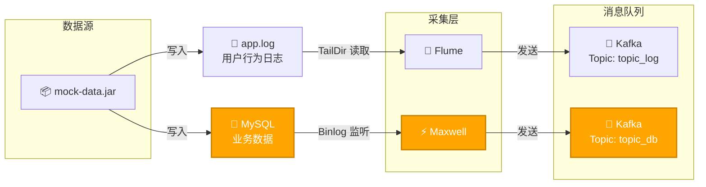
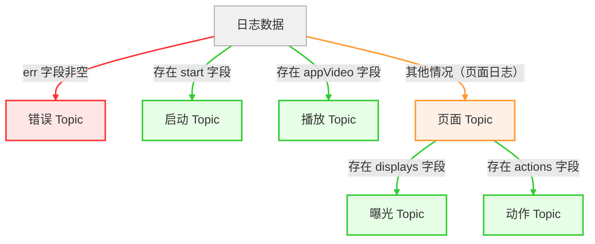
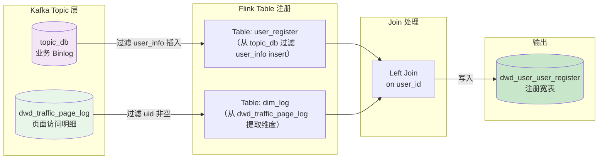

## 数据采集

## 实时数仓

<svg width="1000" height="550" viewBox="0 0 800 550" xmlns="http://www.w3.org/2000/svg">
    <defs>
        <!-- 阴影滤镜 -->
        <filter id="shadow" x="-5%" y="-5%" width="110%" height="110%">
            <feDropShadow dx="0" dy="4" stdDeviation="4" flood-color="#0f172a" flood-opacity="0.06"/>
        </filter>
        <!-- 箭头定义 -->
        <marker id="arrow" viewBox="0 0 10 10" refX="8" refY="5" markerWidth="6" markerHeight="6" orient="auto">
            <path d="M 0 0 L 10 5 L 0 10 z" fill="#94a3b8" />
        </marker>
    </defs>
    <!-- 背景 -->
    <rect width="100%" height="100%" fill="#f8fafc" />
    <rect x="20" y="20" width="760" height="510" fill="#ffffff" rx="12" stroke="#e2e8f0" stroke-width="1" />
    <!-- 标题 -->
    <text x="400" y="55" font-family="system-ui, -apple-system, sans-serif" font-size="20" font-weight="bold" fill="#0f172a" text-anchor="middle" letter-spacing="1">数据仓库分层架构</text>
    <line x1="300" y1="65" x2="500" y2="65" stroke="#cbd5e1" stroke-width="2" stroke-linecap="round"/>
    <!-- 连接线（数据流） -->
    <g id="connections" fill="none" stroke="#94a3b8" stroke-width="2" marker-end="url(#arrow)">
        <!-- ODS 到 DWD -->
        <path d="M 400 400 L 400 380 L 250 380 L 250 375" />
        <!-- ODS 到 DIM -->
        <path d="M 400 400 L 400 380 L 600 380 L 600 375" />
        <!-- DWD 到 DWS -->
        <path d="M 250 280 L 250 260 L 400 260 L 400 255" />
        <!-- DIM 到 DWS -->
        <path d="M 600 280 L 600 260 L 400 260 L 400 255" />
        <!-- DWS 到 ADS -->
        <path d="M 400 180 L 400 145" />
    </g>
    <!-- 第5层：ADS -->
    <g id="ads" transform="translate(200, 80)">
        <rect width="400" height="60" rx="8" fill="#FAF5FF" stroke="#E9D5FF" stroke-width="1.5" filter="url(#shadow)"/>
        <text x="200" y="25" font-family="system-ui, sans-serif" font-size="15" font-weight="bold" fill="#6B21A8" text-anchor="middle">ADS (Application Data Service)</text>
        <text x="200" y="42" font-family="system-ui, sans-serif" font-size="12" fill="#9333EA" text-anchor="middle">数据应用层</text>
        <text x="200" y="55" font-family="system-ui, sans-serif" font-size="12" fill="#A855F7" text-anchor="middle">存放各项统计指标结果。</text>
    </g>
    <!-- 第4层：DWS -->
    <g id="dws" transform="translate(200, 180)">
        <rect width="400" height="70" rx="8" fill="#FFF7ED" stroke="#FED7AA" stroke-width="1.5" filter="url(#shadow)"/>
        <text x="200" y="25" font-family="system-ui, sans-serif" font-size="15" font-weight="bold" fill="#9A3412" text-anchor="middle">DWS (Data Warehouse Summary)</text>
        <text x="200" y="42" font-family="system-ui, sans-serif" font-size="12" fill="#EA580C" text-anchor="middle">汇总数据层</text>
        <text x="200" y="55" font-family="system-ui, sans-serif" font-size="12" fill="#F97316" text-anchor="middle">基于上层的指标需求，以分析的主题对象作为建模驱动，</text>
        <text x="200" y="67" font-family="system-ui, sans-serif" font-size="12" fill="#F97316" text-anchor="middle">构建公共统计粒度的汇总表。</text>
    </g>
    <!-- 第3层：DWD 和 DIM -->
    <!-- DWD -->
    <g id="dwd" transform="translate(40, 280)">
        <rect width="300" height="90" rx="8" fill="#EFF6FF" stroke="#BFDBFE" stroke-width="1.5" filter="url(#shadow)"/>
        <text x="150" y="25" font-family="system-ui, sans-serif" font-size="15" font-weight="bold" fill="#1E3A8A" text-anchor="middle">DWD (Data Warehouse Detail)</text>
        <text x="150" y="42" font-family="system-ui, sans-serif" font-size="12" fill="#2563EB" text-anchor="middle">明细数据层</text>
        <text x="150" y="58" font-family="system-ui, sans-serif" font-size="12" fill="#3B82F6" text-anchor="middle">基于维度建模理论进行构建，存放维度模型中的事实表，</text>
        <text x="150" y="73" font-family="system-ui, sans-serif" font-size="12" fill="#3B82F6" text-anchor="middle">保存各业务过程最小粒度的操作记录。</text>
    </g>
    <!-- DIM -->
    <g id="dim" transform="translate(460, 280)">
        <rect width="300" height="90" rx="8" fill="#F0FDF4" stroke="#BBF7D0" stroke-width="1.5" filter="url(#shadow)"/>
        <text x="150" y="25" font-family="system-ui, sans-serif" font-size="15" font-weight="bold" fill="#166534" text-anchor="middle">DIM (Dimension)</text>
        <text x="150" y="42" font-family="system-ui, sans-serif" font-size="12" fill="#16A34A" text-anchor="middle">公共维度层</text>
        <text x="150" y="58" font-family="system-ui, sans-serif" font-size="12" fill="#22C55E" text-anchor="middle">基于维度建模理论进行构建，</text>
        <text x="150" y="73" font-family="system-ui, sans-serif" font-size="12" fill="#22C55E" text-anchor="middle">存放维度模型中的维度信息。</text>
    </g>
    <!-- 第2层：ODS -->
    <g id="ods" transform="translate(200, 400)">
        <rect width="400" height="70" rx="8" fill="#F1F5F9" stroke="#CBD5E1" stroke-width="1.5" filter="url(#shadow)"/>
        <text x="200" y="25" font-family="system-ui, sans-serif" font-size="15" font-weight="bold" fill="#334155" text-anchor="middle">ODS (Operation Data Store)</text>
        <text x="200" y="42" font-family="system-ui, sans-serif" font-size="12" fill="#475569" text-anchor="middle">原始数据层</text>
        <text x="200" y="55" font-family="system-ui, sans-serif" font-size="12" fill="#64748B" text-anchor="middle">存放未经过处理的原始数据，结构上与源系统保持一致，</text>
        <text x="200" y="67" font-family="system-ui, sans-serif" font-size="12" fill="#64748B" text-anchor="middle">是数据仓库的数据准备区。</text></g></svg>

## ODS

被**Maxwell**和**Flume**采集到**Kafka**中的数据为**ODS**层。

## DIM

将业务系统**MySQL**中的14张表Sink到**HBase**为DIM维度层。

| MySQL(edu)           | HBase目标表名 (dim_*)    |
| :------------------- | :----------------------- |
| base_category_info   | dim_base_category_info   |
| base_province        | dim_base_province        |
| base_source          | dim_base_source          |
| base_subject_info    | dim_base_subject_info    |
| chapter_info         | dim_chapter_info         |
| course_info          | dim_course_info          |
| knowledge_point      | dim_knowledge_point      |
| test_paper           | dim_test_paper           |
| test_paper_question  | dim_test_paper_question  |
| test_point_question  | dim_test_point_question  |
| test_question_info   | dim_test_question_info   |
| test_question_option | dim_test_question_option |
| user_info            | dim_user_info            |
| video_info           | dim_video_info           |

## DWD

### 日志分流

### 用户登录明细

用户每日登录日志只保留一条，发送到Kafka。

| 时间戳        | 对应日期时间        | uid  | mid     | sid                  | is_new | 测试场景                |
| ------------- | ------------------- | ---- | ------- | -------------------- | ------ | ----------------------- |
| 1774202400000 | 2026-03-23 02:00:00 | null | mid_207 | session_20260524_003 | 0      | 无用户ID数据            |
|               |                     |      |         |                      |        |                         |
| 1774026000000 | 2026-03-21 01:00:00 | 8002 | mid_202 | session_20260522_002 | 0      | **老用户会话第1条**     |
| 1774026010000 | 2026-03-21 01:00:10 | 8002 | mid_202 | session_20260522_002 | 0      | 同会话第2条（晚10秒）   |
| 1774110600000 | 2026-03-22 00:30:00 | 8002 | mid_202 | session_20260524_002 | 0      | **老用户第二天登录**    |
| 1774119600000 | 2026-03-22 03:00:00 | 8002 | mid_202 | session_20260524_002 | 0      | 老用户第二天2次登录     |
|               |                     |      |         |                      |        |                         |
| 1774116000000 | 2026-03-22 02:00:00 | 8004 | mid_204 | session_20260523_002 | 1      | 时间戳乱序-后发先到     |
| 1774115990000 | 2026-03-22 01:59:50 | 8004 | mid_204 | session_20260523_002 | 1      | **时间戳乱序-先发后到** |

### 用户注册明细

表 1：用户注册业务数据（来自 topic_db）

| 字段          | 值                  | 说明                         |
| ------------- | ------------------- | ---------------------------- |
| user_id       | 7211                | 用户ID（从 data['id'] 提取） |
| register_time | 2026-05-24 17:59:28 | 注册时间（create_time）      |
| register_date | 2026-05-24          | 注册日期（格式化）           |
| ts            | 1645437568          | Binlog 中的时间戳（秒）      |

> **备注**：该数据是 Maxwell 从 MySQL `user_info` 表中捕获的 `insert` 事件，经过过滤后得到上述字段。

---

表 2：页面访问日志数据（来自 dwd_traffic_page_log）

| 字段           | 值           | 说明                                 |
| -------------- | ------------ | ------------------------------------ |
| user_id        | 7211         | 用户ID（common['uid']）              |
| channel        | web          | 渠道（common['ch']）                 |
| province_id    | 26           | 省份ID（common['ar']）               |
| version_code   | null         | 版本号（common['vc']，本次无该字段） |
| source_id      | 2            | 来源ID（common['sc']）               |
| mid_id         | mid_216      | 设备ID（common['mid']）              |
| brand          | Huawei       | 品牌（common['ba']）                 |
| model          | Huawei P30   | 型号（common['md']）                 |
| operate_system | Android 11.0 | 操作系统（common['os']）             |

> **备注**：该数据来自 Flume 采集的应用日志，经 Flink 分流后写入 `dwd_traffic_page_log` 主题，记录了用户注册页面的访问行为。

---

表 3：Left Join 最终结果（dwd_user_user_register）

| 字段           | 值                       | 说明                         |
| -------------- | ------------------------ | ---------------------------- |
| user_id        | 7212                     | 用户ID                       |
| register_time  | 2026-05-24 18:01:11      | 注册时间                     |
| register_date  | 2026-05-24               | 注册日期                     |
| channel        | web                      | 渠道                         |
| province_id    | 26                       | 省份ID                       |
| version_code   | null                     | 版本号（日志中缺失）         |
| source_id      | 2                        | 来源ID                       |
| mid_id         | mid_216                  | 设备ID                       |
| brand          | Huawei                   | 品牌                         |
| model          | Huawei P30               | 型号                         |
| operate_system | Android 11.0             | 操作系统                     |
| ts             | 1645437672               | 业务数据中的原始时间戳（秒） |
| row_op_ts      | 2026-05-24 10:01:14.811Z | 处理该行数据时的系统时间     |

> **备注**：  
>
> - 该结果是 Flink 将 **表 1**（user_register）与 **表 2**（dim_log）进行 `LEFT JOIN` 后写入 Kafka 的最终数据。  

## DWS