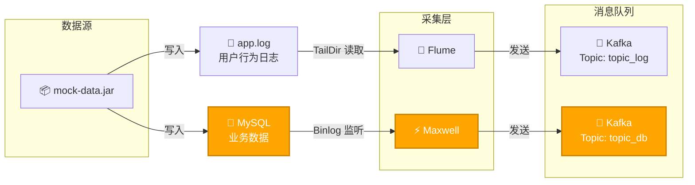
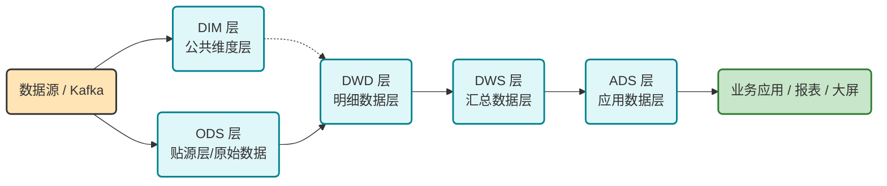
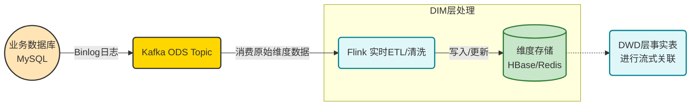
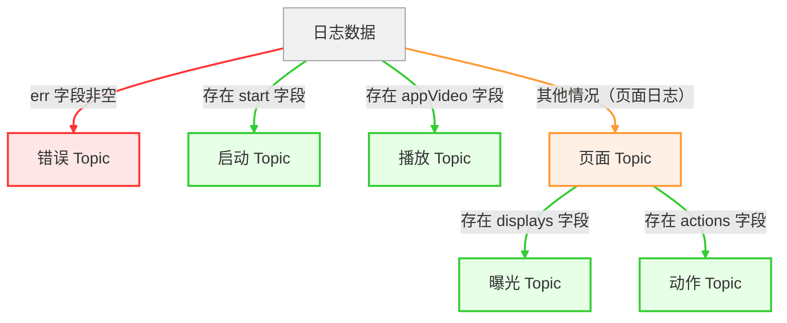
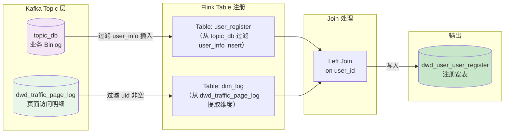
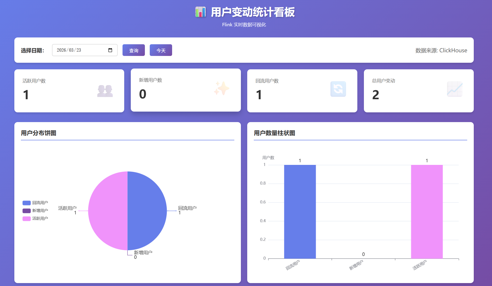

## 数据采集



## 实时数仓



- **ODS 层（贴源层/原始数据层）** 
  直接存放从数据源（如 Kafka、业务库、日志文件）接入的原始数据，保持与源系统相同的结构和粒度，不做过多清洗加工。

- **DIM 层（公共维度层）** 
  存储维度表（如日期、用户、产品、地区等），描述业务实体属性，为各层分析提供一致的维度视角，通常通过 ETL 定期或实时更新。

- **DWD 层（明细数据层）** 
  对 ODS 数据进行清洗、去重、格式统一、维表退化等处理，保留最细粒度的业务过程明细，是后续汇总分析的基础。

- **DWS 层（汇总数据层）** 
  基于 DWD 层按主题或分析维度进行预聚合（如每日用户活跃汇总、订单统计），粒度为轻度汇总，大幅提升查询性能。

- **ADS 层（应用数据层）** 
  面向具体业务应用、报表或大屏的结果数据，高度聚合或直接满足指标需求，通常推送到 MySQL、ClickHouse、Redis 等供前端调用。


## ODS

被**Maxwell**和**Flume**采集到**Kafka**中的数据为**ODS**层。

## DIM



将业务系统**MySQL**中的14张表Sink到**HBase**为DIM维度层。

| MySQL(edu)           | HBase目标表名 (dim_*)    |
| :------------------- | :----------------------- |
| base_category_info   | dim_base_category_info   |
| base_province        | dim_base_province        |
| base_source          | dim_base_source          |
| base_subject_info    | dim_base_subject_info    |
| chapter_info         | dim_chapter_info         |
| course_info          | dim_course_info          |
| knowledge_point      | dim_knowledge_point      |
| test_paper           | dim_test_paper           |
| test_paper_question  | dim_test_paper_question  |
| test_point_question  | dim_test_point_question  |
| test_question_info   | dim_test_question_info   |
| test_question_option | dim_test_question_option |
| user_info            | dim_user_info            |
| video_info           | dim_video_info           |

## DWD

### 日志分流



### 用户登录明细

用户每日登录日志只保留一条，发送到Kafka。

| 时间戳        | 对应日期时间        | uid  | mid     | sid                  | is_new | 测试场景                |
| ------------- | ------------------- | ---- | ------- | -------------------- | ------ | ----------------------- |
| 1774202400000 | 2026-03-23 02:00:00 | null | mid_207 | session_20260524_003 | 0      | 无用户ID数据            |
|               |                     |      |         |                      |        |                         |
| 1774026000000 | 2026-03-21 01:00:00 | 8002 | mid_202 | session_20260522_002 | 0      | **老用户会话第1条**     |
| 1774026010000 | 2026-03-21 01:00:10 | 8002 | mid_202 | session_20260522_002 | 0      | 同会话第2条（晚10秒）   |
| 1774110600000 | 2026-03-22 00:30:00 | 8002 | mid_202 | session_20260524_002 | 0      | **老用户第二天登录**    |
| 1774119600000 | 2026-03-22 03:00:00 | 8002 | mid_202 | session_20260524_002 | 0      | 老用户第二天2次登录     |
|               |                     |      |         |                      |        |                         |
| 1774116000000 | 2026-03-22 02:00:00 | 8004 | mid_204 | session_20260523_002 | 1      | 时间戳乱序-后发先到     |
| 1774115990000 | 2026-03-22 01:59:50 | 8004 | mid_204 | session_20260523_002 | 1      | **时间戳乱序-先发后到** |

### 用户注册明细



表 1：用户注册业务数据（来自 topic_db）

| 字段          | 值                  | 说明                         |
| ------------- | ------------------- | ---------------------------- |
| user_id       | 7211                | 用户ID（从 data['id'] 提取） |
| register_time | 2026-05-24 17:59:28 | 注册时间（create_time）      |
| register_date | 2026-05-24          | 注册日期（格式化）           |
| ts            | 1645437568          | Binlog 中的时间戳（秒）      |

> **备注**：该数据是 Maxwell 从 MySQL `user_info` 表中捕获的 `insert` 事件，经过过滤后得到上述字段。

---

表 2：页面访问日志数据（来自 dwd_traffic_page_log）

| 字段           | 值           | 说明                                 |
| -------------- | ------------ | ------------------------------------ |
| user_id        | 7211         | 用户ID（common['uid']）              |
| channel        | web          | 渠道（common['ch']）                 |
| province_id    | 26           | 省份ID（common['ar']）               |
| version_code   | null         | 版本号（common['vc']，本次无该字段） |
| source_id      | 2            | 来源ID（common['sc']）               |
| mid_id         | mid_216      | 设备ID（common['mid']）              |
| brand          | Huawei       | 品牌（common['ba']）                 |
| model          | Huawei P30   | 型号（common['md']）                 |
| operate_system | Android 11.0 | 操作系统（common['os']）             |

> **备注**：该数据来自 Flume 采集的应用日志，经 Flink 分流后写入 `dwd_traffic_page_log` 主题，记录了用户注册页面的访问行为。

---

表 3：Left Join 最终结果（dwd_user_user_register）

| 字段           | 值                       | 说明                         |
| -------------- | ------------------------ | ---------------------------- |
| user_id        | 7212                     | 用户ID                       |
| register_time  | 2026-05-24 18:01:11      | 注册时间                     |
| register_date  | 2026-05-24               | 注册日期                     |
| channel        | web                      | 渠道                         |
| province_id    | 26                       | 省份ID                       |
| version_code   | null                     | 版本号（日志中缺失）         |
| source_id      | 2                        | 来源ID                       |
| mid_id         | mid_216                  | 设备ID                       |
| brand          | Huawei                   | 品牌                         |
| model          | Huawei P30               | 型号                         |
| operate_system | Android 11.0             | 操作系统                     |
| ts             | 1645437672               | 业务数据中的原始时间戳（秒） |
| row_op_ts      | 2026-05-24 10:01:14.811Z | 处理该行数据时的系统时间     |

> **备注**：  
>
> - 该结果是 Flink 将 **表 1**（user_register）与 **表 2**（dim_log）进行 `LEFT JOIN` 后写入 Kafka 的最终数据。  


## DWS
```sql
SELECT *
FROM dws_user_login_window

┌─────────────────stt─┬─────────────────edt─┬─back_count─┬─uv_count─┬────────────ts─┐
│ 2026-03-23 08:37:00 │ 2026-03-23 08:37:10 │          1 │        1 │ 1780737488707 │
└─────────────────────┴─────────────────────┴────────────┴──────────┴───────────────┘
┌─────────────────stt─┬─────────────────edt─┬─back_count─┬─uv_count─┬────────────ts─┐
│ 2026-03-22 02:00:00 │ 2026-03-22 02:00:10 │          0 │        1 │ 1780734300858 │
└─────────────────────┴─────────────────────┴────────────┴──────────┴───────────────┘
┌─────────────────stt─┬─────────────────edt─┬─back_count─┬─uv_count─┬────────────ts─┐
│ 2026-03-22 02:00:00 │ 2026-03-22 02:00:10 │          0 │        1 │ 1780735849833 │
└─────────────────────┴─────────────────────┴────────────┴──────────┴───────────────┘
┌─────────────────stt─┬─────────────────edt─┬─back_count─┬─uv_count─┬────────────ts─┐
│ 2026-03-21 01:00:00 │ 2026-03-21 01:00:10 │          0 │        1 │ 1780737203940 │
│ 2026-03-21 02:00:00 │ 2026-03-21 02:00:10 │          0 │        1 │ 1780737203940 │
└─────────────────────┴─────────────────────┴────────────┴──────────┴───────────────┘
```


## ADS

