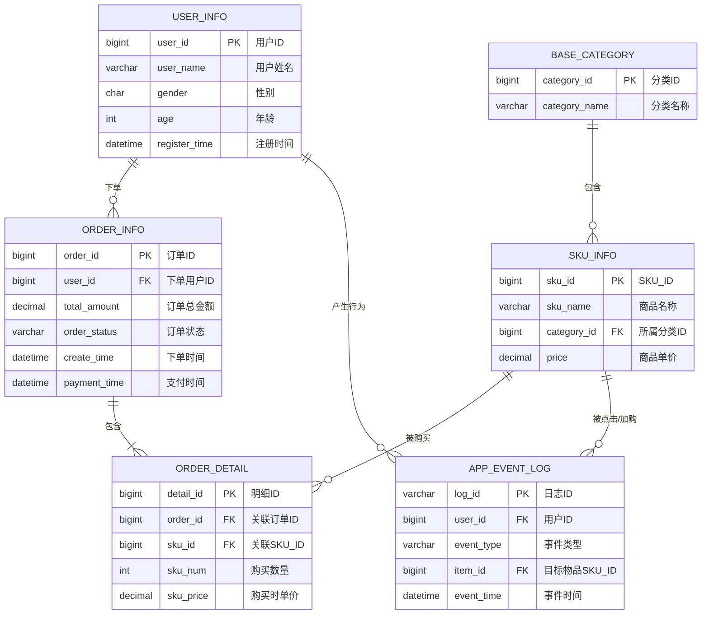

### 1. 用户表 (`user_info`)
```sql
CREATE TABLE `user_info` (
  `id` bigint NOT NULL AUTO_INCREMENT COMMENT '主键ID',
  `user_id` bigint NOT NULL COMMENT '用户ID（业务主键）',
  `user_name` varchar(50) DEFAULT NULL COMMENT '用户姓名',
  `gender` char(1) DEFAULT NULL COMMENT '性别 M男 F女',
  `age` int DEFAULT NULL COMMENT '年龄',
  `register_time` datetime DEFAULT NULL COMMENT '注册时间',
  `create_time` datetime NOT NULL DEFAULT CURRENT_TIMESTAMP COMMENT '创建时间',
  `update_time` datetime NOT NULL DEFAULT CURRENT_TIMESTAMP ON UPDATE CURRENT_TIMESTAMP COMMENT '更新时间',
  PRIMARY KEY (`id`),
  UNIQUE KEY `uk_user_id` (`user_id`)
) ENGINE=InnoDB DEFAULT CHARSET=utf8mb4 COMMENT='用户表';
```
### 2. 商品分类表 (`base_category`)
```sql
CREATE TABLE `base_category` (
  `id` bigint NOT NULL AUTO_INCREMENT COMMENT '主键ID',
  `category_id` bigint NOT NULL COMMENT '分类ID（业务主键）',
  `category_name` varchar(50) NOT NULL COMMENT '分类名称',
  `create_time` datetime NOT NULL DEFAULT CURRENT_TIMESTAMP COMMENT '创建时间',
  `update_time` datetime NOT NULL DEFAULT CURRENT_TIMESTAMP ON UPDATE CURRENT_TIMESTAMP COMMENT '更新时间',
  PRIMARY KEY (`id`),
  UNIQUE KEY `uk_category_id` (`category_id`)
) ENGINE=InnoDB DEFAULT CHARSET=utf8mb4 COMMENT='商品一级分类表';
```
### 3. 商品SKU表 (`sku_info`)
```sql
CREATE TABLE `sku_info` (
  `id` bigint NOT NULL AUTO_INCREMENT COMMENT '主键ID',
  `sku_id` bigint NOT NULL COMMENT '商品SKU_ID（业务主键）',
  `sku_name` varchar(150) NOT NULL COMMENT '商品名称',
  `category_id` bigint NOT NULL COMMENT '所属分类ID',
  `price` decimal(10,2) NOT NULL COMMENT '商品单价',
  `create_time` datetime NOT NULL DEFAULT CURRENT_TIMESTAMP COMMENT '创建时间',
  `update_time` datetime NOT NULL DEFAULT CURRENT_TIMESTAMP ON UPDATE CURRENT_TIMESTAMP COMMENT '更新时间',
  PRIMARY KEY (`id`),
  UNIQUE KEY `uk_sku_id` (`sku_id`),
  KEY `idx_category_id` (`category_id`)
) ENGINE=InnoDB DEFAULT CHARSET=utf8mb4 COMMENT='商品SKU表';
```
### 4. 订单主表 (`order_info`)
```sql
CREATE TABLE `order_info` (
  `id` bigint NOT NULL AUTO_INCREMENT COMMENT '主键ID',
  `order_id` bigint NOT NULL COMMENT '订单ID（业务主键）',
  `user_id` bigint NOT NULL COMMENT '下单用户ID',
  `total_amount` decimal(10,2) NOT NULL COMMENT '订单总金额',
  `order_status` varchar(20) NOT NULL COMMENT '订单状态（1001-待支付, 1002-已支付, 1003-已取消）',
  `create_time` datetime NOT NULL DEFAULT CURRENT_TIMESTAMP COMMENT '创建时间(下单时间)',
  `payment_time` datetime DEFAULT NULL COMMENT '支付时间',
  `update_time` datetime NOT NULL DEFAULT CURRENT_TIMESTAMP ON UPDATE CURRENT_TIMESTAMP COMMENT '更新时间',
  PRIMARY KEY (`id`),
  UNIQUE KEY `uk_order_id` (`order_id`),
  KEY `idx_user_id` (`user_id`),
  KEY `idx_create_time` (`create_time`)
) ENGINE=InnoDB DEFAULT CHARSET=utf8mb4 COMMENT='订单主表';
```
### 5. 订单明细表 (`order_detail`)
```sql
CREATE TABLE `order_detail` (
  `id` bigint NOT NULL AUTO_INCREMENT COMMENT '主键ID',
  `detail_id` bigint NOT NULL COMMENT '明细ID（业务主键）',
  `order_id` bigint NOT NULL COMMENT '关联订单ID',
  `sku_id` bigint NOT NULL COMMENT '关联商品SKU_ID',
  `sku_num` int NOT NULL COMMENT '购买数量',
  `sku_price` decimal(10,2) NOT NULL COMMENT '购买时单价(快照)',
  `create_time` datetime NOT NULL DEFAULT CURRENT_TIMESTAMP COMMENT '创建时间',
  `update_time` datetime NOT NULL DEFAULT CURRENT_TIMESTAMP ON UPDATE CURRENT_TIMESTAMP COMMENT '更新时间',
  PRIMARY KEY (`id`),
  UNIQUE KEY `uk_detail_id` (`detail_id`),
  KEY `idx_order_id` (`order_id`),
  KEY `idx_sku_id` (`sku_id`)
) ENGINE=InnoDB DEFAULT CHARSET=utf8mb4 COMMENT='订单明细表';
```
### 6. 用户行为日志表 (`app_event_log`)
*注：真实场景中，日志通常由前端打点直接写入Kafka/Logstash，不落盘MySQL。这里为了方便你本地模拟生成数据，建在MySQL中。*
```sql
CREATE TABLE `app_event_log` (
  `id` bigint NOT NULL AUTO_INCREMENT COMMENT '主键ID',
  `log_id` varchar(50) NOT NULL COMMENT '日志唯一ID',
  `user_id` bigint DEFAULT NULL COMMENT '用户ID(未登录可为空)',
  `event_type` varchar(30) NOT NULL COMMENT '事件类型(如: page_view, click, cart_add)',
  `item_id` bigint DEFAULT NULL COMMENT '目标物品ID(如点击的商品SKU_ID)',
  `event_time` datetime NOT NULL COMMENT '事件发生时间',
  `create_time` datetime NOT NULL DEFAULT CURRENT_TIMESTAMP COMMENT '日志入库时间',
  PRIMARY KEY (`id`),
  UNIQUE KEY `uk_log_id` (`log_id`),
  KEY `idx_user_id` (`user_id`),
  KEY `idx_event_time` (`event_time`)
) ENGINE=InnoDB DEFAULT CHARSET=utf8mb4 COMMENT='APP端用户行为日志表(模拟)';
```


## ER


