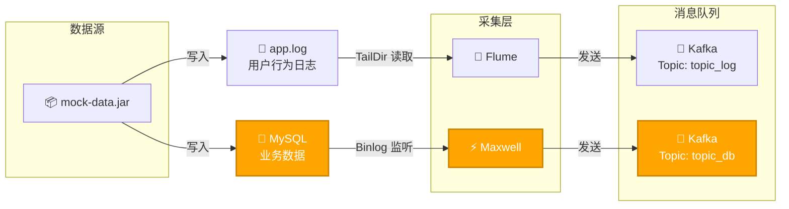
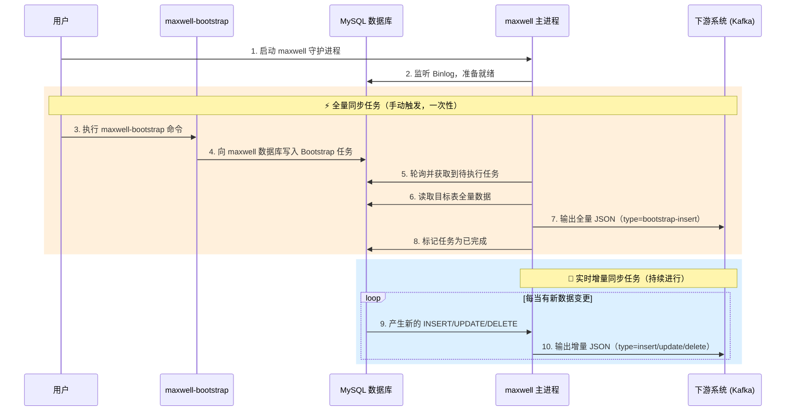
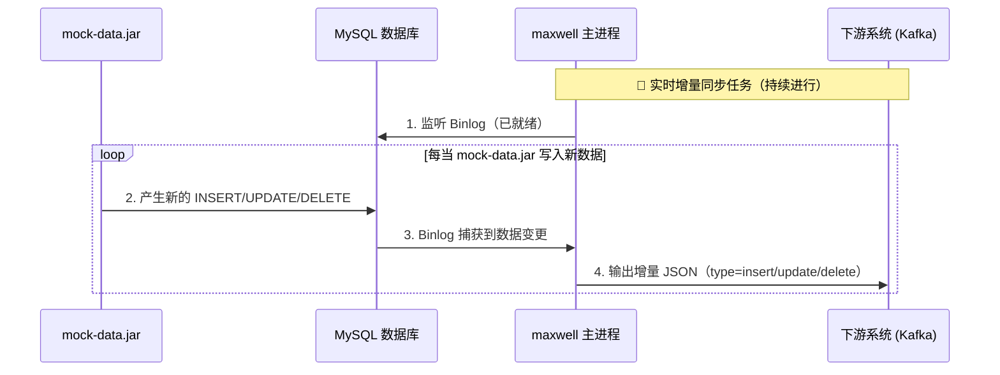
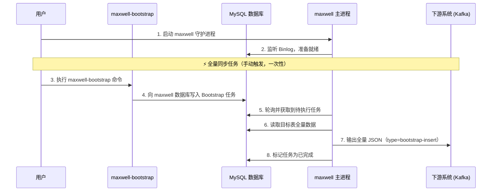

# 教育大数据-业务数据采集（Maxwell）




### 前置条件

- **MySQL正常运行并启用BinLog**
- **ZooKeeper正常运行**
- **Kafka正常运行**
- **mock-data.jar正常模拟数据**

## Maxwell简介

### Maxwell概述
Maxwell 是由美国 Zendesk 公司开源，用 Java 编写的 MySQL 变更数据抓取软件。它会实时监控 MySQL 数据库的数据变更操作（包括 insert、update、delete），并将变更数据以 JSON 格式发送给 Kafka、Kinesis 等流数据处理平台。
- 官网地址：http://maxwells-daemon.io/

Maxwell 将自己伪装成 slave，遵循 MySQL 主从复制协议，实时读取 MySQL 数据库的二进制日志（Binlog），从中获取变更数据，再将变更数据以 JSON 格式发送至 Kafka 等流处理平台。

| 特性         | 全量同步指定表                        | 增量同步库级过滤                       |
| ------------ | ------------------------------------- | -------------------------------------- |
| **核心用途** | 数据初始化、历史数据补全              | 持续监控特定库的实时变更               |
| **触发方式** | 手动执行 bootstrap 命令或插入元数据表 | 随 Maxwell 进程启动自动生效            |
| **过滤粒度** | 库 + 表 + 行（通过 where 条件）       | 库 + 表 + 行（通过 filter 规则）       |
| **性能影响** | 大表同步可能影响源库性能              | 低（仅传输变更数据）                   |
| **适用场景** | 首次部署、数据迁移、历史数据修复      | 实时数据仓库、缓存更新、微服务数据同步 |

### Maxwell部署

1. 下载安装包
   - 地址1：学习通-资料-04-数据表结构与模拟数据
   - 地址2：https://github.com/zendesk/maxwell/releases/download/v1.29.2/maxwell-1.29.2.tar.gz
   - 说明：Maxwell-1.30.0 及以上版本**不再支持 JDK1.8**
2. 上传至 node1 节点
3. 解压到 `/opt/bigdata/maxwell/`
4. 创建软连接
5. 更换jdbc-connector-java.jar
   - 将`$MAXWELL_HOME/lib/`中的`mysql-connector-java-5.1.47.jar`更换为`mysql-connector-java-5.1.27-bin.jar`


#### MySQL配置binlog

`/etc/my.cnf`

```ini
# 我们只记录edu的binlog
binlog-do-db=edu
```

修改后，记得**重启MySQL**服务。

#### 创建Maxwell所需库和用户

1. 创建数据库

   ```sql
   CREATE DATABASE maxwell;
   ```

2. 调整密码策略

   ```sql
   set global validate_password_policy=0;
   set global validate_password_length=4;
   ```

3. 创建用户并授权

   ```sql
   CREATE USER 'maxwell'@'%' IDENTIFIED BY 'maxwell';
   GRANT ALL ON maxwell.* TO 'maxwell'@'%';
   GRANT SELECT, REPLICATION CLIENT, REPLICATION SLAVE ON *.* TO 'maxwell'@'%';
   ```

#### 配置Maxwell
1. 复制配置文件
   ```bash
   cp config.properties.example config.properties
   ```
2. 修改 `config.properties`
   ```properties
   producer=kafka
   kafka.bootstrap.servers=node1:9092,node2:9092,node3:9092
   kafka_topic=topic_db
   
   host=node1
   user=maxwell
   password=maxwell
   jdbc_options=useSSL=false&serverTimezone=Asia/Shanghai
   ```


#### Maxwell启动
```bash
[zhangsan@node3 default]$ bin/maxwell --config config.properties
10:16:16,042 INFO  BinlogConnectorReplicator - Setting initial binlog pos to: mysql-bin-file.000006:4163317
10:16:16,073 INFO  BinaryLogClient - Connected to node1:3306 at mysql-bin-file.000006/4163317 (sid:6379, cid:158)
10:16:16,073 INFO  BinlogConnectorReplicator - Binlog connected.
```

- **数据同步的起始位置**：从`mysql-bin-file.000006`这个 **binlog** 文件的 4163317 偏移量开始读取数据。


## Maxwell使用

主要使用以下两个工具

```bash
[zhangsan@node1 default]$ ll bin
total 2284
-rwxrwxr-x. 1 zhangsan zhangsan    2482 Sep 17  2021 maxwell
-rwxrwxr-x. 1 zhangsan zhangsan     570 Sep 17  2021 maxwell-bootstrap #向maxwell主进程提交全量采集任务
```

### Maxwell工作流程



#### Maxwell增量数据输出数据格式


<table style="border-collapse: collapse; width: 100%; font-family: 'Segoe UI', Arial, sans-serif; border-radius: 8px; overflow: hidden; box-shadow: 0 2px 12px rgba(0,0,0,0.08);">
  <thead>
    <tr style="background-color: #1e2a3a; color: #ffffff; text-align: left;">
      <th style="padding: 12px 16px; border-bottom: 2px solid #0f1720; width: 12%;">操作类型</th>
      <th style="padding: 12px 16px; border-bottom: 2px solid #0f1720; width: 28%;">MySQL 语句</th>
      <th style="padding: 12px 16px; border-bottom: 2px solid #0f1720; width: 60%;">Maxwell输出（JSON）</th>
    </tr>
  </thead>
  <tbody>
    <!-- INSERT 行 -->
    <tr style="background-color: #f9fafb;">
      <td style="padding: 12px 16px; border-bottom: 1px solid #e5e7eb; vertical-align: center;"><strong style="color: #10b981;">INSERT</strong></td>
      <td style="padding: 12px 16px; border-bottom: 1px solid #e5e7eb; font-family: 'Courier New', monospace; font-size: 1.2em;">insert into student values(1,'zhangsan');</td>
      <td style="padding: 12px 16px; border-bottom: 0.1px solid #e5e7eb; background-color: #fefce8;">
        <pre style="margin: 0; font-family: 'Courier New', monospace; font-size: 1em; line-height: 1.4; color: #2d3748; white-space: pre-wrap;">
{
  <span style="color: #b45309; font-weight: 600;">"database"</span>: <span style="color: #0f766e;">"edu"</span>,
  <span style="color: #b45309; font-weight: 600;">"table"</span>: <span style="color: #0f766e;">"student"</span>,
  <span style="color: #b45309; font-weight: 600;">"type"</span>: <span style="color: #dc2626; font-weight: bold; background-color: #fee2e2;">"insert"</span>,
  <span style="color: #b45309; font-weight: 600;">"ts"</span>: <span style="color: #2563eb;">1634004537</span>,
  <span style="color: #b45309; font-weight: 600;">"xid"</span>: <span style="color: #2563eb;">1530970</span>,
  <span style="color: #b45309; font-weight: 600;">"commit"</span>: <span style="color: #16a34a; font-weight: bold;">true</span>,
  <span style="color: #b45309; font-weight: 600;">"data"</span>: {
    <span style="color: #b45309; font-weight: 600;">"id"</span>: <span style="color: #2563eb;">1</span>,
    <span style="color: #b45309; font-weight: 600;">"name"</span>: <span style="color: #0f766e;">"zhangsan"</span>
  }
}
        </pre>
      </td>
    </tr>
    <!-- UPDATE 行 -->
    <tr style="background-color: #ffffff;">
      <td style="padding: 12px 16px; border-bottom: 1px solid #e5e7eb; vertical-align: center;"><strong style="color: #f59e0b;">UPDATE</strong></td>
      <td style="padding: 12px 16px; border-bottom: 1px solid #e5e7eb; font-family: 'Courier New', monospace; font-size: 1.2em;">update student set name='lisi' where id=1;</td>
      <td style="padding: 12px 16px; border-bottom: 1px solid #e5e7eb; background-color: #fefce8;">
        <pre style="margin: 0; font-family: 'Courier New', monospace; font-size: 1em; line-height: 1.4; color: #2d3748; white-space: pre-wrap;">
{
  <span style="color: #b45309; font-weight: 600;">"database"</span>: <span style="color: #0f766e;">"edu"</span>,
  <span style="color: #b45309; font-weight: 600;">"table"</span>: <span style="color: #0f766e;">"student"</span>,
  <span style="color: #b45309; font-weight: 600;">"type"</span>: <span style="color: #dc2626; font-weight: bold; background-color: #fee2e2;">"update"</span>,
  <span style="color: #b45309; font-weight: 600;">"ts"</span>: <span style="color: #2563eb;">1634004653</span>,
  <span style="color: #b45309; font-weight: 600;">"xid"</span>: <span style="color: #2563eb;">1531916</span>,
  <span style="color: #b45309; font-weight: 600;">"commit"</span>: <span style="color: #16a34a; font-weight: bold;">true</span>,
  <span style="color: #b45309; font-weight: 600;">"data"</span>: {
    <span style="color: #b45309; font-weight: 600;">"id"</span>: <span style="color: #2563eb;">1</span>,
    <span style="color: #b45309; font-weight: 600;">"name"</span>: <span style="color: #0f766e;">"lisi"</span>
  },
  <span style="color: #b45309; font-weight: 600;">"old"</span>: {
    <span style="color: #b45309; font-weight: 600;">"name"</span>: <span style="color: #0f766e;">"zhangsan"</span>
  }
}
        </pre>
      </td>
    </tr>
    <!-- DELETE 行 -->
    <tr style="background-color: #f9fafb;">
      <td style="padding: 12px 16px; border-bottom: 1px solid #e5e7eb; vertical-align: center;"><strong style="color: #ef4444;">DELETE</strong></td>
      <td style="padding: 12px 16px; border-bottom: 1px solid #e5e7eb; font-family: 'Courier New', monospace; font-size: 1.2em;">delete from student where id=1;</td>
      <td style="padding: 12px 16px; border-bottom: 0px solid #e5e7eb; background-color: #fefce8;">
        <pre style="margin: 0; font-family: 'Courier New', monospace; font-size: 1em; line-height: 1.4; color: #2d3748; white-space: pre-wrap;">
{
  <span style="color: #b45309; font-weight: 600;">"database"</span>: <span style="color: #0f766e;">"edu"</span>,
  <span style="color: #b45309; font-weight: 600;">"table"</span>: <span style="color: #0f766e;">"student"</span>,
  <span style="color: #b45309; font-weight: 600;">"type"</span>: <span style="color: #dc2626; font-weight: bold; background-color: #fee2e2;">"delete"</span>,
  <span style="color: #b45309; font-weight: 600;">"ts"</span>: <span style="color: #2563eb;">1634004751</span>,
  <span style="color: #b45309; font-weight: 600;">"xid"</span>: <span style="color: #2563eb;">1532725</span>,
  <span style="color: #b45309; font-weight: 600;">"commit"</span>: <span style="color: #16a34a; font-weight: bold;">true</span>,
  <span style="color: #b45309; font-weight: 600;">"data"</span>: {
    <span style="color: #b45309; font-weight: 600;">"id"</span>: <span style="color: #2563eb;">1</span>,
    <span style="color: #b45309; font-weight: 600;">"name"</span>: <span style="color: #0f766e;">"lisi"</span>
  }
}
        </pre>
      </td>
    </tr>
  </tbody>
</table>


##### Maxwell 输出的 JSON 字段说明：

| 字段     | 解释                                                         |
| -------- | ------------------------------------------------------------ |
| database | 变更数据所属的数据库                                         |
| table    | 变更数据所属的表                                             |
| type     | 数据变更类型                                                 |
| ts       | 数据变更发生的时间                                           |
| xid      | 事务 ID                                                      |
| commit   | 事务提交标志，可用于重新组装事务                             |
| data     | 对于 insert 表示插入的数据；update 表示修改后的数据；delete 表示删除的数据 |
| old      | 对于 update 类型，表示修改之前的数据，只包含变更字段         |


### 实时数据增量同步



1. 启动 Maxwell
2. 启动 Kafka 消费者，消费**topic_db**话题。
3. 生成模拟数据


消费端输出示例
```json
{"database":"edu","table":"user_chapter_process","type":"insert","ts":1775787036,"xid":51043,"commit":true,"data":{"id":3375,"course_id":292,"chapter_id":23423,"user_id":6104,"position_sec":851,"create_time":"2026-04-05 16:19:26","update_time":null,"deleted":"0"}}

{"database":"edu","table":"review_info","type":"insert","ts":1775787036,"xid":51052,"commit":true,"data":{"id":3313,"user_id":6104,"course_id":292,"review_txt":null,"review_stars":5,"create_time":"2026-04-05 16:19:26","deleted":"0"}}

{"database":"edu","table":"comment_info","type":"insert","ts":1775787036,"xid":51059,"commit":true,"data":{"id":3316,"user_id":6104,"chapter_id":23423,"course_id":292,"comment_txt":"评论 123123","create_time":"2026-04-05 16:19:26","deleted":"0"}}
```


### 历史数据全量同步




使用 `bootstrap` 功能做全量同步。

#### 提交全量采集任务

此处以全量采集`user_info`表为例：

```bash
maxwell-bootstrap --database edu --table user_info --config config.properties
```

- 此操作会向 **MySQL Server** - **maxwell DB** - **bootstrap Table** 中新增一条任务记录。

  

#### maxwell输出如下

```bash
18:34:42,337 INFO  SynchronousBootstrapper - bootstrapping started for edu.user_info
18:34:43,147 INFO  SynchronousBootstrapper - bootstrapping ended for #11 edu.user_info
```


#### MySQL-maxwell-DB

```mysql
mysql> select * from bootstrap;
+----+---------------+------------+--------------+-------------+---------------+------------+------------+---------------------+---------------------+-------------+-----------------+-----------+---------+
| id | database_name | table_name | where_clause | is_complete | inserted_rows | total_rows | created_at | started_at          | completed_at        | binlog_file | binlog_position | client_id | comment |
+----+---------------+------------+--------------+-------------+---------------+------------+------------+---------------------+---------------------+-------------+-----------------+-----------+---------+
|  1 | edu           | user_info  | NULL         |           1 |          2000 |       2000 | NULL       | 2026-04-11 20:58:08 | 2026-04-11 20:58:08 | NULL        |               0 | maxwell   | NULL    |
+----+---------------+------------+--------------+-------------+---------------+------------+------------+---------------------+---------------------+-------------+-----------------+-----------+---------+
1 row in set (0.00 sec)
```

- 全量任务采集完成后，is_complete=1


#### Kafka消费到的数据格式

```json
{"database":"edu","table":"user_info","type":"bootstrap-start":1775912288,"data":{}}

{"database":"edu","table":"user_info","type":"bootstrap-insert","ts":1775912288,"data":{"id":2000,"login_name":"8eddfd9bn","nick_name":"影荔","passwd":null,"real_name":"宋影荔","phone_num":"13596246637","email":"8eddfd9bn@msn.com","head_img":null,"user_level":"1","birthday":"1992-04-05","gender":"F","create_time":"2026-04-05 00:00:00","operate_time":null,"status":null}}

{"database":"edu","table":"user_info","type":"bootstrap-complete","ts":1775912288,"data":{}}
```

#### 注意事项

1. `bootstrap-start` 和 `bootstrap-complete` 为开始/结束标志，无业务数据
2. 一次 **bootstrap** 所有记录 **ts** 相同


## Maxwell启停优化

##### 后台启动

```bash
[zhangsan@node3 default]$ bin/maxwell --config config.properties  --daemon
Redirecting STDOUT to /opt/bigdata/maxwell/maxwell-1.29.2/bin/../logs/MaxwellDaemon.out
Using kafka version: 1.0.0
```

- `--daemon`：以**守护进程模式**后台运行，不占用当前终端窗口

##### 启动情况查看

```bash
[zhangsan@node3 default]$ jps
18099 QuorumPeerMain
63979 Maxwell
64027 Jps
18540 Kafka
```

##### 停止

```bash
ps -ef | grep com.zendesk.maxwell.Maxwell | grep -v grep | grep maxwell | awk '{print $2}' | xargs kill -9
```

##### 启停脚本 `mxw.sh`

```bash
#!/bin/bash
MAXWELL_HOME=/opt/bigdata/maxwell/default

status_maxwell(){
    result=`ps -ef | grep com.zendesk.maxwell.Maxwell | grep -v grep | wc -l`
    return $result
}

start_maxwell(){
    status_maxwell
    if [[ $? -lt 1 ]]; then
        echo "启动Maxwell"
        $MAXWELL_HOME/bin/maxwell --config $MAXWELL_HOME/config.properties --daemon
    else
        echo "Maxwell正在运行"
    fi
}

stop_maxwell(){
    status_maxwell
    if [[ $? -gt 0 ]]; then
        echo "停止Maxwell"
        ps -ef | grep com.zendesk.maxwell.Maxwell | grep -v grep | awk '{print $2}' | xargs kill -9
    else
        echo "Maxwell未在运行"
    fi
}

case $1 in
    start )
        start_maxwell
    ;;
    stop )
        stop_maxwell
    ;;
    restart )
       stop_maxwell
       start_maxwell
    ;;
esac
```

##### 赋权

```bash
chmod +x mxw.sh
```


---

## QA

### QA1

##### Question:

```bash
Q:
com.github.shyiko.mysql.binlog.network.ServerException: Could not find first log file name in binary log index file
```

##### Reason:

Maxwell 监听 MySQL Binlog 时，指定的 binlog 文件 / 位置在 MySQL 上不存在，查询最新的binlog文件及位置：

```mysql
[zhangsan@node1 default]$ mysql -umaxwell -pmaxwell -h node1 -e "SHOW MASTER STATUS;"
mysql: [Warning] Using a password on the command line interface can be insecure.
+-----------------------+----------+--------------+------------------+-------------------+
| File                  | Position | Binlog_Do_DB | Binlog_Ignore_DB | Executed_Gtid_Set |
+-----------------------+----------+--------------+------------------+-------------------+
| mysql-bin-file.000004 |      154 | edu          |                  |                   |
+-----------------------+----------+--------------+------------------+-------------------+
```

##### Answer:

```bash
./bin/maxwell --user=maxwell --password=maxwell --host=node1 --port=3306 \
--kafka.bootstrap.servers=node1:9092,node2:9092,node3:9092 \
--init_position=mysql-bin-file.000004:154 


A:
[zhangsan@node1 default]$ /opt/bigdata/maxwell/default/bin/maxwell --config /opt/bigdata/maxwell/default/config.properties --init_position=mysql-bin-file.000004:154
# 用 --init_position 重置同步位置
```

- **位置 154 代表什么？**
  - MySQL binlog 从 **154** 开始才是真正的业务数据
  - 154 之前是文件头、格式描述事件

---

### QA2


##### MySQL版本

```bash
[zhangsan@node1 default]$ mysql -V
mysql  Ver 14.14 Distrib 5.7.44, for Linux (x86_64) using  EditLine wrapper
```

##### maxwell mysql-connector-java版本

```bash
[zhangsan@node1 default]$ ll lib/mysql-connector*
-rw-rw-r--. 1 zhangsan zhangsan  1007502 Apr 10 10:48 mysql-connector-java-5.1.47.jar
```

##### 启动maxwell-bootstrap

```bash
[zhangsan@node1 default]$ bin/maxwell-bootstrap --database edu --table user_info --config config.properties

# 出现如下错误
Sat Apr 11 17:19:45 CST 2026 WARN: Establishing SSL connection without server's identity verification is not recommended. According to MySQL 5.5.45+, 5.6.26+ and 5.7.6+ requirements SSL connection must be established by default if explicit option isn't set. For compliance with existing applications not using SSL the verifyServerCertificate property is set to 'false'. You need either to explicitly disable SSL by setting useSSL=false, or set useSSL=true and provide truststore for server certificate verification.
17:19:45,054 ERROR MaxwellBootstrapUtility - failed to connect to mysql server @ jdbc:mysql://node1:3306/maxwell?verifyServerCertificate=false&requireSSL=false&allowPublicKeyRetrieval=true&connectTimeout=5000&serverTimezone=Asia%2FShanghai&zeroDateTimeBehavior=convertToNull&useSSL=false

17:19:45,083 ERROR MaxwellBootstrapUtility - Connections could not be acquired from the underlying database!
java.sql.SQLException: Connections could not be acquired from the underlying database!
        at com.mchange.v2.sql.SqlUtils.toSQLException(SqlUtils.java:118)
        at com.mchange.v2.c3p0.impl.C3P0PooledConnectionPool.checkoutPooledConnection(C3P0PooledConnectionPool.java:692)
        at com.mchange.v2.c3p0.impl.AbstractPoolBackedDataSource.getConnection(AbstractPoolBackedDataSource.java:140)
        at com.zendesk.maxwell.util.C3P0ConnectionPool.getConnection(C3P0ConnectionPool.java:18)
        at com.zendesk.maxwell.bootstrap.MaxwellBootstrapUtility.run(MaxwellBootstrapUtility.java:40)
        at com.zendesk.maxwell.bootstrap.MaxwellBootstrapUtility.main(MaxwellBootstrapUtility.java:253)
Caused by: com.mchange.v2.resourcepool.CannotAcquireResourceException: A ResourcePool could not acquire a resource from its primary factory or source.
        at com.mchange.v2.resourcepool.BasicResourcePool.awaitAvailable(BasicResourcePool.java:1507)
        at com.mchange.v2.resourcepool.BasicResourcePool.prelimCheckoutResource(BasicResourcePool.java:644)
        at com.mchange.v2.resourcepool.BasicResourcePool.checkoutResource(BasicResourcePool.java:554)
        at com.mchange.v2.c3p0.impl.C3P0PooledConnectionPool.checkoutAndMarkConnectionInUse(C3P0PooledConnectionPool.java:758)
        at com.mchange.v2.c3p0.impl.C3P0PooledConnectionPool.checkoutPooledConnection(C3P0PooledConnectionPool.java:685)
        ... 4 more
Caused by: com.mysql.jdbc.exceptions.jdbc4.CommunicationsException: Communications link failure

The last packet successfully received from the server was 3 milliseconds ago.  The last packet sent successfully to the server was 3 milliseconds ago.
        at sun.reflect.GeneratedConstructorAccessor23.newInstance(Unknown Source)
        at sun.reflect.DelegatingConstructorAccessorImpl.newInstance(DelegatingConstructorAccessorImpl.java:45)
        at java.lang.reflect.Constructor.newInstance(Constructor.java:423)
        at com.mysql.jdbc.Util.handleNewInstance(Util.java:425)
        at com.mysql.jdbc.SQLError.createCommunicationsException(SQLError.java:990)
        at com.mysql.jdbc.ExportControlled.transformSocketToSSLSocket(ExportControlled.java:201)
        at com.mysql.jdbc.MysqlIO.negotiateSSLConnection(MysqlIO.java:4914)
        at com.mysql.jdbc.MysqlIO.proceedHandshakeWithPluggableAuthentication(MysqlIO.java:1663)
        at com.mysql.jdbc.MysqlIO.doHandshake(MysqlIO.java:1224)
        at com.mysql.jdbc.ConnectionImpl.coreConnect(ConnectionImpl.java:2199)
        at com.mysql.jdbc.ConnectionImpl.connectOneTryOnly(ConnectionImpl.java:2230)
        at com.mysql.jdbc.ConnectionImpl.createNewIO(ConnectionImpl.java:2025)
        at com.mysql.jdbc.ConnectionImpl.<init>(ConnectionImpl.java:778)
        at com.mysql.jdbc.JDBC4Connection.<init>(JDBC4Connection.java:47)
        at sun.reflect.GeneratedConstructorAccessor16.newInstance(Unknown Source)
        at sun.reflect.DelegatingConstructorAccessorImpl.newInstance(DelegatingConstructorAccessorImpl.java:45)
        at java.lang.reflect.Constructor.newInstance(Constructor.java:423)
        at com.mysql.jdbc.Util.handleNewInstance(Util.java:425)
        at com.mysql.jdbc.ConnectionImpl.getInstance(ConnectionImpl.java:386)
        at com.mysql.jdbc.NonRegisteringDriver.connect(NonRegisteringDriver.java:330)
        at com.mchange.v2.c3p0.DriverManagerDataSource.getConnection(DriverManagerDataSource.java:175)
        at com.mchange.v2.c3p0.WrapperConnectionPoolDataSource.getPooledConnection(WrapperConnectionPoolDataSource.java:220)
        at com.mchange.v2.c3p0.WrapperConnectionPoolDataSource.getPooledConnection(WrapperConnectionPoolDataSource.java:206)
        at com.mchange.v2.c3p0.impl.C3P0PooledConnectionPool$1PooledConnectionResourcePoolManager.acquireResource(C3P0PooledConnectionPool.java:203)
        at com.mchange.v2.resourcepool.BasicResourcePool.doAcquire(BasicResourcePool.java:1176)
        at com.mchange.v2.resourcepool.BasicResourcePool.doAcquireAndDecrementPendingAcquiresWithinLockOnSuccess(BasicResourcePool.java:1163)
        at com.mchange.v2.resourcepool.BasicResourcePool.access$700(BasicResourcePool.java:44)
        at com.mchange.v2.resourcepool.BasicResourcePool$ScatteredAcquireTask.run(BasicResourcePool.java:1908)
        at com.mchange.v2.async.ThreadPoolAsynchronousRunner$PoolThread.run(ThreadPoolAsynchronousRunner.java:696)
Caused by: javax.net.ssl.SSLException: Received fatal alert: internal_error
        at sun.security.ssl.Alerts.getSSLException(Alerts.java:208)
        at sun.security.ssl.Alerts.getSSLException(Alerts.java:154)
        at sun.security.ssl.SSLSocketImpl.recvAlert(SSLSocketImpl.java:2020)
        at sun.security.ssl.SSLSocketImpl.readRecord(SSLSocketImpl.java:1127)
        at sun.security.ssl.SSLSocketImpl.performInitialHandshake(SSLSocketImpl.java:1367)
        at sun.security.ssl.SSLSocketImpl.startHandshake(SSLSocketImpl.java:1395)
        at sun.security.ssl.SSLSocketImpl.startHandshake(SSLSocketImpl.java:1379)
        at com.mysql.jdbc.ExportControlled.transformSocketToSSLSocket(ExportControlled.java:186)
        ... 23 more
```

##### 更换为 mysql-connector-java-8.0.27.jar

##### maxwell

出现如下错误：

```java
[zhangsan@node1 default]$ bin/maxwell --config config.properties
    
18:01:45,804 INFO  SynchronousBootstrapper - bootstrapping started for edu.user_info
18:01:45,958 ERROR MaxwellContext - exception in thread: maxwell-bootstrap-controller
com.zendesk.maxwell.schema.columndef.ColumnDefCastException: null
        at com.zendesk.maxwell.schema.columndef.DateTimeColumnDef.formatValue(DateTimeColumnDef.java:30) ~[maxwell-1.29.2.jar:1.29.2]
        at com.zendesk.maxwell.schema.columndef.ColumnDefWithLength.asJSON(ColumnDefWithLength.java:37) ~[maxwell-1.29.2.jar:1.29.2]
        at com.zendesk.maxwell.bootstrap.SynchronousBootstrapper.setRowValues(SynchronousBootstrapper.java:259) ~[maxwell-1.29.2.jar:1.29.2]
        at com.zendesk.maxwell.bootstrap.SynchronousBootstrapper.performBootstrap(SynchronousBootstrapper.java:105) ~[maxwell-1.29.2.jar:1.29.2]
        at com.zendesk.maxwell.bootstrap.SynchronousBootstrapper.startBootstrap(SynchronousBootstrapper.java:52) ~[maxwell-1.29.2.jar:1.29.2]
        at com.zendesk.maxwell.bootstrap.BootstrapController.doWork(BootstrapController.java:74) ~[maxwell-1.29.2.jar:1.29.2]
        at com.zendesk.maxwell.bootstrap.BootstrapController.work(BootstrapController.java:58) ~[maxwell-1.29.2.jar:1.29.2]
        at com.zendesk.maxwell.util.RunLoopProcess.runLoop(RunLoopProcess.java:34) ~[maxwell-1.29.2.jar:1.29.2]
        at com.zendesk.maxwell.MaxwellContext.lambda$startTask$0(MaxwellContext.java:266) ~[maxwell-1.29.2.jar:1.29.2]
        at java.lang.Thread.run(Thread.java:748) [?:1.8.0_212]
18:01:45,983 INFO  TaskManager - Stopping 4 tasks
18:01:45,983 ERROR TaskManager - cause:
com.zendesk.maxwell.schema.columndef.ColumnDefCastException: null
        at com.zendesk.maxwell.schema.columndef.DateTimeColumnDef.formatValue(DateTimeColumnDef.java:30) ~[maxwell-1.29.2.jar:1.29.2]
        at com.zendesk.maxwell.schema.columndef.ColumnDefWithLength.asJSON(ColumnDefWithLength.java:37) ~[maxwell-1.29.2.jar:1.29.2]
        at com.zendesk.maxwell.bootstrap.SynchronousBootstrapper.setRowValues(SynchronousBootstrapper.java:259) ~[maxwell-1.29.2.jar:1.29.2]
        at com.zendesk.maxwell.bootstrap.SynchronousBootstrapper.performBootstrap(SynchronousBootstrapper.java:105) ~[maxwell-1.29.2.jar:1.29.2]
        at com.zendesk.maxwell.bootstrap.SynchronousBootstrapper.startBootstrap(SynchronousBootstrapper.java:52) ~[maxwell-1.29.2.jar:1.29.2]
        at com.zendesk.maxwell.bootstrap.BootstrapController.doWork(BootstrapController.java:74) ~[maxwell-1.29.2.jar:1.29.2]
        at com.zendesk.maxwell.bootstrap.BootstrapController.work(BootstrapController.java:58) ~[maxwell-1.29.2.jar:1.29.2]
        at com.zendesk.maxwell.util.RunLoopProcess.runLoop(RunLoopProcess.java:34) ~[maxwell-1.29.2.jar:1.29.2]
        at com.zendesk.maxwell.MaxwellContext.lambda$startTask$0(MaxwellContext.java:266) ~[maxwell-1.29.2.jar:1.29.2]
        at java.lang.Thread.run(Thread.java:748) [?:1.8.0_212]
```

##### 最后更换

```bash
-rw-rw-r--. 1 zhangsan zhangsan   872303 Apr 11 18:17 mysql-connector-java-5.1.27-bin.jar
```

成功。

