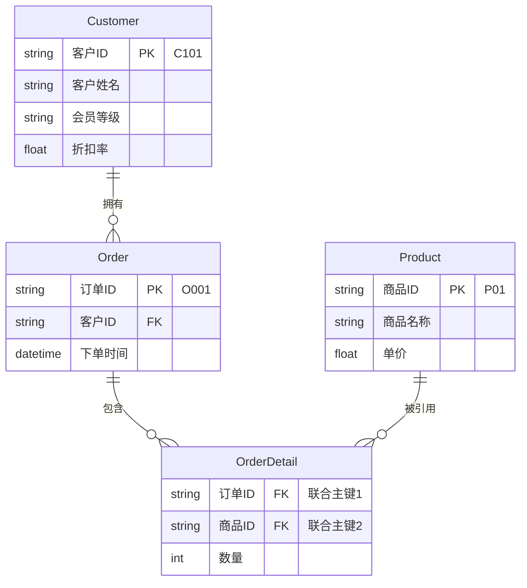
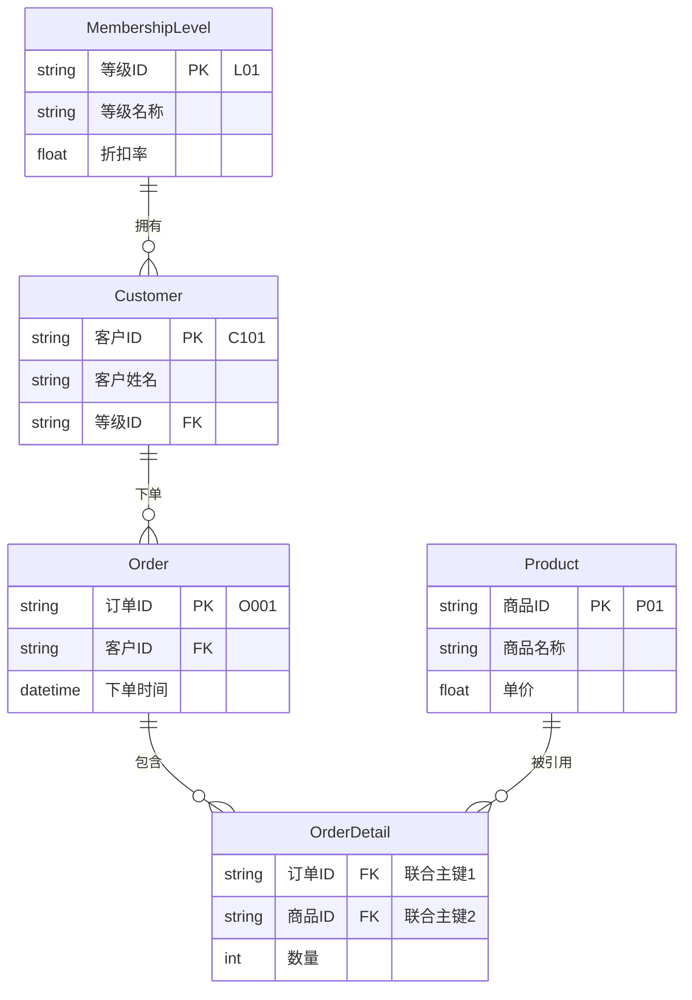

## **数据库范式**

**订单明细表**

| **订单ID (PK)** | **商品详情 (非原子列)**                                | **客户信息 (非原子列)**  | **下单时间**         | **折扣率** |
| :-------------- | :----------------------------------------------------- | :----------------------- | :------------------- | :--------- |
| **O001**        | **P01:无线鼠标:89.00:2 ,  P02:机械键盘:299.00:1** | **C101, 张三, 黄金会员** | **2026-04-15 09:00** | **0.95**   |
| **O002**        | **P01:无线鼠标:89.00:3**                               | **C102, 李四, 白银会员** | **2026-04-14 18:30** | **0.98**   |
| **O003**        | **P03:U盘64G:59.00:2**                                 | **C101, 张三, 黄金会员** | **2026-04-15 10:30** | **0.95**   |

**违反 1NF：在同一个单元格内填入多个值（非原子性），或者出现重复组列。**

- **非原子性问题：“商品详情”列**
- **非原子性问题：“客户信息”列**

---

### **1. 1NF**

**将原表改造为符合1NF（所有属性原子化）**

**具体做法：**

- **“商品详情”拆分为多行（每行一个商品），**

- **“客户信息”拆分为原子列（客户ID、客户姓名、会员等级），**

#### **订单明细表**

| **订单ID** | **商品ID** | **客户ID** | **商品名称** | **单价**   | **数量** | **下单时间**         | **客户姓名** | **会员等级** | **折扣率** |
| :--------- | :--------- | :--------- | :----------- | :--------- | :------- | :------------------- | :----------- | :----------- | :--------- |
| **O001**   | **P01**    | **C101**   | **无线鼠标** | **89.00**  | **2**    | **2026-04-15 09:00** | **张三**     | **黄金会员** | **0.95**   |
| **O001**   | **P02**    | **C101**   | **机械键盘** | **299.00** | **1**    | **2026-04-15 09:00** | **张三**     | **黄金会员** | **0.95**   |
| **O002**   | **P01**    | **C102**   | **无线鼠标** | **89.00**  | **3**    | **2026-04-14 18:30** | **李四**     | **白银会员** | **0.98**   |
| **O003**   | **P03**    | **C101**   | **U盘64G**   | **59.00**  | **2**    | **2026-04-15 10:30** | **张三**     | **黄金会员** | **0.95**   |

- **$f(商品ID)=商品名称、单价$** 
- **$f(客户ID)=客户姓名、会员等级、折扣率$  ；**
- **$f(订单ID,商品ID)=下单时间、数量$** 

---

### **2. 2NF**

#### **1. 商品表（`Product`）**
| **商品ID (PK)** | **商品名称** | **单价**   |
| :-------------- | :----------- | :--------- |
| **P01**         | **无线鼠标** | **89.00**  |
| **P02**         | **机械键盘** | **299.00** |
| **P03**         | **U盘64G**   | **59.00**  |

#### **2. 客户表（`Customer`）**

| **客户ID (PK)** | **客户姓名** | **会员等级** | **折扣率** |
| :-------------- | :----------- | :----------- | :--------- |
| **C101**        | **张三**     | **黄金会员** | **0.95**   |
| **C102**        | **李四**     | **白银会员** | **0.98**   |

#### **3. 订单明细表(`Order`)**

| **订单ID (FK)** | **客户ID(FK)** | **商品ID (FK)** | **数量** | **下单时间**         |
| :-------------- | -------------- | :-------------- | :------- | -------------------- |
| **O001**        | **C101**       | **P01**         | **2**    | **2026-04-15 09:00** |
| **O001**        | **C101**       | **P02**         | **1**    | **2026-04-15 09:00** |
| **O002**        | **C102**       | **P01**         | **3**    | **2026-04-14 18:30** |
| **O003**        | **C101**       | **P03**         | **2**    | **2026-04-15 10:30** |

**如果说此表有三个键，那么依赖关系如下：**

- **$f(订单ID)=客户ID$**
- **$f(订单ID)=下单时间$** 
- **$f(订单ID, 商品ID) = 数量$     // 完全函数依赖**

**存在部分依赖。因此，我们接着将其拆分为以下两个表。**

##### **3.1 订单表（`Order`）**

| **订单ID (PK)** | **客户ID (FK)** | **下单时间**         |
| :-------------- | :-------------- | :------------------- |
| **O001**        | **C101**        | **2026-04-15 09:00** |
| **O002**        | **C102**        | **2026-04-14 18:30** |
| **O003**        | **C101**        | **2026-04-15 10:30** |

- **$f(订单ID)=客户ID$**
- **$f(订单ID)=下单时间$**

##### **3.2 订单详情表（`OrderDetail`）**

| **订单ID (FK)** | **商品ID (FK)** | **数量** |
| :-------------- | :-------------- | :------- |
| **O001**        | **P01**         | **2**    |
| **O001**        | **P02**         | **1**    |
| **O002**        | **P01**         | **3**    |
| **O003**        | **P03**         | **2**    |

- **$f(订单ID, 商品ID)=数量$**

---

#### **4. ER 图**

##### **关系说明：**
- **Customer — Order：一个客户可下多个订单（一对多）。**
- **Order — OrderDetail：一个订单包含多条商品记录（一对多）。**
- **Product — OrderDetail：一个商品可在多个订单明细中出现（一对多）。**

---

### **3. 3FN**

#### **1. 客户表（`Customer`）**

| **客户ID (PK)** | **客户姓名** | **会员等级** | **折扣率** |
| :-------------- | :----------- | :----------- | :--------- |
| **C101**        | **张三**     | **黄金会员** | **0.95**   |
| **C102**        | **李四**     | **白银会员** | **0.98**   |

**由于存在以下传递依赖：**

- **$f(客户ID)=客户姓名$**
- **$f(客户ID)=会员等级$  #可能存在同名用户**
- **$f(会员等级)=折扣率$**

>  **不存在 $f(客户姓名)=等级ID$，比如，同名不同人的张三用户，不能一个X对应两个Y。**
>
> **$f(张三)=L02$**
>
> **$f(张三)=L01$**

##### **1.1 会员等级表（`MembershipLevel`）**

| **等级ID (PK)** | **等级名称** | **折扣率** |
| :-------------- | :----------- | :--------- |
| **L01**         | **黄金会员** | **0.95**   |
| **L02**         | **白银会员** | **0.98**   |
| **L03**         | **普通会员** | **1.00**   |

- **$f(等级ID)=等级名称$**
- **$f(等级ID)=折扣率$**

##### **1.2 客户表（`Customer`）**

| **客户ID (PK)** | **客户姓名** | **等级ID (FK)** |
| :-------------- | :----------- | :-------------- |
| **C101**        | **张三**     | **L01**         |
| **C102**        | **李四**     | **L02**         |

- **$f(客户ID)=客户姓名$**
- **$f(客户ID)=等级ID$**

---

#### **2. ER 图**

##### **关系说明（3NF 特定变化）：**
- **MembershipLevel — Customer：一个等级对应多位客户，客户仅属于一个等级（一对多）。**
- **Customer — Order：一个客户可下多个订单（一对多）。**
- **Order — OrderDetail：一个订单包含多条商品明细（一对多）。**
- **Product — OrderDetail：一个商品可被多条订单明细引用（一对多）。**

##### **3NF 与 2NF 的核心区别：**
- **新增 `MembershipLevel` 表，消除了 `Customer` 表中的传递依赖（`客户ID → 等级名称 → 折扣率`），使折扣率仅由等级表直接管理。**

---

### **4. 规范化过程验证**

| **步骤** | **解决的问题**                                               | **关键操作**                                                 |
| :------- | :----------------------------------------------------------- | :----------------------------------------------------------- |
| **1NF**  | **单元格非原子性，重复组**                                   | **拆分商品行、拆分客户信息列**                               |
| **2NF**  | **非主属性对联合主键的部分依赖（商品信息只依赖商品ID，客户信息只依赖客户ID）** | **抽出 `Product` 表、`Customer` 表，拆分 `Order` 与 `OrderDetail`** |
| **3NF**  | **非主属性对主键的传递依赖（折扣率通过姓名间接依赖ID）**     | **抽出 `MembershipLevel` 表，客户表仅存外键**                |

### 5. 再看3NF

- 复杂问题的解决必然需要复合函数。

- 3NF 不是消灭复合逻辑，而是将复合逻辑从“数据存储层”剥离，归还给“关系连接层”（Join操作）。

- 这就像神经网络：**网络结构是深度的（复合的），但每一层权重矩阵内部是扁平的（无传递依赖的）。**
- 每一层计算只存储该层的参数（权重），不要存储前向传播过程中的中间变量（激活值）。

#### 神经网络视角下的对照表

| 概念     | **不满足3NF的宽表**                                  | **3NF分解后的两张表**                          | **两层神经网络**                        |
| :------- | :--------------------------------------------------- | :--------------------------------------------- | :-------------------------------------- |
| **函数** | 一个已经固化了中间结果的复合函数（如 $h = g(f(x))$） | 把复合函数还原为构成它的基本函数（$f$ 和 $g$） | 前一层$f$与后一层$g$                    |
| **结构** | 单表包含 $X \to Y \to Z$                             | 表1: $X \to Y$；表2: $Y \to Z$                 | 层1: $X \to Y$；层2: $Y \to Z$          |
| **计算** | 每个元组存储了 $Y$ 和 $Z$ 的**计算快照**             | 仅存储**权重**（外键参照），实时连接查 $Z$     | 仅存储**参数** $W_1, W_2$，实时前向传播 |
| **冗余** | **极高**（同系的地址存100遍）                        | **极低**（地址只存1遍，系编号重复）            | **无数据冗余**（只有参数共享）          |

