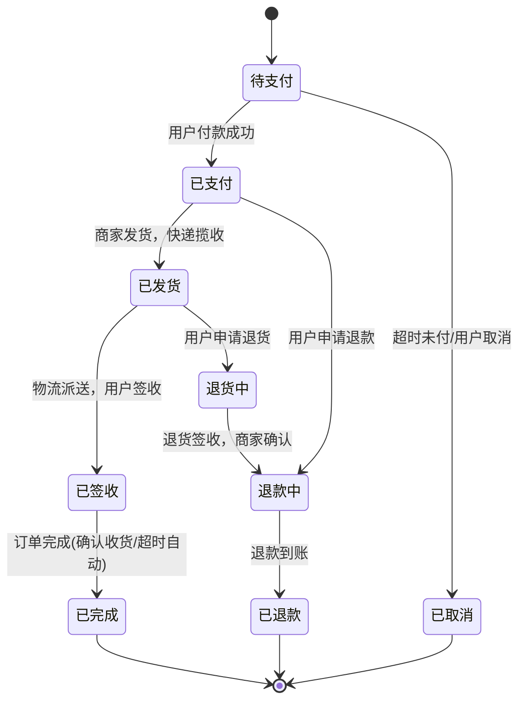

### 电商业务流程的粒度划分

#### 第一级：属性级 (单表，单字段)
**最小单元，原子状态跃迁**

- **操作**：对一个实体的一个状态字段做条件更新。
- **典型例子**：
  - `签收`：`UPDATE shipment SET status = 'SIGNED'`
  - `已读`：`UPDATE notification SET is_read = 1`
  - `取消`：`UPDATE order SET status = 'CANCELLED'`
- **本质**：一个业务行动的最小粒度。它不关心其他实体，只完成自己核心的那个“事儿”。

---

#### 第二级：连接级 (双表关联)
**常见查询与一对一的写入**

- **操作**：围绕一个核心实体，建立或查询其唯一的附属信息。
- **典型例子**：
  - `付款`：创建支付单，并与订单绑定 → `订单表1 : 1支付表`
  - `发货`：创建物流单，并与订单绑定 → `订单表1 : 1物流表`
  - `退款`：创建退款单，关联原支付单。
- 在数据库设计上，这是一种**垂直拆分**，用于扩展核心实体。读是两表Join，写是先写子表，再更新主表状态。

---

#### 第三级：事务级 (多表连接)
**一个写操作，多个实体联动**
- **操作**：需要在一个事务内，同时操作两个以上的实体，保证数据一致性。
- **典型例子**：
  - `下单`：用户表(校验) → 商品表(扣库存) → 订单头(生成) → 订单行(快照) → 优惠券(核销)。
  - `拆单发货`：一个订单，生成多个物流单，库存要对应扣减。
- **本质**：这是一个**跨聚合的领域编排**。你不再是一个简单的状态机，而是一个复杂的状态流转协调器。

---

#### 第四级：流程级 (长流程，状态机)
**端到端的长业务流**
- **操作**：由多个有序的阶段（每个阶段都是一个“连接级”或“事务级”操作）串联而成的完整生命周期。
- **典型例子**：
  - `下单 → 付款 → 发货 → 签收 → 完成`：这就是一个典型的**订单状态机**的一次完整旅程。
- **本质**：这是业务最大的粒度。它定义了实体从生到死的完整路径，每一步都是上述三个级别操作之一的触发和结果。

**购物系统中一个订单完整的业务流程**（核心里程碑状态流转）：

**图上展示的就是纯粹的业务流程主线与分支：**
- 正常路径：下单 → 付款 → 发货 → 签收 → 完成  
- 取消路径：待支付时主动或超时取消  
- 逆向流程：已支付可申请退款；已发货可申请退货，之后再退款  

### 总结
**属性修改 → 两表连接 → 多表事务 → 全流程**，是把业务流程从**微观的写操作**，经**中观的实体关联**，到**宏观的生命周期管理**，进行了完美的抽象。它既是理解业务的“粒度标尺”，也是指导架构解耦和领域划分的“设计光谱”。

---

1.  **职责边界清晰化**
    -   **属性级**的操作，应该内聚在实体内，方法就是 `entity.sign()`。
    -   **连接级**的操作，适合做成一对一的领域服务，如 `PaymentService.createFor(order)`。
    -   **事务级**的操作，需要应用服务/用例层来编排多个领域服务，并管理事务。

2.  **发现解耦的机会**
    -   如果你发现一个“连接级”操作（付款），总是与另一个“事务级”操作（下单）耦合出现，你就可以思考：它们真的必须同步完成吗？
    -   答案是：通常不。于是就有了 **异步解耦**（付款通过消息触发后续流程），把一个**事务级的大动作，拆成一个属性级触发 + 一个异步事件**。

3.  **评估重构的复杂度**
    -   想要把“属性级”重构为“连接级”（比如给签收增加一个图片凭证子表），复杂度可控。
    -   想要把一个同“连接级”的同步核心路径操作拆解成异步，则是架构性的重构，需要仔细设计状态机中间态和回滚策略。