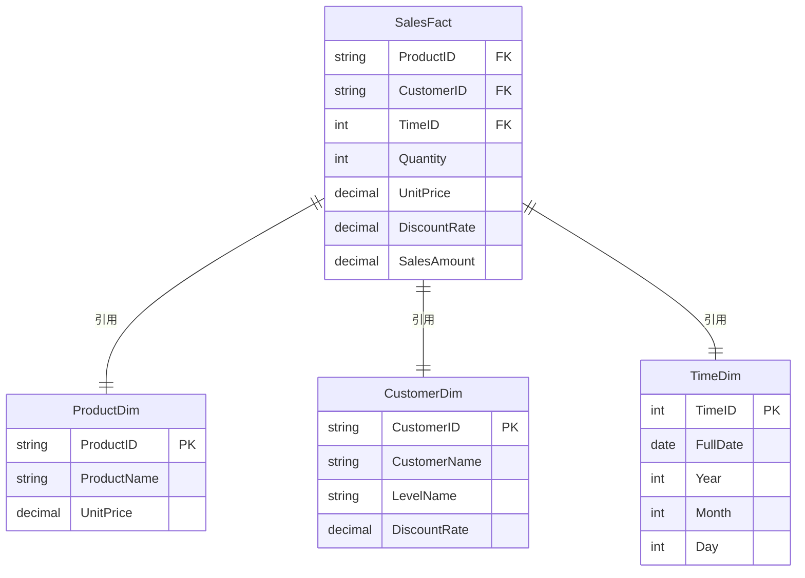
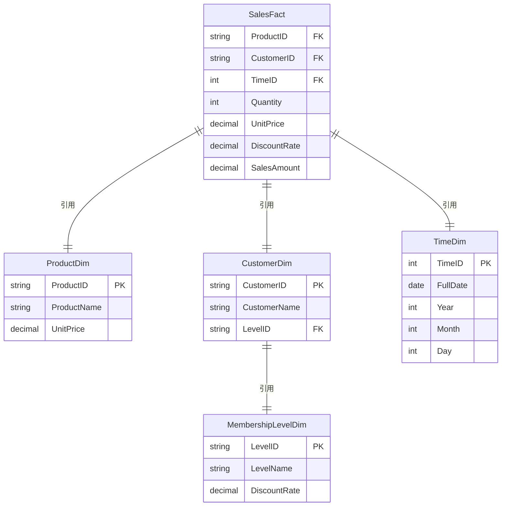

## 维度建模

### 1. 星型模型（Star Schema）

**特点**：一个事实表 + 多个扁平化的维度表（非规范化，冗余可接受）。  

**目标**：查询性能优先，适合 OLAP 分析。

---

#### 1. 事实表：`SalesFact`

记录每条订单明细的销售事实，包含度量值和维度外键。

| 列名           | 类型          | 说明                                          |
| :------------- | :------------ | :-------------------------------------------- |
| `ProductID`    | FK → Product  | 商品 ID（维度外键）                           |
| `CustomerID`   | FK → Customer | 客户 ID（维度外键）                           |
| `TimeID`       | FK → Time     | 时间维度外键（由下单时间生成）                |
| `Quantity`     | int           | 数量（事实度量）                              |
| `UnitPrice`    | decimal       | 单价（快照，来自商品表，避免历史变化）        |
| `DiscountRate` | decimal       | 折扣率（快照，来自会员等级表）                |
| `SalesAmount`  | decimal       | 计算列：`Quantity * UnitPrice * DiscountRate` |

> 事实表的主键通常是 `(ProductID, CustomerID, TimeID, ...)` 的组合，也可添加代理键。

---

#### 2. 维度表

##### 2.1 产品维度（`ProductDim`）

| 列名           | 类型    | 说明                   |
| :------------- | :------ | :--------------------- |
| `ProductID` PK | string  | 商品 ID                |
| `ProductName`  | string  | 商品名称               |
| `UnitPrice`    | decimal | 单价（可包含历史追踪） |

> 如果产品有类别、品牌等层次，也可以直接扁平在表中。

---

##### 2.2 客户维度（`CustomerDim`）

**扁平化处理**：将客户信息与会员等级信息合并到一张表，避免雪花。

| 列名            | 类型    | 说明                        |
| :-------------- | :------ | :-------------------------- |
| `CustomerID` PK | string  | 客户 ID                     |
| `CustomerName`  | string  | 客户姓名                    |
| `LevelName`     | string  | 会员等级名称（黄金/白银等） |
| `DiscountRate`  | decimal | 该等级对应的折扣率          |

---

##### 2.3 时间维度（`TimeDim`）

从 `下单时间` 提取粒度，方便按年/月/日/小时分析。

| 列名        | 类型   | 说明                  |
| :---------- | :----- | :-------------------- |
| `TimeID` PK | int    | 代理键，如 `20260415` |
| `FullDate`  | date   | 日期                  |
| `Year`      | int    | 年                    |
| `Month`     | int    | 月                    |
| `Day`       | int    | 日                    |
| `Hour`      | int    | 小时                  |
| `Weekday`   | string | 星期几                |
| `Quarter`   | int    | 季度                  |
---
#### 2. 星型模型 ER 图

---

### 2. 雪花模型（Snowflake Schema）

**特点**：**维度表被进一步规范化**，消除冗余，形成层次结构。  

**目标**：节省存储空间，保持一致性，但查询时需要更多 JOIN，性能略低于星型。

#### 1. 事实表：`SalesFact`（与星型相同）

同样包含 `ProductID`, `CustomerID`, `TimeID`, `Quantity`, `UnitPrice`, `DiscountRate`, `SalesAmount`。

---

#### 2. 维度表（规范化）

##### 2.1 产品维度（`ProductDim`）

与星型相同，产品本身没有进一步拆分（如果产品有品牌/类别，则可拆成 `Product` → `Category` → `Brand` 的雪花结构）。

| 列名           | 类型    | 说明     |
| :------------- | :------ | :------- |
| `ProductID` PK | string  | 商品 ID  |
| `ProductName`  | string  | 商品名称 |
| `UnitPrice`    | decimal | 单价     |

---

##### 2.2 客户维度（雪花化）

拆分为 `CustomerDim` 和 `MembershipLevelDim`，保持 3NF 设计。

**客户表（`CustomerDim`）**

| 列名            | 类型   | 说明                 |
| :-------------- | :----- | :------------------- |
| `CustomerID` PK | string | 客户 ID              |
| `CustomerName`  | string | 客户姓名             |
| `LevelID` FK    | string | 指向会员等级表的外键 |

---

**会员等级表（`MembershipLevelDim`）**

| 列名           | 类型    | 说明           |
| :------------- | :------ | :------------- |
| `LevelID` PK   | string  | 等级 ID（L01） |
| `LevelName`    | string  | 等级名称       |
| `DiscountRate` | decimal | 折扣率         |

##### 2.3 时间维度（`TimeDim`）

与星型相同，通常时间维度不再雪花化（除非需要更细的层次如 `Year` → `Quarter` → `Month`，但一般合并为一张表）。

---

#### 3. 雪花模型 ER 图

---

### 3. 星型 vs 雪花：对比与选择

| 维度           | 星型模型                 | 雪花模型                     |
| :------------- | :----------------------- | :--------------------------- |
| **维度表数量** | 较少（扁平化）           | 较多（规范化）               |
| **数据冗余**   | 高（维度属性重复）       | 低（通过外键引用）           |
| **查询性能**   | 快（JOIN 次数少）        | 稍慢（需多表 JOIN）          |
| **存储空间**   | 大（冗余存储）           | 小（无冗余）                 |
| **ETL 复杂度** | 简单（直接填充）         | 较复杂（需维护外键关系）     |
| **适用场景**   | 查询性能要求高、维度稳定 | 存储敏感、维度层次复杂且易变 |

实际生产中，**星型模型更常见**，因为它简单、查询快，适合绝大多数分析需求。雪花模型只在维度表频繁变化或存储成本极其敏感时使用。

---

### 5. 具体案例

#### 数据表

| 表名                   | 说明               | 表名                   | 说明                  |
| :--------------------- | :----------------- | :--------------------- | :-------------------- |
| `base_province`        | **省份信息表**     | `base_source`          | **来源渠道表**        |
| `base_subject_info`    | **学科信息表**     | `base_category_info`   | **商品分类表**        |
| `user_info`            | **用户信息表**     | `vip_change_detail`    | 用户VIP等级变更记录表 |
| `course_info`          | **课程信息表**     | `chapter_info`         | **课程章节表**        |
| `video_info`           | **视频信息表**     | `knowledge_point`      | **知识点表**          |
| `user_chapter_process` | 用户章节学习进度表 | `favor_info`           | 用户收藏表            |
| `comment_info`         | 课程评论表         | `review_info`          | 课程评价表            |
| `cart_info`            | 购物车表           | `order_info`           | 订单信息表            |
| `order_detail`         | 订单明细表         | `payment_info`         | 支付信息表            |
| `test_paper`           | **试卷表**         | `test_paper_question`  | **题目表**            |
| `test_question_info`   | **题目信息表**     | `test_question_option` | **题目选项表**        |
| `test_point_question`  | **题目知识点**     | `test_exam`            | 考试记录表            |
| `test_exam_question`   | 考试题目答题记录表 |                        |                       |
