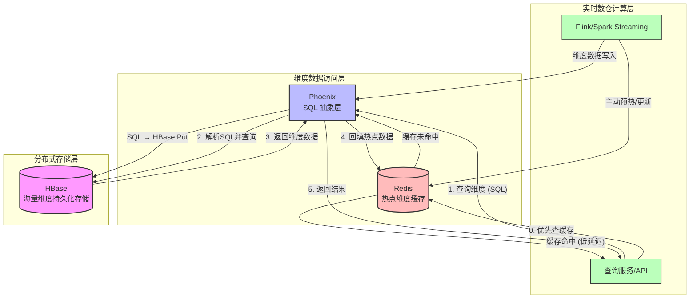

 HBase、Phoenix、Redis 在实时数仓中的定位与协作关系，聚焦于**维度数据的高吞吐持久化**与**低延迟热点访问**两条主线。

### 图表解读

- **HBase（底层持久存储）** 
  负责存储海量、持续增长的维度数据，支持高吞吐写入与随机读取，是维表的唯一真实数据源。

- **Phoenix（SQL 抽象层）** 
  架设在 HBase 之上，提供标准 JDBC/SQL 接口，将 SQL 自动转化为 HBase 的 Get/Put/Scan 操作，大幅简化开发，同时利用二级索引、盐表等特性提升查询效率。
  - 在 rowkey **最前面加一个“盐字节”**，比如 0~9 或 0~F
  
  - 相同业务数据会被**随机分配到不同盐值前缀**
  - 数据自然打散到多个 Region
  - 查询时 Phoenix 会自动并行查多个盐分区，再合并结果
  
- **Redis（热点缓存）** 
  缓存高频访问的维度数据（如热门商品、活跃用户属性），将关联查询延迟从毫秒级降至亚毫秒级。缓存未命中时自动回源到 Phoenix/HBase，并异步回填。

- **协作流程（读路径）**  
  1. 查询服务优先请求 Redis，命中则直接返回（最快路径）。  
  2. 未命中时，通过 Phoenix 以 SQL 查询 HBase。  
  3. Phoenix 将 HBase 返回的结果集透传给应用，同时可将该数据写入 Redis 设置合理 TTL，后续相同查询即可走缓存。

- **写路径** 
  流处理任务（Flink 等）既可通过 Phoenix 写入 HBase 保证数据一致，也可同时将更新的维度数据主动推入 Redis 完成缓存预热或失效处理。

这种三层协作模式在实时数仓中非常典型：**HBase 保证容量与持久化，Phoenix 降低开发复杂度，Redis 消除热点瓶颈**，共同支撑起高并发、低延迟的维表关联查询。

