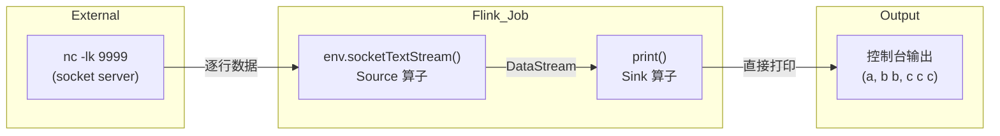
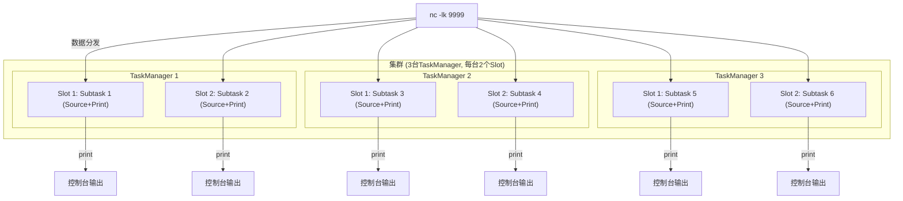

### 创建项目


创建完成后，删除 **src**目录


### 添加Module


> 包名改成自己的名字


### 添加依赖

在该Modue的pom.xml中添加依赖

```xml
<flink.version>1.16.1</flink.version>

<!-- Flink 核心依赖 -->
<dependency>
    <groupId>org.apache.flink</groupId>
    <artifactId>flink-java</artifactId>
    <version>${flink.version}</version>
</dependency>
<dependency>
    <groupId>org.apache.flink</groupId>
    <artifactId>flink-streaming-java</artifactId>
    <version>${flink.version}</version>
</dependency>
<!-- Flink 客户端依赖（本地运行需要） -->
<dependency>
    <groupId>org.apache.flink</groupId>
    <artifactId>flink-clients</artifactId>
    <version>${flink.version}</version>
</dependency>
```


### 编写实现

#### 创建包

包名为 `com.姓名全拼.flink.base`

#### 创建类

创建类 HelloWorld，此类将`Socket`输入直接输出到控制台。

```java
public static void main(String[] args) throws Exception {
    // 1. 创建流处理执行环境
    StreamExecutionEnvironment env = StreamExecutionEnvironment.getExecutionEnvironment();
    // 本地运行时设置并行度为 1，方便查看结果
    env.setParallelism(1);

    // 2. 加载数据源：监听本地 9999 端口的实时输入（需先启动 nc -lk 9999 命令）
    DataStream<String> socketSource = env.socketTextStream("node1", 9999);

    // 3. 输出结果到控制台
    socketSource.print();
    
    // 4. 触发流处理执行（流处理必须显式调用 execute）
    env.execute("Flink Stream WordCount Demo");
}
```

### 输入

```bash
[root@node1 hadoop]# yum install epel-release -y

[root@node1 hadoop]#  yum install nc -y

[root@node1 zhangsan]# nc --version
Ncat: Version 7.50 ( https://nmap.org/ncat )

[zhangsan@node1 zhangsan]~ nc -lk 9999
a
b b
c c c
```

### 输出

```bash
a
b b
c c c
```


### 知识点

```properties
假设集群有3台机器，每台机器有2个slot
env.setParallelism(6);
结果：6个并行子任务分布在3台机器上
Machine1: 线程1, 线程2
Machine2: 线程3, 线程4
Machine3: 线程5, 线程6
```



