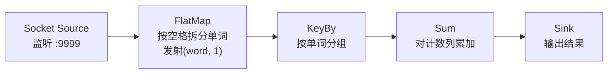

# Flink WordCount

### 实验目的

#### 输入

```bash
zhangsan@node1:~$ nc -lk 9999
a
b b
c c c
```

#### 输出

```python
(a,1)
(b,1)
(b,2)
(c,1)
(c,2)
(c,3)
```

### 词频统计思路

 **读取文本 → 切分单词 → 映射为 `(word, 1)` → 按单词分组求和 → 输出结果**。

| 步骤            | 数据形态                                                 |
| --------------- | -------------------------------------------------------- |
| **1. 原始输入** | `["a", "b b", "c c c"]`                                  |
| **2. 切分单词** | `["a", "b", "b", "c", "c", "c"]`                         |
| **3. 初始计数** | `[("a",1), ("b",1), ("b",1), ("c",1), ("c",1), ("c",1)]` |
| **4. 分组求和** | `("a",1)`, `("b",2)`, `("c",3)`                          |
| **5. 最终输出** | `(a,1)`<br>`(b,2)`<br>`(c,3)`                            |


### Flink词频统计



### 编程实现

#### 创建包

包名为 `com.姓名全拼.flink.base`

#### 创建类

创建类 WordCount，我们这里还是使用nc作为输入源，进行词频统计。

```java
// 3. 数据处理：单词计数
DataStream<Tuple2<String, Integer>> wordCountStream = socketSource
        // 拆分每行输入为单个单词，并初始化为 (单词, 1)
        .flatMap(new FlatMapFunction<String, Tuple2<String, Integer>>() {
            @Override
            public void flatMap(String line, Collector<Tuple2<String, Integer>> out) throws Exception {
                // 按空格拆分单词
                String[] words = line.split(" ");
                for (String word : words) {
                    // 过滤空单词
                    if (!word.isEmpty()) {
                        out.collect(new Tuple2<>(word, 1));
                    }
                }
            }
        })
        // 按单词分组（Tuple2 的第一个元素）
        .keyBy(0)
        // 累加计数（Tuple2 的第二个元素）
        .sum(1);
```

记得启动执行环境。


### 测试词频统计结果

根据在nc中的输入，WordCount程序应该能够输出正确的词频统计结果。