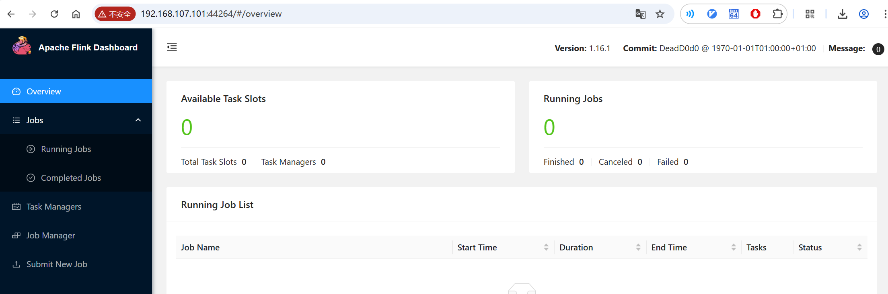
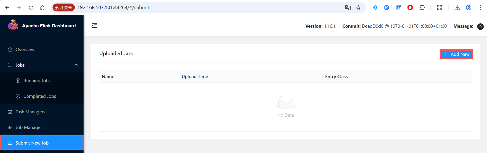
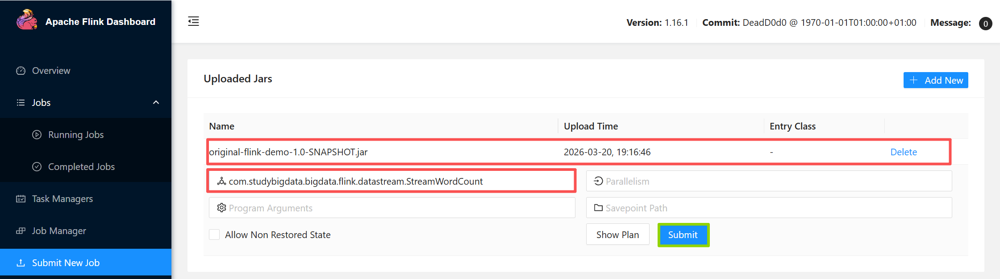
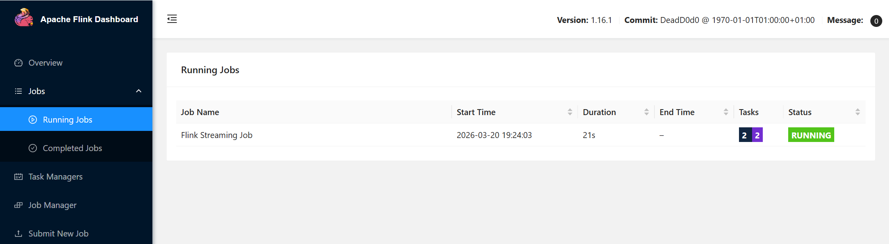
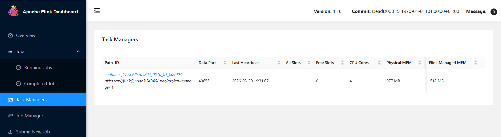
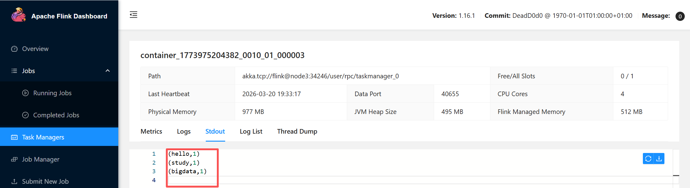
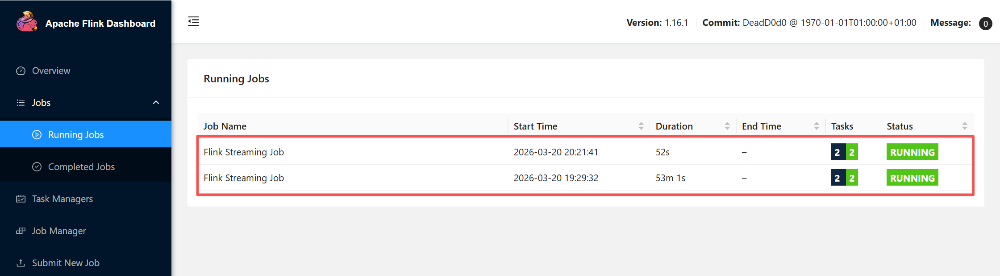
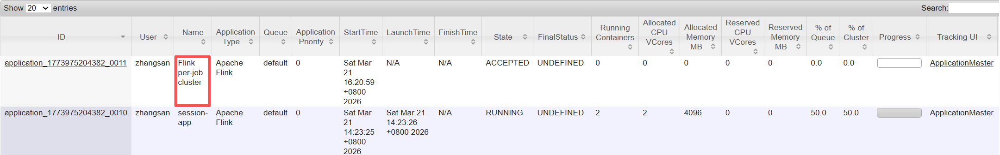

# Flink On YARN

在 **Flink on YARN** 的上下文中，"集群"本质上就是一个 **YARN Application**。

**Flink三种部署模式对比表**

| **维度**             | **Session模式**                                              | **Per-Job模式**                               | **Application模式**                                       |
| -------------------- | ------------------------------------------------------------ | --------------------------------------------- | --------------------------------------------------------- |
| **集群与作业关系**   | 多对多：一个集群服务多个作业                                 | 一对一：每个作业启动独立集群                  | 一对多：一个应用集群服务应用内所有作业（含多个Job）       |
| **资源隔离性**       | 弱隔离：作业共享集群资源，可能互相影响                       | 强隔离：作业独占集群资源，互不影响            | 应用级隔离：应用内作业共享资源，应用间隔离                |
| **集群生命周期**     | 长期运行，需手动停止；与作业解耦                             | 随作业启动/销毁，自动释放资源                 | 随应用启动/销毁，生命周期与应用绑定                       |
| **Main方法执行位置** | 客户端（Client）                                             | 客户端（Client）                              | 集群（JobManager容器内）                                  |
| **作业提交方式**     | 通过已启动的Session集群提交（如`yarn-session.sh` + `flink run ...`） | 直接提交作业触发集群创建（如`flink run ...`） | 直接提交应用触发集群创建（如`flink run-application ...`） |
| **启动延迟**         | 低（集群已存在，仅提交JobGraph）                             | 高（需申请资源、启动集群）                    | 中（需启动集群，但无需客户端处理JobGraph）                |
| **资源利用率**       | 高（资源共享，适合短小/频繁作业）                            | 低（集群独占，可能闲置资源）                  | 中（应用内资源共享，应用间隔离）                          |
| **适用场景**         | 开发测试、小作业频繁提交、资源敏感环境                       | 生产环境关键任务、高隔离要求、长作业          | 云原生/容器化环境，应用级管理，减轻客户端压力             |
| **典型部署工具**     | YARN Session、Kubernetes Session、Standalone（本质为Session） | YARN Per-Job、Kubernetes（需支持）            | YARN/Kubernetes（与编排系统深度集成）                     |
| **优缺点总结**       | ✅ 启动快，资源高效；❌ 隔离性差，集群故障影响所有作业         | ✅ 隔离性强，生产稳定；❌ 启动慢，资源开销大    | ✅ 兼顾隔离与效率，云原生适配；❌ 需较新Flink版本（v1.11+） |

**备注**：

- **Per-Job模式** 在Standalone独立集群中无法使用，需依赖YARN/K8s等资源管理器。
- **Application模式** 进一步优化了资源分配和客户端负载，适合复杂应用或云原生部署。


## Flink部署


## NetCat输入

启动NetCat作为Socket类型的输入源

```bash
[root@node1 zhangsan]# nc --version
Ncat: Version 7.50 ( https://nmap.org/ncat )

[root@node1 zhangsan]# nc -lk 9999
```


## 项目打包

将`edu-flink-study`项目打包

pom.xml

```xml
    <properties>
	<flink.version>1.16.1</flink.version>
    </properties>

    <build>
        <plugins>
            <plugin>
                <groupId>org.apache.maven.plugins</groupId>
                <artifactId>maven-shade-plugin</artifactId>
                <version>3.2.4</version>
                <executions>
                    <execution>
                        <phase>package</phase>
                        <goals>
                            <goal>shade</goal>
                        </goals>
                        <configuration>
                            <artifactSet>
                                <excludes>
                                    <exclude>com.google.code.findbugs:jsr305</exclude>
                                    <exclude>org.slf4j:*</exclude>
                                    <exclude>log4j:*</exclude>
                                </excludes>
                            </artifactSet>
                            <filters>
                                <filter>
                                    <!-- Do not copy the signatures in the META-INF folder.
                                    Otherwise, this might cause SecurityExceptions when using the JAR. -->
                                    <artifact>*:*</artifact>
                                    <excludes>
                                        <exclude>META-INF/*.SF</exclude>
                                        <exclude>META-INF/*.DSA</exclude>
                                        <exclude>META-INF/*.RSA</exclude>
                                    </excludes>
                                </filter>
                            </filters>
                            <transformers combine.children="append">
                                <transformer
                                        implementation="org.apache.maven.plugins.shade.resource.ServicesResourceTransformer">
                                </transformer>
                            </transformers>
                        </configuration>
                    </execution>
                </executions>
            </plugin>
        </plugins>

    </build>

```


```bash
(base) [zhangsan@node2 conf]$ vim flink-conf.yaml
bind 0.0.0.0
```


## YARN运行模式


`YARN`上部署的过程是：客户端把`Flink`应用提交给`YARN`的`ResourceManager`，`YARN`的`ResourceManager`会向`YARN`的`NodeManager`申请容器。在这些容器上，`Flink`会部署`JobManager`和`TaskManager`的实例，从而启动集群。`Flink`会根据运行在`JobManger`上的作业所需要的`Slot`数量动态分配`TaskManager`资源。

### 相关准备和配置

具体配置步骤如下：

1. 配置环境变量，增加环境变量配置如下：

```bash
export HADOOP_HOME=/opt/bigdata/hadoop/default
export HADOOP_CONF_DIR=$HADOOP_HOME/etc/hadoop
export YARN_CONF_DIR=$HADOOP_HOME/etc/hadoop
export HADOOP_CLASSPATH=$(hadoop classpath)
```

2. 启动Hadoop集群。

### Session模式

需要向YARN申请一个YARN Application（Session会话）。

#### 启动Session

```bash
# -d,--detached: 以分离模式运行作业
# -nm,--name: 为 YARN 上的应用设置自定义名称 
[zhangsan@node2 hadoop]$ yarn-session.sh -d -nm "session-app"
... ... 
2026-03-21 14:23:28,941 INFO  org.apache.flink.yarn.YarnClusterDescriptor                  [] - YARN application has been deployed successfully.
2026-03-21 14:23:28,942 INFO  org.apache.flink.yarn.YarnClusterDescriptor                  [] - Found Web Interface node1:44264 of application 'application_1773975204382_0010'.
```

Session启动之后会给出一个Web UI地址` node1:44264`以及一个YARN application ID。




```bash
[zhangsan@node1 ~]$ jps
2328 NameNode
2521 DataNode
4044 NodeManager
52317 YarnTaskExecutorRunner
2767 SecondaryNameNode
52415 Jps
```


#### 提交作业

用户可以通过`Web UI`或者`命令行`两种方式提交作业。

##### 通过Web UI提交作业









###### 输入数据

```bash
[root@node1 zhangsan]# nc -lk 9999
hello
study bigdata
```

###### 结果输出



#### 通过命令行提交作业

```bash
(base) [zhangsan@node2 ~]$ pwd
/home/zhangsan
(base) [zhangsan@node2 ~]$ ls original-flink-demo-1.0-SNAPSHOT.jar
original-flink-demo-1.0-SNAPSHOT.jar

(base) [zhangsan@node2 ~]$ flink run -t yarn-session -Dyarn.application.id=application_1773975204382_0010  -c com.studybigdata.bigdata.flink.datastream.Stre
amWordCount  original-flink-demo-1.0-SNAPSHOT.jar
SLF4J: Class path contains multiple SLF4J bindings.
SLF4J: Found binding in [jar:file:/opt/bigdata/flink/flink-1.16.1/lib/log4j-slf4j-impl-2.17.1.jar!/org/slf4j/impl/StaticLoggerBinder.class]
SLF4J: Found binding in [jar:file:/opt/bigdata/hadoop/hadoop-3.1.3/share/hadoop/common/lib/slf4j-log4j12-1.7.25.jar!/org/slf4j/impl/StaticLoggerBinder.class]
SLF4J: See http://www.slf4j.org/codes.html#multiple_bindings for an explanation.
SLF4J: Actual binding is of type [org.apache.logging.slf4j.Log4jLoggerFactory]
2026-03-21 16:01:20,927 WARN  org.apache.flink.yarn.configuration.YarnLogConfigUtil        [] - The configuration directory ('/opt/bigdata/flink/flink-1.16.1/conf') already contains a LOG4J config file.If you want to use logback, then please delete or rename the log configuration file.
2026-03-21 16:01:21,013 INFO  org.apache.hadoop.yarn.client.RMProxy                        [] - Connecting to ResourceManager at node2/192.168.107.102:8032
2026-03-21 16:01:21,241 INFO  org.apache.flink.yarn.YarnClusterDescriptor                  [] - No path for the flink jar passed. Using the location of class org.apache.flink.yarn.YarnClusterDescriptor to locate the jar
2026-03-21 16:01:21,560 INFO  org.apache.flink.yarn.YarnClusterDescriptor                  [] - Found Web Interface node1:44264 of application 'application_1773975204382_0010'.
Job has been submitted with JobID b010565e27a37b92a3f92a119f510fc4

```





### Per-Job模式(deprecated)

 deprecated in Flink 1.15

```bash
[zhangsan@node1 ~]$ flink run -d -t yarn-per-job -c com.studybigdata.bigdata.flink.datastream.StreamWordCount  original-flink-demo-1.0-SNAPSHOT.jar

# Job Clusters are deprecated
2026-03-21 20:50:09,350 WARN  org.apache.flink.yarn.YarnClusterDescriptor                  [] - Job Clusters are deprecated since Flink 1.15. Please use an Application Cluster/Application Mode instead.
```




> 如YARN Application处于pending状态，从ApplicationMaster处，无法跳转到FlinkDashBoard，考虑是不是资源不够。


### Application模式

```bash
[zhangsan@node1 ~]$ flink run-application -d -t yarn-application -c com.studybigdata.bigdata.flink.datastream.StreamWordCount  original-flink-demo-1.0-SNAPSHOT.jar 
```


## 历史服务器


## 错误排查

```bash
yarn logs -applicationId 
```

