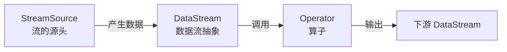
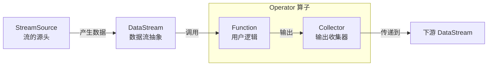
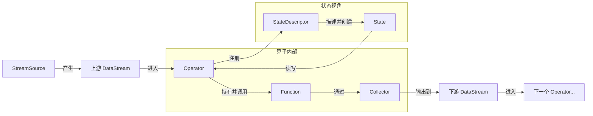

## Flink流计算基础概念



- **StreamSource（流源）** 
  流的**起点**，负责对接外部系统（Kafka、文件、Socket）把数据“引”进来，转成 `DataStream`。 
  它就是一个算子的特殊实现，但这个算子没有上游输入，只有输出。

- **Stream（流）** 
  代表**无限的数据记录序列**。类比成“水流”——数据像水一样源源不断地流过。 
  在 API 中 `DataStream<T>` 就是“承载 T 类型数据的数据流”。
- **Operator（算子）** 
  对数据流进行**转换的逻辑节点**。比如 `map`、`filter`、`keyBy`、`window` 本质上都会在底层生成一个或一串 Operator。 
  作业的拓扑图就是由 Operator 节点和它们之间的边构成的。 
  `StreamSource` 本质上也是一个 Operator（`SourceOperator`）。



- **Function（函数）** 
  用户**自定义的处理逻辑**，是真正“干活的代码”。 
  例如 `MapFunction`、`FlatMapFunction`、`ReduceFunction`。 
  Operator 是框架侧的“执行容器”，Function 是用户侧的“业务逻辑”。 
  Operator 会在内部调用 Function，比如 `map(myMapFunction)`，Operator 把每条数据传给 `myMapFunction.map()`，然后收集结果。
- **Collector（收集器）** 
  函数**输出结果的出口**。 
  典型的签名：`void flatMap(T value, Collector<O> out)`。 
  你调用 `out.collect(...)` 就是把数据发到下游。它屏蔽了网络传输、序列化等细节。 
  命名含义就是“收集者/汇集器”，把你的零散输出收集起来统一交给下游算子。



- **State（状态）** 
  算子需要**记住**的数据。流处理是“来一条处理一条”，但很多场景需要跨记录记住信息（如计数、累加、窗口内缓存）。这些记忆就是 State。 
  Flink 把它做成可容错的、分布式的 keyed state / operator state。

- **Descriptor（描述符）** 
  只描述“是什么样”，但不包含实际数据。用于**创建或注册**一个东西。 
  这是典型的“描述符模式”（Descriptor Pattern），比如 Java 里 `FileDescriptor`、`SecurityDescriptor` 等。

- **StateDescriptor（状态描述符）** 
  描述状态的**元信息**：名称、类型、TTL 等，但**不是状态本身**。 
  你需要通过它来向 Flink 的运行时“申请”一份状态实例：  

  ```java
  ValueStateDescriptor<Long> descriptor = new ValueStateDescriptor<>(
    "count", Long.class
  );
  ValueState<Long> countState = getRuntimeContext().getState(descriptor);
  ```

  这里 `descriptor` 就是对 State 的“规格说明书”。
