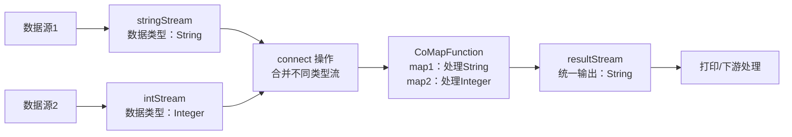

### 一、Flink Connect 操作核心说明

Flink 的 `connect` 是比 `union` 更灵活的流合并操作：
- **union**：仅能合并**同数据类型**的多个流，合并后仍是同类型流；
- **connect**：可以合并**不同数据类型**的两个流，合并后得到 `ConnectedStreams`，需通过 `CoMapFunction`/`CoFlatMapFunction` 分别处理两种类型的数据。

### 二、流程图


### 三、Connect 操作完整代码示例
以下示例实现「字符串流 + 整数流」的 Connect 合并，并分别处理两种类型的数据：

```java
package com.studybigdata.bigdata.flink.datastream;

import org.apache.flink.streaming.api.datastream.ConnectedStreams;
import org.apache.flink.streaming.api.datastream.DataStream;
import org.apache.flink.streaming.api.environment.StreamExecutionEnvironment;
import org.apache.flink.streaming.api.functions.co.CoMapFunction;

public class StreamConnect {
    public static void main(String[] args) throws Exception {
        // 1. 创建执行环境
        StreamExecutionEnvironment env = StreamExecutionEnvironment.getExecutionEnvironment();
        env.setParallelism(1);

        // 2. 构建不同数据类型的两个流
        // 流1：字符串类型
        DataStream<String> stringStream = env.fromElements("Flink", "Connect", "Example");
        // 流2：整数类型
        DataStream<Integer> intStream = env.fromElements(1, 2, 3);

        // 3. 执行 Connect 操作（合并不同类型流）
        ConnectedStreams<String, Integer> connectedStreams = stringStream.connect(intStream);

        // 4. 处理 ConnectedStreams：分别处理两种类型的数据
        DataStream<String> resultStream = connectedStreams.map(new CoMapFunction<String, Integer, String>() {
            // 处理第一个流（字符串流）的元素
            @Override
            public String map1(String value) throws Exception {
                return "String Stream: " + value;
            }

            // 处理第二个流（整数流）的元素
            @Override
            public String map2(Integer value) throws Exception {
                return "Integer Stream: " + value * 10; // 对整数做简单处理
            }
        });

        // 5. 打印结果
        resultStream.print("Connect Result: ");

        // 6. 执行任务
        env.execute("Flink Connect Stream Example");
    }
}
```

#### 代码关键说明：
1. **Connect 特性**：`connect` 仅支持**两个流**的合并（不支持多流），且允许流的类型不同；
2. **处理逻辑**：必须通过 `CoMapFunction`（或 `CoFlatMapFunction`）定义 `map1`（处理第一个流）和 `map2`（处理第二个流），最终输出统一类型的流；
3. **输出统一化**：示例中无论输入是 String 还是 Integer，最终都转换为 String 输出，保证下游处理的一致性。


### 四、代码运行结果
执行代码后，控制台输出如下（顺序可能略有差异）：
```
Connect Result: String Stream: Flink
Connect Result: String Stream: Connect
Connect Result: String Stream: Example
Connect Result: Integer Stream: 10
Connect Result: Integer Stream: 20
Connect Result: Integer Stream: 30
```

### 总结
1. **Connect 核心特性**：支持合并**不同数据类型**的两个流，需通过 `CoMapFunction`/`CoFlatMapFunction` 分别处理；
2. **与 Union 区别**：Union 合并同类型多流、无额外处理逻辑；Connect 仅合并两个流、支持不同类型、可自定义差异化处理；
3. **典型场景**：双流关联、数据补全、实时对账（结合状态使用）。