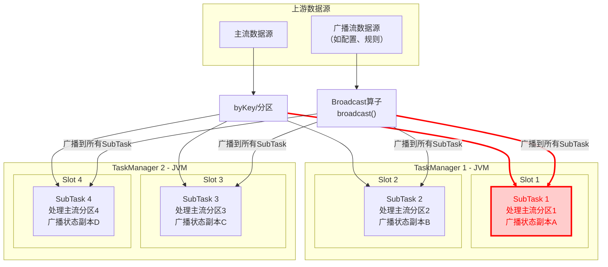
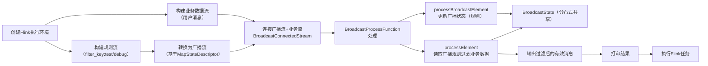

# Flink Broadcast（广播流）

Flink 的 Broadcast（广播流）是一种特殊的流合并方式，用于将**配置/规则/维度数据**（小体量、低频更新）广播到所有并行子任务中，让每个任务都能访问到这些全局数据，常与普通数据流结合实现动态规则匹配、维度补全等场景。



### 广播内存模型

- 广播流由 `Broadcast算子` 通过 `broadcast()` 分区策略直接发送给所有下游 SubTask。
- 主流经过 `keyBy`（或其他分区策略）后，每个分区仅到达对应的一个 SubTask。
- 每个 **Slot 代表一个算子链的并行实例**，这里用 `SubTask` 体现；为简洁略去了链内其他算子，但在物理上它可能就是 `KeyedBroadcastProcessFunction` 这个算子。
- 每个 SubTask 持有**完整的广播状态副本**（A/B/C/D）。

- Flink 的 **Slot** 是资源调度的基本单位，**一个 Slot 里通常运行一个完整的算子链（Operator Chain），这个链可以包含多个算子**。也就是 **一个算子链 = 一个 Task = 一个 SubTask**。
- 算子链内部结构， 比如： SubTask4   `Source->Map->KeyedBroadcastProcess` 


### 核心特点

- 广播流（Broadcast Stream）：被广播的流，数据会复制到所有并行实例；
- 普通流（Data Stream）：业务数据流，每个并行实例处理自己分片的数据；
- 结合方式：通过 `connect` + `BroadcastProcessFunction` 实现双流结合，广播流数据会存入 `BroadcastState`（可共享的状态）。

### 示例

##### 主流数据

| 用户标识  | 消息内容      |
| --------- | ------------- |
| user:1001 | 正常业务消息  |
| user:1002 | test测试消息  |
| user:1003 | debug调试消息 |
| user:1004 | 订单支付成功  |

##### 过滤规则

| 关键词 |
| ------ |
| test   |
| debug  |

##### 过滤后的结果

| 用户标识  | 消息内容     |
| --------- | ------------ |
| user:1001 | 正常业务消息 |
| user:1004 | 订单支付成功 |


### Flink BroadcastProcessFunction 详解



`BroadcastProcessFunction` 是 Flink 中用于处理**广播流（Broadcast Stream）** 与**主流（Data Stream）** 连接（connect）操作的核心 API。它允许你在动态更新规则、实时配置、特征库等场景下，将低吞吐的控制流（广播流）中的数据高效地分发到所有并行任务实例，并应用于主流数据的处理。

#### 核心概念

- **广播流（Broadcast Stream）**：一个普通的数据流，通过 `.broadcast(广播状态描述符)` 方法转换成广播流。广播流的数据会完整地发送到下游所有并行算子实例。
- **广播状态（Broadcast State）**：一种特殊的算子状态，每个并行任务都持有一份相同的副本。广播流通过更新广播状态来动态改变处理逻辑。
- **连接（Connect）**：使用 `keyedStream.connect(broadcastStream)` 或 `dataStream.connect(broadcastStream)` 将主流与广播流连接，然后调用 `.process(new YourBroadcastProcessFunction())`。

#### BroadcastProcessFunction 的声明

```java
public abstract class BroadcastProcessFunction<IN1, IN2, OUT> extends BaseBroadcastProcessFunction {
    public abstract void processElement(IN1 value, ReadOnlyContext ctx, Collector<OUT> out) throws Exception;
    public abstract void processBroadcastElement(IN2 value, Context ctx, Collector<OUT> out) throws Exception;
}
```

- **IN1**：主流中元素的类型。
- **IN2**：广播流中元素的类型。
- **OUT**：输出元素的类型。

#### 主要方法

##### 1. `processElement`

处理主流中的每一个元素。你可以：

- 访问**只读**的广播状态（通过 `ctx.getBroadcastState(stateDescriptor)`）。
- 使用 `ctx.timerService()` 注册事件/处理时间定时器。
- 通过 `Collector` 发送结果数据。
- 不能修改广播状态。

##### 2. `processBroadcastElement`

处理广播流中的每一个元素。你可以：

- 获取**可写**的广播状态，并更新它（例如动态添加/删除规则）。
- 访问**只读**的广播状态（但不能直接修改 `ValueState` 等，因为广播状态是共享的）。
- 通过 `Collector` 发送数据（但通常广播流输出很少用）。

#### 关键上下文对象

- **`ReadOnlyContext`**：在 `processElement` 中提供，**仅允许读取**广播状态。
- **`Context`**：在 `processBroadcastElement` 中提供，**允许读写**广播状态。
- 两者都提供 `applyToKeyedState` 方法（有限地操作键控状态），但需要小心使用。

#### 典型使用场景

1. **动态规则更新**：广播流持续发送最新规则，主流数据根据当前规则进行过滤、转换或告警。
2. **实时黑名单**：广播流更新黑名单集合，主流数据判断是否命中。
3. **特征库/配置更新**：特征映射表（如设备ID → 设备类型）实时更新，主流数据做丰富处理。
4. **AB测试分流**：广播流下发流量比例配置，主流根据配置动态选择分支。


## Broadcast 入门示例

以下示例实现「规则广播流 + 业务数据流」的结合：
- 广播流：动态更新的过滤规则（比如过滤掉包含特定关键词的消息）；
- 业务流：普通字符串消息流；
- 核心逻辑：用广播的规则过滤业务流数据。

##### 设置并行度

```java
env.setParallelism(1);
```

##### 构建业务数据流

```java
// 待过滤的消息
DataStream<String> businessStream = env.fromElements(
        "user:1001,msg:正常业务消息",
        "user:1002,msg:test测试消息（需过滤）",
        "user:1003,msg:debug调试消息（需过滤）",
        "user:1004,msg:订单支付成功"
);
```

##### 构建广播流

```java
// 动态过滤规则（比如更新规则：过滤掉包含"test"的消息）
        DataStreamSource<String> ruleStream = executionEnvironment.fromElements("test", "debug");
```

##### 定义广播状态的描述符

```java
// 用于标识广播状态，存储规则：key=ruleId，value=过滤关键词）
    private static final MapStateDescriptor<String, List<String>> RULE_STATE_DESCRIPTOR =
            new MapStateDescriptor<>("filter_rules", Types.STRING, Types.LIST(Types.STRING));
```

>  **MapStateDescriptor**：定义广播状态**BroadcastState**的结构（Key-Value 类型），是广播流和业务流共享状态的标识；

##### 将规则流转换为广播流

```java
// 4. 将规则流转换为广播流
BroadcastStream<String> broadcastRuleStream = ruleStream.broadcast(RULE_STATE_DESCRIPTOR);        BroadcastStream<String> broadcastStream = ruleStream.broadcast(RULE_STATE_DESCRIPTOR);
```

**BroadcastStream**：通过 `broadcast(descriptor)` 将普通流转为广播流；

##### 连接广播流和业务流

```java
// 连接广播流和业务流
BroadcastConnectedStream<String, String> connectedStream = mainStream.connect(broadcastStream);
```

##### 处理连接后的流

```java
        SingleOutputStreamOperator<String> processed = connectedStream.process(new BroadcastProcessFunction<String, String, String>() {
            @Override
            public void processElement(String value, ReadOnlyContext ctx, Collector<String> out) throws Exception {

                ReadOnlyBroadcastState<String, List<String>> broadcastState = ctx.getBroadcastState(RULE_STATE_DESCRIPTOR);
                List<String> rules = broadcastState.get("rule");
                System.out.println("Main: "+ value + "  Rules: " +rules);
            }

            @Override
            public void processBroadcastElement(String value, Context ctx, Collector<String> out) throws Exception {

                BroadcastState<String, List<String>> broadcastState = ctx.getBroadcastState(RULE_STATE_DESCRIPTOR);
                if (broadcastState.contains("rule")){
                    broadcastState.get("rule").add(value);
                }else {
                    broadcastState.put("rule", new ArrayList<>());
                    broadcastState.get("rule").add(value);
                }
                System.out.println("Broadcast add Rule: " + broadcastState.get("rule"));
            }
        });
processed.print();
```


```java
// 7. 执行任务
env.execute("Flink Broadcast Stream Example");
```


#### 代码关键说明

- `processBroadcastElement`：处理广播流数据，更新 `BroadcastState`（所有并行实例可见）；
- `processElement`：处理业务流数据，读取**只读**的 `BroadcastState`，实现规则匹配；


## 四、代码运行结果

### 并行度为1

```properties
1. Main: user:1002,msg:test测试消息（需过滤）  Rules: null
2. Broadcast add Rule: [test]
3. Main: user:1003,msg:debug调试消息（需过滤）  Rules: [test]
4. Broadcast add Rule: [test, debug]
5. Main: user:1004,msg:订单支付成功  Rules: [test, debug]
6. Main: user:1001,msg:正常业务消息  Rules: [test, debug]
```

- 通过第一条数据可以看到，主流数据处理1002时，广播流晚到，还没有构造出广播规则，因此，这种情况无法根据规则过滤。
- 通过第二条数据可以看到，广播流添加规则 test；
- 通过第三条数据可以看懂，主流数据处理1003数据时，广播流中只有一条广播规则 test，因此，主流数据中存在debug无法被过滤掉；
- 通过第四条数据可以看到，广播流添加了规则debug；
- 通过第五六条数据可以看到，广播流规则已完整，但是主流数据中都是合规数据，这时候，规则完整也没有了意义。


### 并行度为2

```properties
1. Main: user:1002... Rules: null    → 【子任务1】处理主流数据
2. Broadcast add Rule: [test]        → 【子任务1】处理广播规则test
3. Main: user:1004... Rules: [test]  → 【子任务1】处理主流数据
4. Broadcast add Rule: [test, debug] → 【子任务1】处理广播规则debug

5. Main: user:1003... Rules: null    → 【子任务2】处理主流数据
6. Broadcast add Rule: [test]        → 【子任务2】处理广播规则test（多出来的第1行）
7. Main: user:1001... Rules: [test]  → 【子任务2】处理主流数据
8. Broadcast add Rule: [test, debug] → 【子任务2】处理广播规则debug（多出来的第2行）
```

## 五、open 预加载初始规则

算子启动时提前加载兜底旧规则，解决**启动初期主流先到无规则**的问题

可以重写 open方法，实现预加载规则。


## 六、Broadcast 核心注意事项

1. **数据体量**：广播流适合小体量数据（如配置、规则），因为会复制到所有并行实例，大量数据会导致内存压力；
2. **状态一致性**：`BroadcastState` 是分布式的，更新后所有并行实例会同步，但仅支持 `put`/`remove` 等简单操作，不支持聚合；
3. **使用场景**：动态规则过滤、维度表补全（如广播商品维度数据，补全订单流的商品名称）、实时配置更新。

## 总结
1. **Broadcast 核心作用**：将小体量、低频更新的全局数据（规则/配置）广播到所有并行子任务，供业务流实时使用；
2. **核心组件**：`MapStateDescriptor`（状态描述）、`BroadcastStream`（广播流）、`BroadcastProcessFunction`（双流处理）；
3. **与普通 Connect 区别**：普通 Connect 是两个流的一对一合并，Broadcast 是“一对多”的全局分发，且广播数据存入共享状态。

