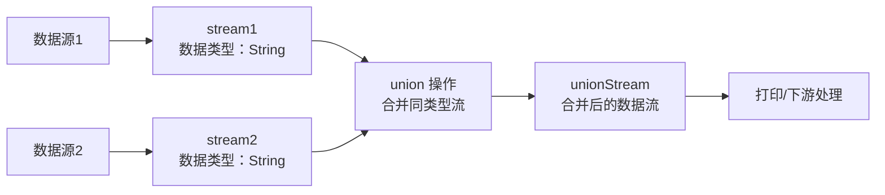

### 一、流程图



### 二、Flink Union 操作实现代码

首先为你提供可直接运行的 Flink 代码示例，实现两个流（stream1、stream2）的 Union 操作，代码基于 Flink 1.16+ 版本：

```java
import org.apache.flink.api.common.typeinfo.Types;
import org.apache.flink.streaming.api.datastream.DataStream;
import org.apache.flink.streaming.api.environment.StreamExecutionEnvironment;

public class FlinkUnionExample {
    public static void main(String[] args) throws Exception {
        // 1. 创建 Flink 流执行环境
        StreamExecutionEnvironment env = StreamExecutionEnvironment.getExecutionEnvironment();
        env.setParallelism(1); // 简化测试，设置并行度为1

        // 2. 构建第一个数据流 stream1（示例数据：字符串类型）
        DataStream<String> stream1 = env.fromElements("stream1-1", "stream1-2", "stream1-3")
                .returns(Types.STRING);

        // 3. 构建第二个数据流 stream2（需与 stream1 数据类型一致）
        DataStream<String> stream2 = env.fromElements("stream2-1", "stream2-2", "stream2-3")
                .returns(Types.STRING);

        // 4. 执行 Union 操作：合并 stream1 和 stream2
        DataStream<String> unionStream = stream1.union(stream2);

        // 5. 打印合并后的流数据，验证结果
        unionStream.print("Union Result: ");

        // 6. 执行任务（Flink 流任务必须调用 execute）
        env.execute("Flink Union Stream Example");
    }
}
```

#### 代码关键说明：
1. **数据类型要求**：`union` 操作要求合并的所有流**数据类型必须完全一致**（如上例均为 String 类型），否则会报错；
2. **Union 特性**：合并后的流会保留所有输入流的元素，元素顺序不保证（并行场景下），且不会去重；
3. **多流合并**：`union` 支持合并多个流，例如 `stream1.union(stream2, stream3, stream4)`。


### 三、代码运行结果
执行代码后，控制台会输出合并后的所有元素（顺序可能因环境略有差异）：
```
Union Result: stream1-1
Union Result: stream1-2
Union Result: stream1-3
Union Result: stream2-1
Union Result: stream2-2
Union Result: stream2-3
```

### 总结
1. **Union 核心规则**：Flink 的 `union()` 仅能合并**数据类型完全相同**的数据流，合并后保留所有元素且不保证顺序；
2. **代码关键步骤**：创建执行环境 → 定义多个同类型流 → 调用 `union()` 合并 → 输出/处理结果流；
3. **Mermaid 图表逻辑**：清晰展示了从数据源、数据流合并到结果输出的完整流程，体现了 Union 操作“合并同类型流”的核心特性。