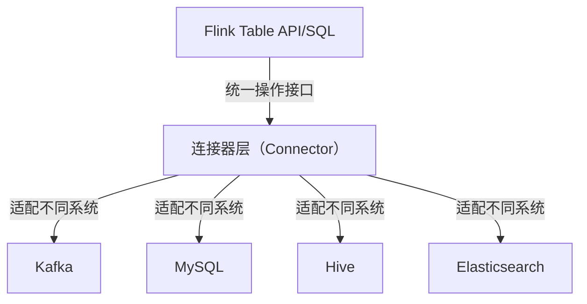
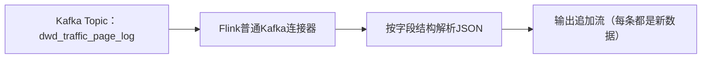
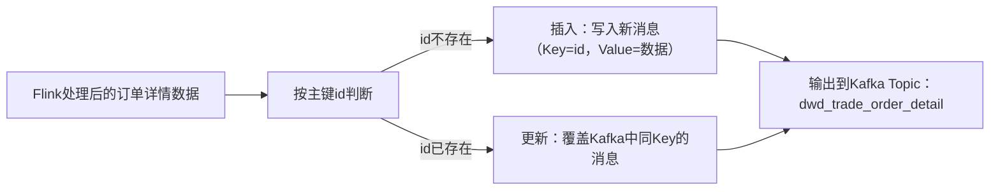

## 1. StreamTableEnvironment


| 方法                | 支持的SQL类型                | 返回值                  | 核心用途                                  |
|---------------------|------------------------------|-------------------------|-------------------------------------------|
| `tableEnv.executeSql()` | DDL（CREATE/DROP/ALTER）、DML（INSERT/UPDATE/DELETE）、DQL（SELECT） | `TableResult`（执行结果） | 执行**有副作用**的操作（创建表、写入数据），或执行SELECT并直接触发执行 |
| `tableEnv.sqlQuery()`   | 仅DQL（SELECT）              | `Table`（内存表对象）   | 执行查询并返回Table对象，供后续操作（注册视图、二次查询），**不触发执行** |


---


## 2. **Flink的Table连接器（Connector）机制**

Flink Table Connector本质是：**Flink Table API提供的一套“标准化接口”，用于让Flink和外部存储系统（Kafka/MySQL/Hive/ES等）进行数据交互**。

Flink Table API遵循“统一抽象”的设计理念，不管对接什么外部系统，操作方式都是“创建表 + 执行SQL”，连接器就是实现这个“统一抽象”的关键：



#### 核心流程（以Kafka为例）

1. **定义表时指定连接器**：通过`CREATE TABLE`的`WITH`子句，告诉Flink“这个表要用xxx连接器”；
2. **连接器初始化**：Flink根据连接器类型（如`kafka`/`upsert-kafka`），加载对应的连接器实现类；
3. **数据交互**：
   - 读数据（Source）：连接器从外部系统拉取数据，解析成Flink Table的行数据；
   - 写数据（Sink）：连接器把Flink Table的行数据，序列化后写入外部系统。

#### 典型示例：不同连接器的对比

通过`'connector' = 'xxx'`指定，这是Flink识别连接器的核心标识。

##### 示例1：Kafka连接器（普通追加）
```sql
CREATE TABLE page_log (
    common MAP<String,String>,
    page MAP<String,String>,
    ts STRING
) WITH (
    'connector' = 'kafka',                -- 连接器类型：普通Kafka
    'topic' = 'dwd_traffic_page_log',     -- 连接参数：Kafka Topic
    'properties.bootstrap.servers' = 'node1:9092', -- 连接参数：Kafka地址
    'format' = 'json',                    -- 格式参数：JSON解析
    'scan.startup.mode' = 'latest-offset' -- 读取参数：从最新偏移量开始
);
```

##### 示例2：MySQL CDC连接器（读取增量数据）
```sql
CREATE TABLE order_info (
    id STRING,
    user_id STRING,
    create_time STRING
) WITH (
    'connector' = 'mysql-cdc',            -- 连接器类型：MySQL CDC
    'hostname' = 'node1',                 -- 连接参数：MySQL地址
    'port' = '3306',                      -- 连接参数：MySQL端口
    'username' = 'root',                  -- 连接参数：用户名
    'password' = '123456',                -- 连接参数：密码
    'database-name' = 'edu_trade',        -- 连接参数：数据库名
    'table-name' = 'order_info',          -- 连接参数：表名
    'format' = 'debezium-json'            -- 格式参数：CDC数据格式
);
```


## 3. 普通Kafka表 vs Upsert Kafka表 核心区别
#### 1. 普通Kafka表（page_log，读数据）


#### 2. Upsert Kafka表（dwd_trade_order_detail，写数据）


