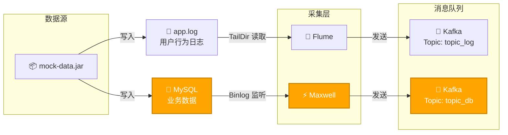
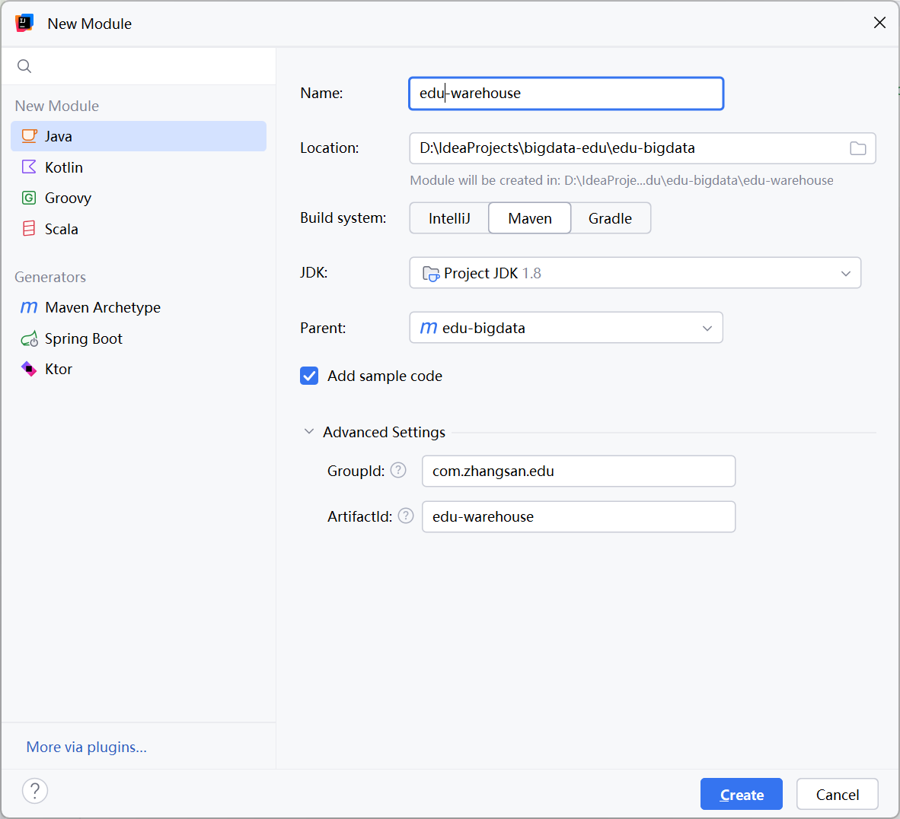

# 数仓开发之DIM层(接收Kafka数据)

## ODS层

采集到 Kafka 的 

- topic_log 
- topic_db 

主题的数据即为实时数仓的 **ODS** 层，这一层的作用是对数据做原样展示和备份。

## 前置条件




确保图中突出显示的路径是通畅的。

## DIM层设计

1. **DIM**层的设计依据是**维度建模理论**，该层存储维度模型的**维度表**。
2. 在实时计算中一般把**维度数据**写入存储容器
3. DIM 层表是用于维度关联的，要通过主键去获取相关维度信息，这种场景下 K-V 类型数据库的效率较高。常见的 K-V 类型数据库有 Redis、HBase，而 Redis 的数据常驻内存，会给内存造成较大压力，因而选用 HBase 存储维度数据。

## 开发

过滤空值数据

#### 新增Module



对Maxwell抓取的数据进行ETL，有用的部分保留，没用的过滤掉。


#### 添加依赖

在此module中添加依赖

```xml
        <hadoop.version>3.3.1</hadoop.version>

		<dependency>
            <groupId>org.apache.flink</groupId>
            <artifactId>flink-connector-kafka</artifactId>
            <version>${flink.version}</version>
        </dependency>
     
		<dependency>
            <groupId>com.alibaba</groupId>
            <artifactId>fastjson</artifactId>
            <version>1.2.68</version>
        </dependency>

        <!--如果保存检查点到hdfs上，需要引入此依赖-->
        <dependency>
            <groupId>org.apache.hadoop</groupId>
            <artifactId>hadoop-client</artifactId>
            <version>${hadoop.version}</version>
        </dependency>
```

创建包`com.姓名全拼.edu.util`

#### 创建配置类

创建包`com.zhangsan.edu.common`，并在该包中创建`EduConfig`类。

```java
public class EduConfig {
    // kafka连接地址
    public static final String KAFKA_BOOTSTRAPS = "node1:9092,node2:9092,node3:9092";
}
```


#### 创建工具类

创建包`com.zhangsan.edu.util`，后续我们会在该包中创建需要用到的工具类。

##### KafkaUtil

Flink与Kafka 交互要用到 Flink 提供的 FlinkKafkaConsumer、FlinkKafkaProducer 类，为了提高模板代码的复用性，将其封装到KafkaUtil工具类中。

此处从 Kafka 读取数据，创建 getKafkaConsumer(String topic, String groupId) 方法

```java
public class KafkaUtil {
    
    public static KafkaSource<String> getKafkaConsumer(String topic, String groupId) {

        return KafkaSource.<String>builder()
                .setBootstrapServers(EduConfig.KAFKA_BOOTSTRAPS)
                .setTopics(topic)
                .setGroupId(groupId)
                .setStartingOffsets(OffsetsInitializer.committedOffsets(OffsetResetStrategy.LATEST))
                .setValueOnlyDeserializer(new DeserializationSchema<String>() {
                    @Override
                    public String deserialize(byte[] bytes) throws IOException {
                        if (bytes != null && bytes.length != 0) {
                            return new String(bytes);
                        }
                        return null;
                    }

                    @Override
                    public boolean isEndOfStream(String s) {
                        return false;
                    }

                    @Override
                    public TypeInformation<String> getProducedType() {
                        return TypeInformation.of(String.class);
                    }
                })
                .build();
    }
}
```

##### EnvUtil

本项目所有 Flink 程序都要进行环境准备及状态后端设置，为了减少重复工作，将这部分代码抽取为工具类。

```java
import org.apache.flink.api.common.restartstrategy.RestartStrategies;
import org.apache.flink.api.common.time.Time;
import org.apache.flink.runtime.state.hashmap.HashMapStateBackend;
import org.apache.flink.streaming.api.CheckpointingMode;
import org.apache.flink.streaming.api.environment.CheckpointConfig;
import org.apache.flink.streaming.api.environment.StreamExecutionEnvironment;

public class EnvUtil {

    /**
     * 环境准备及状态后端设置
     * @param parallelism Flink 程序的并行度
     * @return Flink 流处理环境对象 
     */
    public static StreamExecutionEnvironment getExecutionEnvironment(Integer parallelism) {
        // TODO 1. 环境准备
        StreamExecutionEnvironment env = StreamExecutionEnvironment.getExecutionEnvironment();
        env.setParallelism(parallelism);

        // TODO 2. 状态后端设置
        env.enableCheckpointing(3000L, CheckpointingMode.EXACTLY_ONCE);
        env.getCheckpointConfig().setCheckpointTimeout(60 * 1000L);
        env.getCheckpointConfig().setMinPauseBetweenCheckpoints(3000L);
        env.getCheckpointConfig().setExternalizedCheckpointCleanup(
                CheckpointConfig.ExternalizedCheckpointCleanup.RETAIN_ON_CANCELLATION
        );
        env.setRestartStrategy(RestartStrategies.failureRateRestart(
                3, Time.days(1), Time.minutes(1)
        ));
        env.setStateBackend(new HashMapStateBackend());
        env.getCheckpointConfig().setCheckpointStorage(
                "hdfs://node1:8020/edu/ck"
        );
        System.setProperty("HADOOP_USER_NAME", "zhangsan");
        return env;
    }
}

```

#### 主程序

创建包`com.zhangsan.edu.dim`，我们将在此包中编写DIM层构建代码。

**DimSinkApp.java**

```java
public static void main(String[] args) throws Exception {
        // TODO 1. 环境准备及状态后端设置
        StreamExecutionEnvironment env = EnvUtil.getExecutionEnvironment(4);

        // TODO 2. 从Kafka中读取ods作为主流
        SingleOutputStreamOperator<JSONObject> jsonDS = read_ods_as_main_stream_from_kafka(env);

        // 环境执行
        env.execute();
}
```


```java
public static SingleOutputStreamOperator<JSONObject> read_ods_as_main_stream_from_kafka(StreamExecutionEnvironment env) throws Exception {
    // TODO 2. 读取业务主流
    String topic = "topic_db";
    String groupId = "dim_sink_app";
    DataStreamSource<String> eduDS = env.fromSource(KafkaUtil.getKafkaConsumer(topic, groupId),
            WatermarkStrategy.noWatermarks(), "kafka_source");

    // TODO 3. 对主流数据进行ETL
    SingleOutputStreamOperator<JSONObject> jsonDS = eduDS.flatMap(new FlatMapFunction<String, JSONObject>() {
        @Override
        public void flatMap(String value, Collector<JSONObject> out) throws Exception {
            try {
                JSONObject jsonObject = JSON.parseObject(value);
                String type = jsonObject.getString("type");
                if (!(type.equals("bootstrap-complete") || type.equals("bootstrap-start"))) {
                    // 需要的数据
                    out.collect(jsonObject);
                }
            } catch (Exception e) {
                e.printStackTrace();
                System.out.println("数据转换json错误");
            }
        }
    }) ;
    jsonDS.print();
    return jsonDS;
}
```


## 测试

#### 启动Maxwell业务采集

以全量采集 table base_source 表为例

```bash
[zhangsan@node1 default]$ bin/maxwell-bootstrap --database edu --table base_source
connecting to jdbc:mysql://node1:3306/maxwell?allowPublicKeyRetrieval=true&connectTimeout=5000&serverTimezone=Asia%2FShanghai&zeroDateTimeBehavior=convertToNull&useSSL=false
```

Flink 运行日志

```json
{"database":"edu","table":"base_source","type":"bootstrap-start","ts":1645444224,"data":{}}
{"database":"edu","table":"base_source","type":"bootstrap-insert","ts":1645444224,"data":{"id":1,"source_site":"baidu","source_url":"http://xxxx/xxx/xx/x"}}
{"database":"edu","table":"base_source","type":"bootstrap-insert","ts":1645444224,"data":{"id":2,"source_site":"tiktok","source_url":"http://xxxx/xxx/xx/x"}}
{"database":"edu","table":"base_source","type":"bootstrap-insert","ts":1645444224,"data":{"id":3,"source_site":"toutiao","source_url":"http://xxxx/xxx/xx/x"}}
{"database":"edu","table":"base_source","type":"bootstrap-insert","ts":1645444224,"data":{"id":4,"source_site":"360","source_url":"http://xxxx/xxx/xx/x"}}
{"database":"edu","table":"base_source","type":"bootstrap-complete","ts":1645444224,"data":{}}
```

#### 模拟数据

生成模拟数据

```bash
[zhangsan@node1 edu]$ java -jar edu-mock-data-1.0-SNAPSHOT.jar
```

我们可以在Flink运行日志中消费到模拟的数据。


## Flink并行度

在上面的`Flink`执行日志中，可以发现只有`3`号`subtask`消费到了数据，为`Flink`设置的并行度`4`失去了意义，原因是我们`Kafka`中的这个`topic_db`只有一个分区，接下来我们修改`Topic`分区数和`Maxwell`的分区策略。

##### Topic详情

可以发现`topic_db`默认只有一个分区

| Partition ID | Message Count | Start Offset | End Offset | Leader | Replicas |
| ------------ | ------------- | ------------ | ---------- | ------ | -------- |
| 0            | 101233        | 0            | 101233     | 3      | 3        |

> IDEA Kafka插件：https://plugins.jetbrains.com/plugin/21704-confluent

##### 修改成4分区

```shell
(base) [zhangsan@node1 edu]$ kafka-topics.sh --alter --topic topic_db --partitions 4 --bootstrap-server node1:9092,node2:9092,node3:9092
```

##### 修改maxwell

`maxwell`默认按照`database`分区，修改maxwell生产者分区策略

```properties
# What part of the data do we partition by?
#producer_partition_by=database # [database, table, primary_key, transaction_id, thread_id, column]
producer_partition_by=table
```

##### 模拟数据

```bash
java -jar edu-mock-data-1.0-SNAPSHOT.jar
```

##### Topic详情

| Partition ID | Message Count | Start Offset | End Offset | Leader | Replicas |
| ------------ | ------------- | ------------ | ---------- | ------ | -------- |
| 0            | 106676        | 0            | 106676     | 3      | 3        |
| 1            | 6198          | 0            | 6198       | 1      | 1        |
| 2            | 19930         | 0            | 19930      | 2      | 2        |
| 3            | 12324         | 0            | 12324      | 3      | 3        |

##### 重启Flink

可以看到`Flink`的`4`个并行`Subtask`在消费数据。

##### 备注

| 项目                 | 谁决定  | 作用               | 解释              |
| -------------------- | ------- | ------------------ | ----------------- |
| **Kafka 分区数**     | Kafka   | 提供多少个存储位置 | 4个分区（容器）   |
| **Maxwell 分区策略** | Maxwell | 决定数据去哪个位置 | 数据分配到4个容器 |

>  Maxwell 使用 **按表哈希（分配规则）** 将不同表的数据分发到这4个分区


## 总结


## QA

### 清空脏数据

##### MySQL 清理过期 binlog

```mysql
PURGE BINARY LOGS TO CURRENT_LOG;
```

##### 清空Kafka

```

```

##### 重置 Maxwell 位点

让 Maxwell **忽略旧的 binlog 记录**，从最新位置开始同步。

```mysql
DELETE FROM maxwell.positions;
DELETE FROM maxwell.schemas;
DELETE FROM maxwell.heartbeats;
```

