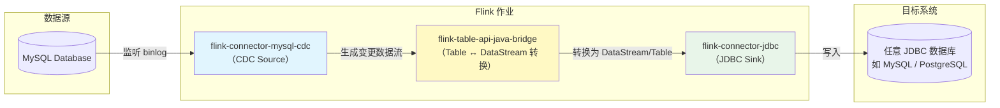

# DW-DIM-Config-Table-CDC

由于Maxwell是把全部数据统一写入一个`Topic`中, 这样显然不利于日后的数据处理。所以需要把各个维度表拆开处理。

本层的任务是将业务数据直接写入到相应的 **HBase** 表中，DIM层表名的命名规范为dim_表名：

| MySQL(edu)           | HBase目标表名 (dim_*)    |
| :------------------- | :----------------------- |
| base_category_info   | dim_base_category_info   |
| base_province        | dim_base_province        |
| base_source          | dim_base_source          |
| base_subject_info    | dim_base_subject_info    |
| chapter_info         | dim_chapter_info         |
| course_info          | dim_course_info          |
| knowledge_point      | dim_knowledge_point      |
| test_paper           | dim_test_paper           |
| test_paper_question  | dim_test_paper_question  |
| test_point_question  | dim_test_point_question  |
| test_question_info   | dim_test_question_info   |
| test_question_option | dim_test_question_option |
| user_info            | dim_user_info            |
| video_info           | dim_video_info           |

那么如何让程序知道上述映射关系呢？

- MySQL对于配置数据初始化和维护管理，
- 使用`FlinkCDC`读取配置信息表，
- 将配置流作为广播流与主流进行连接。

## Flink CDC

#### Flink CDC 是什么

**Flink CDC（Change Data Capture）** 是 Apache Flink 生态的**实时数据集成框架**，核心是**直接读取数据库日志**（如 MySQL binlog、PostgreSQL WAL），**无侵入**地捕获表的 **INSERT/UPDATE/DELETE**，转成流式数据，由 Flink 做实时处理与同步。


#### FlinkCDC依赖

```xml
        <!-- 此依赖可不导入 -->
		<dependency>
            <groupId>org.apache.flink</groupId>
            <artifactId>flink-connector-jdbc</artifactId>
            <version>${flink.version}</version>
        </dependency>
		<!-- flink-connector-mysql-cdc -->
        <dependency>
            <groupId>com.ververica</groupId>
            <artifactId>flink-connector-mysql-cdc</artifactId>
            <version>2.3.0</version>
        </dependency>
            
        <!-- 如果不引入 flink-table 相关依赖，则会报错：
        Caused by: java.lang.ClassNotFoundException: 
        org.apache.flink.connector.base.source.reader.RecordEmitter
        引入以下依赖可以解决这个问题（引入某些其它的 flink-table相关依赖也可）
        -->
        <dependency>
            <groupId>org.apache.flink</groupId>
            <artifactId>flink-table-api-java-bridge</artifactId>
            <version>${flink.version}</version>
        </dependency>
```

##### 三个依赖的定位与协作关系



##### 三者的关系与职责

| 依赖                            | 作用                                                         | 典型使用场景                                                 |
| ------------------------------- | ------------------------------------------------------------ | ------------------------------------------------------------ |
| **flink-connector-jdbc**        | 通用的 JDBC 写入（或读取）连接器。支持通过参数指定任意支持 JDBC 的数据库（MySQL、PostgreSQL、ClickHouse 等）。常作为 **Sink**，将处理后的数据批量写入外部库。 | 作为 **Sink**，将结果写回数据库。                            |
| **flink-connector-mysql-cdc**   | 专门读取 MySQL 的 binlog（变更数据捕获），实时产生变更流（Insert/Update/Delete）。返回的结果通常是 `DataStream<RowData>` 或直接注册为动态表。 | 作为 **Source**，从 MySQL 捕获增量数据。                     |
| **flink-table-api-java-bridge** | 桥接 Table API 与 DataStream API。可以将 CDC 得到的 `DataStream` 转换成 `Table`，方便用 SQL 做清洗、关联；也可将 `Table` 转回 `DataStream`，再交给 JDBC Sink。 | 在 **Stream 与 Table 之间互相转换**，实现灵活的数据处理逻辑。 |


#### Flink CDC读取模式

| 启动模式 | 方法         | 输出 `op` 类型                             | 简要说明                               |
| -------- | ------------ | ------------------------------------------ | -------------------------------------- |
| 初始模式 | `initial()`  | 全量阶段：`"r"`<br>增量阶段：`"c"/"u"/"d"` | 先全量快照，再读 binlog 增量           |
| 最新模式 | `latest()`   | 仅 `"c"/"u"/"d"`                           | 只从当前 binlog 最新位置开始，不读历史 |
| 最早模式 | `earliest()` | 仅 `"c"/"u"/"d"`                           | 从 binlog 最早位置回放所有历史变更     |

#### Flink CDC op字段

| `op` 值 | 含义               | 阶段/操作类型       |
| ------- | ------------------ | ------------------- |
| `"r"`   | 全量读取阶段的数据 | 初始快照（initial） |
| `"c"`   | INSERT 操作        | 变更数据捕获（CDC） |
| `"u"`   | UPDATE 操作        | 变更数据捕获（CDC） |
| `"d"`   | DELETE 操作        | 变更数据捕获（CDC） |

#### FlinkCDC与Maxwell

Flink CDC 输出的 JSON 与 Maxwell 输出的 JSON **格式不一样**。

两者都用于表示数据库变更事件（CDC），但结构设计、字段命名和层级有显著差异。

| 特性         | Flink CDC（Debezium 格式）                                   | Maxwell                                                      |
| ------------ | ------------------------------------------------------------ | ------------------------------------------------------------ |
| **事件结构** | 包含 `before`、`after`、`source`、`op`、`ts_ms` 等顶层字段   | 扁平化结构，主要字段如 `database`、`table`、`type`、`data`、`old` |
| **操作类型** | `op` 字段：`c`=insert, `u`=update, `d`=delete, `r`=read      | `type` 字段：`insert`、`update`、`delete`、`bootstrap-insert` |
| **数据位置** | `after` 存放新行（`c`/`u` 事件），`before` 存放旧行（`u`/`d` 事件） | `data` 存放变更后的行，`old` 存放被修改的字段（仅更新事件）  |
| **元数据**   | `source` 子对象包含 `db`、`table`、`connector`、`ts_ms` 等   | 顶层 `database`、`table`、`ts`、`xid`、`commit` 等           |
| **时间戳**   | `ts_ms` 以毫秒戳，可选 epoch 或 ISO                          | `ts` 为秒级浮点数（带毫秒小数），`datetime` 为 ISO 字符串    |

## 准备配置数据

### 配置表设计

我们将为配置表设计五个字段

| 参数名       | PK   | 说明                                         |
| ------------ | ---- | -------------------------------------------- |
| source_table | True | 作为数据源的业务数据表名                     |
| sink_table   |      | 作为数据目的地的 Phoenix 表名                |
| sink_columns |      | Phoenix 表字段                               |
| sink_pk      |      | Phoenix 表主键                               |
| sink_extend  |      | Phoenix 建表扩展，即建表时一些额外的配置语句 |

将 **source_table** 作为配置表的主键，可以通过它获取唯一的目标表名、字段、主键和建表扩展，从而得到完整的 Phoenix 建表语句。

### 配置库创建

创建数据库 **edu_config** ，注意:和 **edu** 业务库区分开

```mysql
mysql -uroot -p123456 -e"create database edu_config charset utf8 default collate utf8_general_ci"
```

### 配置表创建

在 **edu_config** 库中创建配置表 **table_process**

```mysql
Use edu_config;
CREATE TABLE `table_process` (
  `source_table` varchar(200) NOT NULL COMMENT '来源表',
  `sink_table` varchar(200) DEFAULT NULL COMMENT '输出表',
  `sink_columns` varchar(2000) DEFAULT NULL COMMENT '输出字段',
  `sink_pk` varchar(200) DEFAULT NULL COMMENT '主键字段',
  `sink_extend` varchar(200) DEFAULT NULL COMMENT '建表扩展',
  PRIMARY KEY (`source_table`)
) ENGINE=InnoDB DEFAULT CHARSET=utf8;
```

### 数据初始化

```mysql
-- ----------------------------
-- Records of table_process
-- ----------------------------
INSERT INTO `table_process` VALUES ('base_category_info', 'dim_base_category_info', 'id,category_name,create_time,update_time,deleted','id', NULL);
INSERT INTO `table_process` VALUES ('base_province', 'dim_base_province', 'id,name,region_id,area_code,iso_code,iso_3166_2', 'id', NULL);
INSERT INTO `table_process` VALUES ('base_source', 'dim_base_source', 'id, source_site', 'id', NULL);
INSERT INTO `table_process` VALUES ('base_subject_info', 'dim_base_subject_info', 'id,subject_name,category_id,create_time,update_time,deleted', 'id', NULL);
INSERT INTO `table_process` VALUES ('chapter_info', 'dim_chapter_info', 'id,chapter_name,course_id,video_id,publisher_id,is_free,create_time,deleted,update_time', 'id', NULL);
INSERT INTO `table_process` VALUES ('course_info', 'dim_course_info', 'id,course_name,course_slogan,subject_id,teacher,publisher_id,chapter_num,origin_price,reduce_amount,actual_price,course_introduce,create_time,deleted,update_time', 'id', NULL);
INSERT INTO `table_process` VALUES ('knowledge_point', 'dim_knowledge_point', 'id,point_txt,point_level,course_id,chapter_id,create_time,update_time,publisher_id,deleted', 'id', NULL);
INSERT INTO `table_process` VALUES ('test_paper', 'dim_test_paper', 'id,paper_title,course_id,create_time,update_time,publisher_id,deleted', 'id', NULL);
INSERT INTO `table_process` VALUES ('test_paper_question', 'dim_test_paper_question', 'id,paper_id,question_id,score,create_time,deleted,publisher_id', 'id', NULL);
INSERT INTO `table_process` VALUES ('test_point_question', 'dim_test_point_question', 'id,point_id,question_id,create_time,publisher_id,deleted', 'id', NULL);
INSERT INTO `table_process` VALUES ('test_question_info', 'dim_test_question_info', 'id,question_txt,chapter_id,course_id,question_type,create_time,update_time,publisher_id,deleted', 'id', NULL);
INSERT INTO `table_process` VALUES ('test_question_option', 'dim_test_question_option', 'id,option_txt,question_id,is_correct,create_time,update_time,deleted', 'id', NULL);
INSERT INTO `table_process` VALUES ('user_info', 'dim_user_info', 'id,login_name,nick_name,passwd,real_name,phone_num,email,user_level,birthday,gender,create_time,operate_time,status', 'id', NULL);
INSERT INTO `table_process` VALUES ('video_info', 'dim_video_info', 'id,video_name,during_sec,video_status,video_size,video_source_id,version_id,chapter_id,course_id,publisher_id,create_time,update_time,deleted', 'id', NULL);
```

### 配置库开启Binlog

在MySQL配置文件中增加 **edu_config** 开启**Binlog**

```bash
略，参照Maxwell实验中开启edu库的Binlog
```

修改完成后，记得重启MySQL服务。


## FlinkCDC读取配置表

在`DimSinkApp`添加如下方法。

```java
public static DataStreamSource<String> read_config_table_as_stream_with_cdc(StreamExecutionEnvironment env) throws Exception {
    // 1. FlinkCDC 读取配置表信息
    MySqlSource<String> mySqlSource = MySqlSource.<String>builder()
            .hostname("node1")
            .port(3306)
            .databaseList("edu_config") // set captured database
            .tableList("edu_config.table_process") // set captured table
            .username("root")
            .password("123456")
            .deserializer(new JsonDebeziumDeserializationSchema()) // converts SourceRecord to JSON String
            .startupOptions(StartupOptions.initial())//全量读取
            .build();
    System.out.println("=== 从 MySQL Source 创建数据流 ===");
    // 2. 封装为流
    DataStreamSource<String> mysqlDSSource = env.fromSource(mySqlSource, WatermarkStrategy.noWatermarks(), "MysqlSource");
    // 3. 打印cdc结果
    mysqlDSSource.print("mysql_cdc_data");
    return mysqlDSSource;
    
}
```

> 先全量快照，再读 binlog 增量

## 测试

##### 启动日志

启动时，会全量读取：

```properties
mysql_cdc_data:3> {"before":null,"after":{"source_table":"base_category_info","sink_... ...
mysql_cdc_data:3> {"before":null,"after":{"source_table":"base_province","sink_table... ...
mysql_cdc_data:3> {"before":null,"after":{"source_table":"base_source","sink_table":... ...
mysql_cdc_data:3> {"before":null,"after":{"source_table":"base_subject_info","sink_t... ...
mysql_cdc_data:3> {"before":null,"after":{"source_table":"chapter_info","sink_table"... ...
mysql_cdc_data:3> {"before":null,"after":{"source_table":"course_info","sink_table":... ...
mysql_cdc_data:3> {"before":null,"after":{"source_table":"knowledge_point","sink_tab... ...
mysql_cdc_data:3> {"before":null,"after":{"source_table":"test_paper","sink_table":"... ...
mysql_cdc_data:3> {"before":null,"after":{"source_table":"test_paper_question","sink... ...
mysql_cdc_data:3> {"before":null,"after":{"source_table":"test_point_question","sink... ...
mysql_cdc_data:3> {"before":null,"after":{"source_table":"test_question_info","sink_... ...
mysql_cdc_data:3> {"before":null,"after":{"source_table":"test_question_option","sin... ...
mysql_cdc_data:3> {"before":null,"after":{"source_table":"user_info","sink_table":"d... ...
mysql_cdc_data:3> {"before":null,"after":{"source_table":"video_info","sink_table":"... ...
```

选择其中一条：

```json
{"before":null,"after":{"source_table":"base_category_info","sink_table":"dim_base_category_info","sink_columns":"id,category_name,create_time,update_time,deleted","sink_pk":"id","sink_extend":null},"source":{"version":"1.6.4.Final","connector":"mysql","name":"mysql_binlog_source","ts_ms":0,"snapshot":"false","db":"edu_config","sequence":null,"table":"table_process","server_id":0,"gtid":null,"file":"","pos":0,"row":0,"thread":null,"query":null},"op":"r","ts_ms":1777537733494,"transaction":null}
```

这就是 **Flink CDC 读取到的 MySQL binlog 数据**！🎉

> - **`"op": "r"`**：表示这是**全量读取阶段**的数据（因为使用了 `StartupOptions.initial()`）
> - **`"op": "c"`**：INSERT 操作
> - **`"op": "u"`**：UPDATE 操作  
> - **`"op": "d"`**：DELETE 操作


#### 修改一条数据

```mysql
UPDATE `table_process`
SET `sink_columns` = 'id,login_name,nick_name,passwd,real_name,phone_num,email,user_level,birthday,gender,create_time,operate_time'
WHERE `source_table` = 'user_info';
```


#### 删除一条数据

```mysql
DELETE FROM table_process WHERE source_table='user_info';
```

##### FlinkCDC输出

```json
mysql_cdc_data:1> 
{
  "before": {                       // 修改前的数据
    "source_table": "user_info",
    "sink_table": "dim_user_info",
    "sink_columns": "id,login_name,nick_name,passwd,real_name,phone_num,email,user_level,birthday,gender,create_time,operate_time,status",
    "sink_pk": "id",
    "sink_extend": null
  },
  "after": null,                    // 修改后的数据
  "source": {                       // 数据来源信息
    "version": "1.6.4.Final",
    "connector": "mysql",
    "name": "mysql_binlog_source",
    "ts_ms": 1777074440000,
    "snapshot": "false",
    "db": "edu_config",
    "sequence": null,
    "table": "table_process",
    "server_id": 1,
    "gtid": null,
    "file": "mysql-bin.000001",
    "pos": 3539726,
    "row": 0,
    "thread": null,
    "query": null
  },
  "op": "d",                         // 操作类型
  "ts_ms": 1777074440845,
  "transaction": null
}
```


#### 插入一条数据

```mysql
INSERT INTO `table_process` VALUES ('user_info', 'dim_user_info', 'id,login_name,nick_name,passwd,real_name,phone_num,email,user_level,birthday,gender,create_time,operate_time,status', 'id', NULL);
```

##### Flink CDC输出

```json
{
  "before": null,
  "after": {
    "source_table": "user_info",
    "sink_table": "dim_user_info",
    "sink_columns": "id,login_name,nick_name,passwd,real_name,phone_num,email,user_level,birthday,gender,create_time,operate_time,status",
    "sink_pk": "id",
    "sink_extend": null
  },
  "source": {
    "version": "1.6.4.Final",
    "connector": "mysql",
    "name": "mysql_binlog_source",
    "ts_ms": 1777113916000,
    "snapshot": "false",
    "db": "edu_config",
    "sequence": null,
    "table": "table_process",
    "server_id": 1,
    "gtid": null,
    "file": "mysql-bin.000001",
    "pos": 3545365,
    "row": 0,
    "thread": null,
    "query": null
  },
  "op": "c",
  "ts_ms": 1777113916844,
  "transaction": null
}
```


##### FlinkCDC输出

```json
{
  "before": {
    "source_table": "user_info",
    "sink_table": "dim_user_info",
    "sink_columns": "id,login_name,nick_name,passwd,real_name,phone_num,email,user_level,birthday,gender,create_time,operate_time,status",
    "sink_pk": "id",
    "sink_extend": null
  },
  "after": {
    "source_table": "user_info",
    "sink_table": "dim_user_info",
    "sink_columns": "id,login_name,nick_name,passwd,real_name,phone_num,email,user_level,birthday,gender,create_time,operate_time",
    "sink_pk": "id",
    "sink_extend": null
  },
  "source": {
    "version": "1.6.4.Final",
    "connector": "mysql",
    "name": "mysql_binlog_source",
    "ts_ms": 1777114234000,
    "snapshot": "false",
    "db": "edu_config",
    "sequence": null,
    "table": "table_process",
    "server_id": 1,
    "gtid": null,
    "file": "mysql-bin.000001",
    "pos": 3545798,
    "row": 0,
    "thread": null,
    "query": null
  },
  "op": "u",
  "ts_ms": 1777114234878,
  "transaction": null
}
```

**在插入、更新及快照读取事件中，`after` 包含该记录的完整信息；在删除事件中 `after` 为空。**


## 广播配置流

广播教育大数据维度表配置流


##### DimSinkApp

```java
// TODO 3 从MySQL中读取配置表数据
DataStreamSource<String> mysqlDSSource = read_config_table_as_stream_with_cdc(env);

// TODO 4 将配置表数据创建为广播流
MapStateDescriptor<String, DimTableProcess> tableConfigDescriptor = new MapStateDescriptor<String, DimTableProcess>("table-process-state", String.class, DimTableProcess.class);
BroadcastStream<String> broadcastDS = mysqlDSSource.broadcast(tableConfigDescriptor);
```


## 总结

在此实验中，我们通过`Flink CDC`全量读取到了 `edu_config.table_process`中的数据，并完成了配置表`edu_config.table_process`数据的变化数据捕捉，最后将其设置为广播流。


---


### 日志配置

resources/log4j.properties

```properties
log4j.rootLogger=INFO, console
log4j.appender.console=org.apache.log4j.ConsoleAppender
log4j.appender.console.layout=org.apache.log4j.PatternLayout
log4j.appender.console.layout.ConversionPattern=%d{HH:mm:ss,SSS} %-5p %-60c %x - %m%n
log4j.logger.com.ververica.cdc=INFO
log4j.logger.io.debezium=INFO
log4j.logger.org.apache.flink.runtime.checkpoint=WARN
log4j.logger.org.apache.flink.runtime.source.coordinator=WARN
log4j.logger.org.apache.hadoop.hdfs.protocol.datatransfer.sasl=WARN
```

### 导入依赖

```xml
<!-- 添加 logback 或 log4j 的桥接依赖       -->
<dependency>
<groupId>org.slf4j</groupId>
<artifactId>slf4j-log4j12</artifactId>
<version>1.7.36</version>
</dependency>

<dependency>
<groupId>log4j</groupId>
<artifactId>log4j</artifactId>
<version>1.2.17</version>
</dependency>
```


