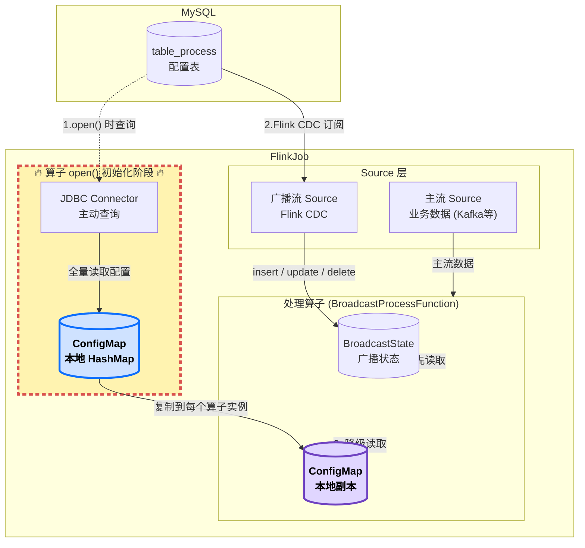

# 首次加载配置表




#### MySQL连接参数

为使用`Flink`连接`MySQL`，我们将`MySQL`的连接参数放入配置常量类 `com.zhangsan.edu.common.EduConfig`中。

```java
public static final String MYSQL_DRIVER = "com.mysql.cj.jdbc.Driver";
public static final String MYSQL_URL = "jdbc:mysql://node1:3306/edu_config?useUnicode=true&characterEncoding=utf8&serverTimezone=Asia/Shanghai&useSSL=false";
public static final String MYSQL_USERNAME = "root";
public static final String MYSQL_PASSWORD = "123456";
```


#### ORM

ORM（Object-Relational Mapping，对象关系映射）

```bash
数据库表                        ORM映射                      编程语言对象
+-------------+               +-----------+                +------------+
| id          |  ---------->  |           |  ---------->   | user.id    |
| name        |  ---------->  |  映射规则  |  ---------->   | user.name  |
| email       |  ---------->  |           |  ---------->   | user.email |
+-------------+               +-----------+                +------------+
```


在`com.zhangsan.edu.util`中定义`MySQL`工具类，将`table_process`表映射为`DimTableProcess`类，表中的记录便可映射为类中的多个对象。

##### table_process表

| Field        | Type          | Null | Key  | Default | Extra |
| ------------ | ------------- | ---- | ---- | ------- | ----- |
| source_table | varchar(200)  | NO   | PRI  | NULL    |       |
| sink_table   | varchar(200)  | YES  |      | NULL    |       |
| sink_columns | varchar(2000) | YES  |      | NULL    |       |
| sink_pk      | varchar(200)  | YES  |      | NULL    |       |
| sink_extend  | varchar(200)  | YES  |      | NULL    |       |

##### DimTableProcess

创建包`com.zhangsan.edu.bean`，并在其中创建类`DimTableProcess`。

```java
public class DimTableProcess {
    //来源表
    String sourceTable;
    //输出表
    String sinkTable;
    //输出字段
    String sinkColumns;
    //主键字段
    String sinkPk;
    //建表扩展
    String sinkExtend;
}
```

> 自行创建 getter,setter, toString方法 

#### MySQLUtil工具类

在`com.zhangsan.edu.util`包中创建`MySQL`工具类

```java
public class MySQLUtil {

    private static final Logger logger = LoggerFactory.getLogger(MySQLUtil.class);

    private static final String QUERY_TABLE_PROCESS_SQL = "SELECT source_table, sink_table, sink_columns, sink_pk, sink_extend FROM table_process";

    public static Map<String, DimTableProcess> getTableProcessMap() {
        Map<String, DimTableProcess> configMap = new HashMap<>();

        Connection connection = null;
        PreparedStatement preparedStatement = null;
        ResultSet resultSet = null;

        try {
            Class.forName(EduConfig.MYSQL_DRIVER);
            connection = DriverManager.getConnection(
                    EduConfig.MYSQL_URL,
                    EduConfig.MYSQL_USERNAME,
                    EduConfig.MYSQL_PASSWORD
            );

            preparedStatement = connection.prepareStatement(QUERY_TABLE_PROCESS_SQL);
            resultSet = preparedStatement.executeQuery();

            while (resultSet.next()) {
                DimTableProcess dimTableProcess = new DimTableProcess();
                dimTableProcess.setSourceTable(resultSet.getString("source_table"));
                dimTableProcess.setSinkTable(resultSet.getString("sink_table"));
                dimTableProcess.setSinkColumns(resultSet.getString("sink_columns"));
                dimTableProcess.setSinkPk(resultSet.getString("sink_pk"));
                dimTableProcess.setSinkExtend(resultSet.getString("sink_extend"));

                logger.info("初始化配置表数据：{} -> {}",
                        dimTableProcess.getSourceTable(),
                        dimTableProcess.getSinkTable());

                configMap.put(dimTableProcess.getSourceTable(), dimTableProcess);
            }
        } catch (ClassNotFoundException e) {
            logger.error("MySQL驱动加载失败", e);
            throw new RuntimeException("MySQL驱动加载失败", e);
        } catch (SQLException e) {
            logger.error("查询MySQL配置表失败", e);
            throw new RuntimeException("查询MySQL配置表失败", e);
        } finally {
            closeResources(resultSet, preparedStatement, connection);
        }

        return configMap;
    }

    private static void closeResources(ResultSet resultSet, Statement statement, Connection connection) {
        if (resultSet != null) {
            try {
                resultSet.close();
            } catch (SQLException e) {
                logger.warn("关闭ResultSet失败", e);
            }
        }

        if (statement != null) {
            try {
                statement.close();
            } catch (SQLException e) {
                logger.warn("关闭Statement失败", e);
            }
        }

        if (connection != null) {
            try {
                connection.close();
            } catch (SQLException e) {
                logger.warn("关闭Connection失败", e);
            }
        }
    }
}
```


#### 测试

自行在`DimSinkApp`中测试MySQLUtil的数据查询结果。
