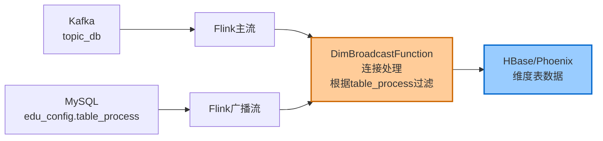
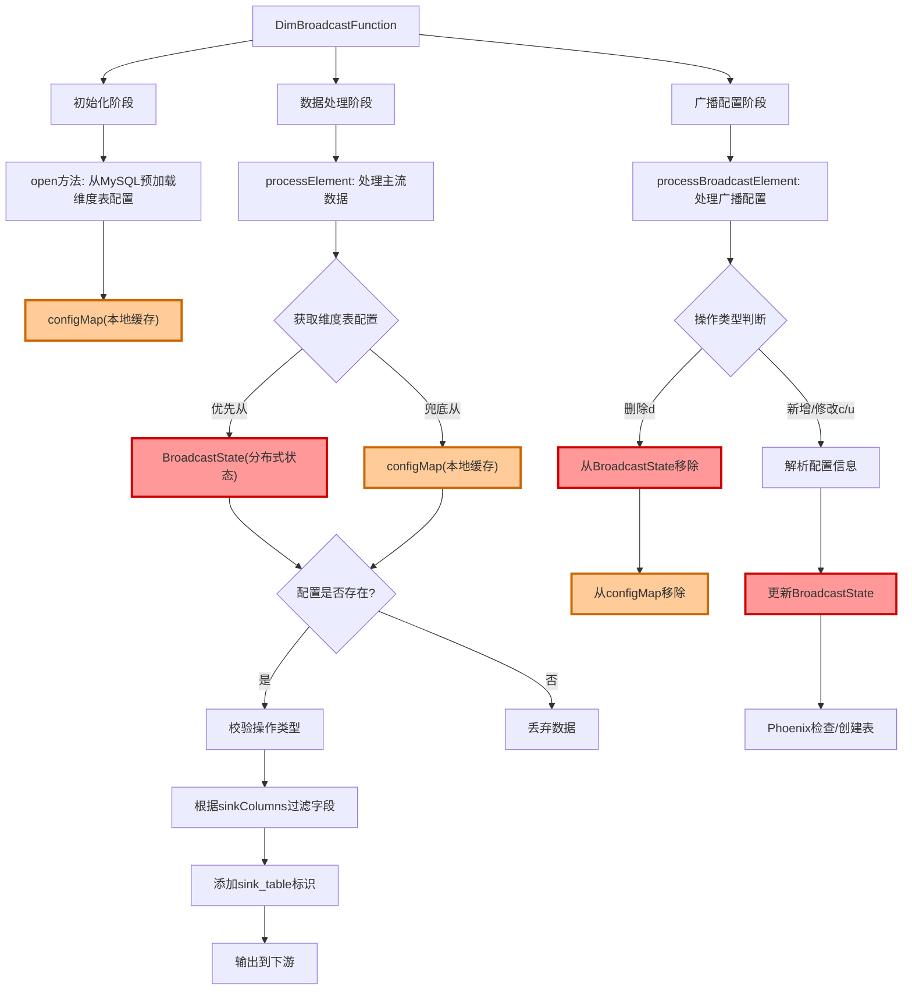
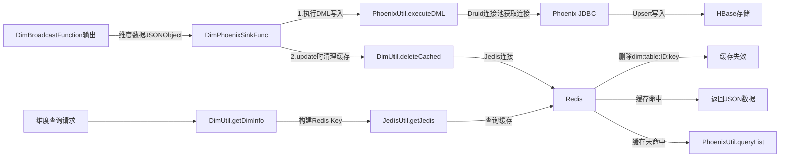
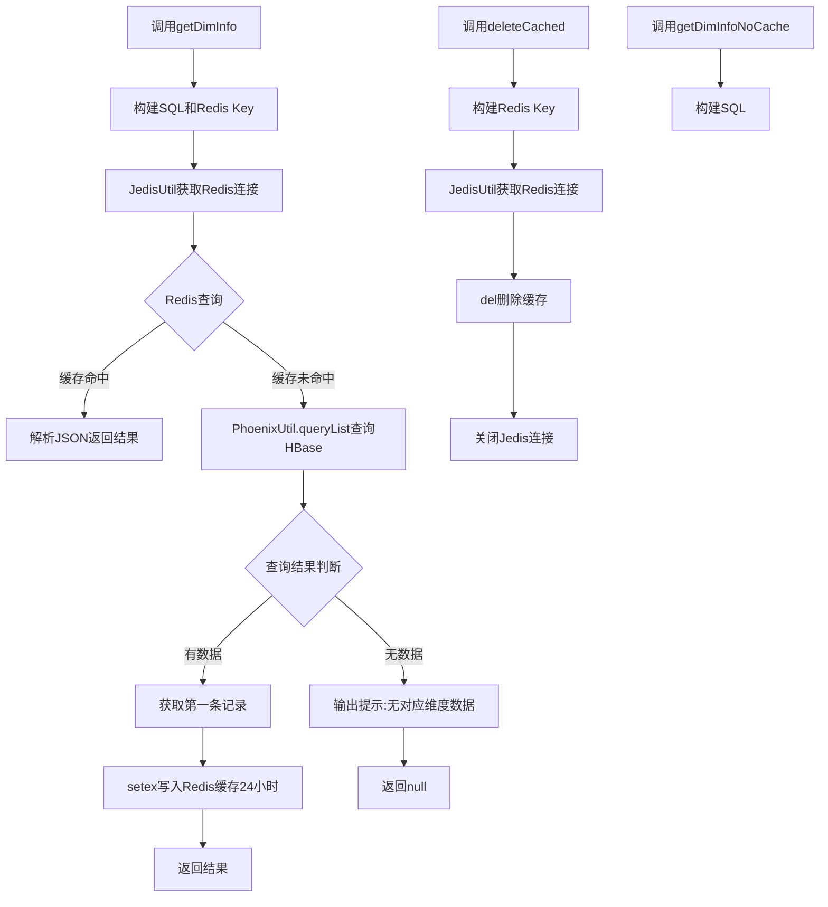

# 教育大数据之数仓DIM层设计与实现




## 从ODS中分离维度表


### 自定义函数DimBroadcastFunction



创建包`com.zhangsan.edu.func`

```java
import com.alibaba.fastjson.JSONObject;
import org.apache.flink.api.common.state.MapStateDescriptor;
import org.apache.flink.streaming.api.functions.co.BroadcastProcessFunction;
import org.apache.flink.util.Collector;

public class DimBroadcastFunction extends BroadcastProcessFunction<JSONObject, String, JSONObject> {

    private MapStateDescriptor<String, DimTableProcess> tableConfigDescriptor;

    public DimBroadcastFunction(MapStateDescriptor<String, DimTableProcess> tableConfigDescriptor) {
        this.tableConfigDescriptor = tableConfigDescriptor;
    }

    @Override
    public void processElement(JSONObject jsonObj, ReadOnlyContext readOnlyContext, Collector<JSONObject> out) throws Exception {

    }

    @Override
    public void processBroadcastElement(String jsonStr, Context context, Collector<JSONObject> out) throws Exception {

    }
}
```

##### open

在`DimBroadcastFunction`，重写`org.apache.flink.api.common.functions.RichFunction.open`方法，在该方法中手动加载一下配置表。（确保在主流之前加载配置表）

```java
// 定义预加载配置对象
Map<String, DimTableProcess> configMap = new HashMap<>();

@Override
public void open(Configuration parameter) throws Exception {
        configMap = MySQLUtil.getTableProcessMap();
}
```


##### processBroadcastElement

重写`processBroadcastElement`方法，处理广播数据。

```java
public void processBroadcastElement(String jsonStr, Context context, Collector<JSONObject> out) throws Exception {
    JSONObject jsonObj = JSON.parseObject(jsonStr);
    BroadcastState<String, DimTableProcess> tableConfigState = context.getBroadcastState(tableConfigDescriptor);
    String op = jsonObj.getString("op");
    if ("d".equals(op)) {
        DimTableProcess before = jsonObj.getObject("before", DimTableProcess.class);
        String sourceTable = before.getSourceTable();
        tableConfigState.remove(sourceTable);
        // 同时删除预加载 Map 中的配置信息
        configMap.remove(sourceTable);
    } else {
        DimTableProcess config = jsonObj.getObject("after", DimTableProcess.class);
        String sourceTable = config.getSourceTable();
        tableConfigState.put(sourceTable, config);
        String sinkTable = config.getSinkTable();
        String sinkColumns = config.getSinkColumns();
        String sinkPk = config.getSinkPk();
        String sinkExtend = config.getSinkExtend();

        PhoenixUtil.checkTable(sinkTable, sinkColumns, sinkPk, sinkExtend);
    }
}
```

##### 新增filterColumns

校验字段，过滤掉多余的字段

```java
  private void filterColumns(JSONObject data, String sinkColumns) {
        Set<Map.Entry<String, Object>> entries = data.entrySet();
        List<String> stringList = Arrays.asList(sinkColumns.split(","));
        entries.removeIf(entry -> !stringList.contains(entry.getKey()));
    }
```

##### processElement

处理主流数据。

```java
public void processElement(JSONObject jsonObj, ReadOnlyContext readOnlyContext, Collector<JSONObject> collector) throws Exception {
    ReadOnlyBroadcastState<String, DimTableProcess> dimTableProcessState = readOnlyContext.getBroadcastState(tableConfigDescriptor);
    // 获取配置信息
    String sourceTable = jsonObj.getString("table");
    DimTableProcess dimTableProcess = dimTableProcessState.get(sourceTable);

    // 如果状态中没有配置信息，从预加载 Map 中加载一次
    if (dimTableProcess == null) {
        dimTableProcess = configMap.get(sourceTable);
    }

    if (dimTableProcess != null) {
        // 判断操作类型是否为 null，校验数据结构是否完整
        String type = jsonObj.getString("type");
        if (type == null) {
            System.out.println("Maxwell 采集的数据格式异常，缺少操作类型");
        } else {
            JSONObject data = jsonObj.getJSONObject("data");

            String sinkTable = dimTableProcess.getSinkTable();
            String sinkColumns = dimTableProcess.getSinkColumns();

            // 根据 sinkColumns 过滤数据
            filterColumns(data, sinkColumns);

            // 将目标表名加入到主流数据中
            data.put("sink_table", sinkTable);

            collector.collect(data);
        }
    }
}

```


## 将维度数据存入HBase




#### EduConfig

```java
// Phoenix库名
public static final String HBASE_SCHEMA = "EDU_REALTIME";

// Phoenix驱动
public static final String PHOENIX_DRIVER = "org.apache.phoenix.jdbc.PhoenixDriver";

// Phoenix连接参数
public static final String PHOENIX_SERVER = "jdbc:phoenix:node1,node2,node3:2181";
```


#### DruidDSUtil

```xml
        <dependency>
            <groupId>com.alibaba</groupId>
            <artifactId>druid</artifactId>
            <version>1.1.16</version>
        </dependency>
```


```java
import com.alibaba.druid.pool.DruidDataSource;

public class DruidDSUtil {
    private static DruidDataSource druidDataSource;

    static {
        // 创建连接池
        druidDataSource = new DruidDataSource();
        // 设置驱动全类名
        druidDataSource.setDriverClassName(EduConfig.PHOENIX_DRIVER);
        // 设置连接 url
        druidDataSource.setUrl(EduConfig.PHOENIX_SERVER);
        // 设置初始化连接池时池中连接的数量
        druidDataSource.setInitialSize(5);
        // 设置同时活跃的最大连接数
        druidDataSource.setMaxActive(20);
        // 设置空闲时的最小连接数，必须介于 0 和最大连接数之间，默认为 0
        druidDataSource.setMinIdle(1);
        // 设置没有空余连接时的等待时间，超时抛出异常，-1 表示一直等待
        druidDataSource.setMaxWait(-1);
        // 验证连接是否可用使用的 SQL 语句
        druidDataSource.setValidationQuery("select 1");
        // 指明连接是否被空闲连接回收器（如果有）进行检验，如果检测失败，则连接将被从池中去除
        // 注意，默认值为 true，如果没有设置 validationQuery，则报错
        // testWhileIdle is true, validationQuery not set
        druidDataSource.setTestWhileIdle(true);
        // 借出连接时，是否测试，设置为 false，不测试，否则很影响性能
        druidDataSource.setTestOnBorrow(false);
        // 归还连接时，是否测试
        druidDataSource.setTestOnReturn(false);
        // 设置空闲连接回收器每隔 30s 运行一次
        druidDataSource.setTimeBetweenEvictionRunsMillis(30 * 1000L);
        // 设置池中连接空闲 30min 被回收，默认值即为 30 min
        druidDataSource.setMinEvictableIdleTimeMillis(30 * 60 * 1000L);
    }

//    public static DruidDataSource getDruidDataSource(){
//        if (druidDataSource!=null){
//            return druidDataSource;
//        }else {
//            return DruidDSUtil.createDataSource();
//        }
//    }

    public static DruidDataSource createDataSource() {
        return druidDataSource;
    }

    public static DruidDataSource getDruidDataSource() {
        return druidDataSource;
    }
}
```


#### Phoenix

创建SCHEMA

```sql
CREATE SCHEMA IF NOT EXISTS EDU_REALTIME;
```


##### 引入依赖

```xml
        <dependency>
            <groupId>org.apache.phoenix</groupId>
            <artifactId>phoenix-spark</artifactId>
            <version>5.0.0-HBase-2.0</version>
            <exclusions>
                <exclusion>
                    <groupId>org.glassfish</groupId>
                    <artifactId>javax.el</artifactId>
                </exclusion>
            </exclusions>
        </dependency>
```

##### hbase-site.xml

```
将hbase-site.xml放入项目的resources目录中。
```


##### PhoenixUtil

```java
import com.alibaba.druid.pool.DruidDataSource;
import com.alibaba.druid.pool.DruidPooledConnection;
import com.alibaba.fastjson.JSONObject;
import org.apache.commons.beanutils.BeanUtils;
import org.apache.commons.lang3.StringUtils;

public class PhoenixUtil {

    private static DruidDataSource druidDataSource = DruidDSUtil.getDruidDataSource();

    public static void checkTable(String sinkTable, String sinkColumns, String sinkPk, String sinkExtend) {
        // create table if not exists table (id string pk,name string...)
        // 拼接建表语句的sql
        StringBuilder sql = new StringBuilder();
        sql.append("create table if not exists " + EduConfig.HBASE_SCHEMA + "." + sinkTable + "(\n");
        // 判断主键
        // 如果主键为空,默认使用id
        if (sinkPk==null){
            sinkPk="";
        }
        if (sinkExtend==null){
            sinkExtend="";
        }

        // 遍历字段拼接建表语句
        String[] split = sinkColumns.split(",");
        for (int i = 0; i < split.length; i++) {
            sql.append(split[i] + " varchar");
            if (split[i].equals(sinkPk)){
                sql.append(" primary key");
            }
            if (i < split.length - 1){
                sql.append(",\n");
            }
        }
        sql.append(") ");
        sql.append(sinkExtend);
        System.out.println("=== 准备创建表：" + sinkTable);
        System.out.println("=== 建表 SQL: " + sql.toString());
        PhoenixUtil.executeDDL(sql.toString());
        System.out.println("=== 表创建完成：" + sinkTable);
    }


    public static void executeDDL(String sqlString) {
        DruidPooledConnection connection = null;
        PreparedStatement preparedStatement = null;
        try {
            connection = druidDataSource.getConnection();
        } catch (SQLException throwables) {
            throwables.printStackTrace();
            System.out.println("连接池获取连接异常");
        }


        try {
            preparedStatement = connection.prepareStatement(sqlString);
        } catch (SQLException throwables) {
            throwables.printStackTrace();
            System.out.println("编译sql异常");
        }

        try {
            preparedStatement.execute();
        } catch (SQLException throwables) {
            throwables.printStackTrace();
            System.out.println("建表语句错误");
        }

        // 关闭资源
        try {
            preparedStatement.close();
        } catch (SQLException throwables) {
            throwables.printStackTrace();
        }

        try {
            connection.close();
        } catch (SQLException throwables) {
            throwables.printStackTrace();
        }

    }


    public static void executeDML(String sinkTable, JSONObject jsonObject) {
        // TODO 2 拼接sql语言
        StringBuilder sql = new StringBuilder();
        Set<Map.Entry<String, Object>> entries = jsonObject.entrySet();
        ArrayList<String> columns = new ArrayList<>();
        ArrayList<Object> values = new ArrayList<>();
        StringBuilder symbols = new StringBuilder();
        for (Map.Entry<String, Object> entry : entries) {
            columns.add(entry.getKey());
            values.add(entry.getValue());
            symbols.append("?,");
        }

        sql.append("upsert into " + EduConfig.HBASE_SCHEMA + "." + sinkTable + "(");

        // 拼接列名
        String columnsStrings = StringUtils.join(columns, ",");
        String symbolStr = symbols.substring(0, symbols.length() - 1).toString();
        sql.append(columnsStrings)
                .append(")values(")
                .append(symbolStr)
                .append(")");

        DruidPooledConnection connection = null;
        try {
            connection = druidDataSource.getConnection();
        } catch (SQLException throwables) {
            throwables.printStackTrace();
            System.out.println("连接池获取连接异常");
        }

        PreparedStatement preparedStatement = null;
        try {
            preparedStatement = connection.prepareStatement(sql.toString());
            // 传入参数
            for (int i = 0; i < values.size(); i++) {
                preparedStatement.setObject(i + 1, values.get(i) + "");
            }
        } catch (SQLException throwables) {
            throwables.printStackTrace();
            System.out.println("编译sql异常");
        }


        try {
            preparedStatement.executeUpdate();
        } catch (SQLException throwables) {
            throwables.printStackTrace();
            System.out.println("写入phoenix错误");
        }

        try {
            preparedStatement.close();
        } catch (SQLException throwables) {
            throwables.printStackTrace();
        }

        try {
            connection.close();
        } catch (SQLException throwables) {
            throwables.printStackTrace();
        }

    }

    public static <T> List<T> queryList(String sql, Class<T> clazz) {
        ArrayList<T> resultList = new ArrayList<>();
        DruidPooledConnection connection = null;
        PreparedStatement preparedStatement = null;
        try {
            connection = druidDataSource.getConnection();
            preparedStatement = connection.prepareStatement(sql);
            ResultSet resultSet = preparedStatement.executeQuery();
            ResultSetMetaData metaData = resultSet.getMetaData();
            while (resultSet.next()) {
                T obj = clazz.newInstance();
                for (int i = 1; i <= metaData.getColumnCount(); i++) {
                    String columnName = metaData.getColumnName(i);
                    Object columnValue = resultSet.getObject(i);
                    BeanUtils.setProperty(obj, columnName, columnValue);
                }
                resultList.add(obj);
            }
        } catch (Exception e) {
            e.printStackTrace();
        }

        if (preparedStatement !=null){
            try {
                preparedStatement.close();
            } catch (SQLException throwables) {
                throwables.printStackTrace();
            }
        }

        if (connection != null){
            try {
                connection.close();
            } catch (SQLException throwables) {
                throwables.printStackTrace();
            }
        }

        return  resultList;
    }
}
```

##### 测试

```java
package com.zhangsan.edu.util;

import com.alibaba.fastjson.JSONObject;
import lombok.var;
import org.junit.Test;

import java.util.List;

public class PhoenixUtilTest {

    @Test
    public void testCheckTable() {
        System.out.println("=== 测试创建表 ===");
        String sinkTable = "test_user";
        String sinkColumns = "id,name,age,email";
        String sinkPk = "id";
        String sinkExtend = "";

        PhoenixUtil.checkTable(sinkTable, sinkColumns, sinkPk, sinkExtend);
        System.out.println("=== 表创建测试完成 ===");
    }

    @Test
    public void testExecuteDML() {
        System.out.println("=== 测试插入数据 ===");

        JSONObject jsonObject = new JSONObject();
        jsonObject.put("id", "1");
        jsonObject.put("name", "张三");
        jsonObject.put("age", "25");
        jsonObject.put("email", "zhangsan@example.com");

        PhoenixUtil.executeDML("test_user", jsonObject);
        System.out.println("=== 数据插入测试完成 ===");
    }

    @Test
    public void testQueryList() {
        System.out.println("=== 测试查询数据 ===");

        String sql = "SELECT * FROM EDU_REALTIME.test_user";
        List<JSONObject> resultList = PhoenixUtil.queryList(sql, JSONObject.class);

        System.out.println("查询结果数量: " + resultList.size());
        for (JSONObject obj : resultList) {
            System.out.println(obj.toJSONString());
        }

        System.out.println("=== 数据查询测试完成 ===");
    }

    @Test
    public void testDruidDataSource() {
        System.out.println("=== 测试 Druid 数据源 ===");

        var dataSource = DruidDSUtil.getDruidDataSource();
        System.out.println("数据源: " + dataSource);
        System.out.println("初始化连接数: " + dataSource.getInitialSize());
        System.out.println("最大连接数: " + dataSource.getMaxActive());
        System.out.println("最小空闲连接数: " + dataSource.getMinIdle());

        System.out.println("=== Druid 数据源测试完成 ===");
    }
}
```


#### Redis

##### 引入依赖

```xml
        <dependency>
            <groupId>redis.clients</groupId>
            <artifactId>jedis</artifactId>
            <version>3.3.0</version>
        </dependency>
```

##### JedisUtil

```java
import redis.clients.jedis.Jedis;
import redis.clients.jedis.JedisPool;
import redis.clients.jedis.JedisPoolConfig;

public class JedisUtil {
    private static JedisPool jedisPool;

    private static void initJedisPool() {
        JedisPoolConfig poolConfig = new JedisPoolConfig();
        poolConfig.setMaxTotal(100);
        poolConfig.setMaxIdle(5);
        poolConfig.setMinIdle(5);
        poolConfig.setBlockWhenExhausted(true);
        poolConfig.setMaxWaitMillis(2000);
        poolConfig.setTestOnBorrow(true);
        jedisPool = new JedisPool(poolConfig,"node1",6379,10000);
    }
    public static Jedis getJedis(){
        if(jedisPool == null){
            initJedisPool();
        }
        // 获取Jedis客户端
        Jedis jedis = jedisPool.getResource();
        return jedis;
    }
}

```

##### 测试

测试Redis是否可以正常连接。

```java
Jedis jedis = getJedis();
String pong = jedis.ping();
System.out.println(pong);
```


#### DimUtil

在util包中创建此工具类。




```java
import com.alibaba.fastjson.JSON;
import com.alibaba.fastjson.JSONObject;
import org.apache.flink.api.java.tuple.Tuple2;
import redis.clients.jedis.Jedis;

import java.util.List;

public class DimUtil {
    /**
     * 如果不填写主键关联的列名  默认是id
     * @param tableName
     * @param id
     * @return
     */
    public static JSONObject getDimInfo(String tableName,String id){
         return getDimInfo(tableName,Tuple2.of("ID",id));
    }

    /**
     * 使用redis进行旁路缓存
     * @param tableName
     * @param columnNamesAndValues
     * @return
     */
    public static JSONObject getDimInfo(String tableName, Tuple2<String,String>... columnNamesAndValues){
        JSONObject result = null;
        StringBuilder sql = new StringBuilder("select * from " + EduConfig.HBASE_SCHEMA + "." + tableName + " where ");
        StringBuilder redisKey = new StringBuilder("dim:" + tableName.toLowerCase() + ":");
        // 把属性名和属性值的过滤条件都添加进sql中
        for (int i = 0; i < columnNamesAndValues.length; i++) {
            Tuple2<String, String> columnNamesAndValue = columnNamesAndValues[i];
            String columnName = columnNamesAndValue.f0;
            String columnValue = columnNamesAndValue.f1;
            sql.append(columnName + " = " + "'" +columnValue+ "'");
            redisKey.append(columnName + ":" + columnValue);
            if (i <  columnNamesAndValues.length - 1){
                sql.append(" and ");
                redisKey.append("_");
            }
        }
        System.out.println("phoenix查询sql语句如下" + sql.toString());
        Jedis jedis = null;
        String dimJsonStr = null;
        try {
            jedis=JedisUtil.getJedis();
            dimJsonStr = jedis.get(redisKey.toString());
        }catch (Exception e){
            e.printStackTrace();
        }

        // 判断缓存是否命中
        if (dimJsonStr != null && dimJsonStr.length()>0){
            // 缓存命中直接返回
            result = JSON.parseObject(dimJsonStr);
        }else {
            List<JSONObject> jsonObjects = PhoenixUtil.queryList(sql.toString(), JSONObject.class);

            if (jsonObjects != null && jsonObjects.size()>0){
                result = jsonObjects.get(0);
                // 将从Phoenix中读取的数据写入缓存中
                if (jedis != null){
                    jedis.setex(redisKey.toString(),3600 * 24,result.toJSONString());
                }
            }else{
                System.out.println("dim层当前没有对应的维度数据");
            }
        }
        // 释放资源
        if (jedis !=null){
            jedis.close();
        }
        return result;

    }

    public static void deleteCached(String tableName,String id){
        StringBuilder redisKey = new StringBuilder("dim:" + tableName.toLowerCase() + ":");
        redisKey.append( "ID:" + id);
        Jedis jedis = null;
        try {
            jedis = JedisUtil.getJedis();
            jedis.del(redisKey.toString());
        }catch (Exception e){
            e.printStackTrace();
            System.out.println("清除redis缓存错误");
        }finally {
            if (jedis !=null){
                jedis.close();
            }
        }
    }

    /**
     * 不使用redis进行旁路缓存
     * @param tableName
     * @param columnNamesAndValues
     * @return
     */
    public static JSONObject getDimInfoNoCache(String tableName, Tuple2<String,String>... columnNamesAndValues){
        StringBuilder sql = new StringBuilder("select * from " + EduConfig.HBASE_SCHEMA + "." + tableName + " where ");
        // 把属性名和属性值的过滤条件都添加进sql中
        for (int i = 0; i < columnNamesAndValues.length; i++) {
            Tuple2<String, String> columnNamesAndValue = columnNamesAndValues[i];
            String columnName = columnNamesAndValue.f0;
            String columnValue = columnNamesAndValue.f1;
            sql.append(columnName + " = " + "'" +columnValue+ "'");
            if (i <  columnNamesAndValues.length - 1){
                sql.append(" and ");
            }
        }
        System.out.println("phoenix查询sql语句如下" + sql.toString());

        List<JSONObject> jsonObjects = PhoenixUtil.queryList(sql.toString(), JSONObject.class);
        JSONObject result = null;
        if (jsonObjects != null && jsonObjects.size()>0){
            result = jsonObjects.get(0);
        }else{
            System.out.println("dim层当前没有对应的维度数据");
        }
        return result;

    }
}
```


#### DimPhoenixSinkFunc

在 **func** 包中创建**DimPhoenixSinkFunc**类，用来将维度数据保存到 **Phoenix** （**HBase**）中。

```java
import com.alibaba.fastjson.JSONObject;
import org.apache.flink.streaming.api.functions.sink.SinkFunction;

public class DimPhoenixSinkFunc implements SinkFunction<JSONObject> {
    @Override
    public void invoke(JSONObject jsonObject, Context context) throws Exception {
        // TODO 1 获取输出的表名
        String sinkTable = jsonObject.getString("sink_table");
        String type = jsonObject.getString("type");
        String id = jsonObject.getString("id");
        System.out.println("=== 维度数据输出：表名=" + sinkTable + ", 类型=" + type + ", ID=" + id);
        jsonObject.remove("sink_table");
        jsonObject.remove("type");

        // TODO 2 使用工具类 写出数据
        PhoenixUtil.executeDML(sinkTable, jsonObject);

        // TODO 3 如果类型为update 删除redis对应缓存
        if ("update".equals(type)){
            DimUtil.deleteCached(sinkTable,id);
        }
    }
}
```


## DimSinkApp

在主程序`DimSinkApp`中调用`DimBroadcastFunction`对维度数据分流，启动`Flink`程序。

```java
    public static void main(String[] args) throws Exception {
        // TODO 1. 环境准备及状态后端设置
        StreamExecutionEnvironment env = EnvUtil.getExecutionEnvironment(4);

        // TODO 2. 从Kafka中读取ods作为主流
        SingleOutputStreamOperator<JSONObject> jsonDS = read_ods_as_main_stream_from_kafka(env);

        // TODO 3. 从Mysql中读取配置表信息
        DataStreamSource<String> configStream = read_config_table_as_stream_with_cdc(env);

        // TODO 4. 创建广播状态描述符
        MapStateDescriptor<String, DimTableProcess> tableConfigDescriptor = new MapStateDescriptor<>("table-config-state", String.class, DimTableProcess.class);

        // TODO 5 创建广播流
        BroadcastStream<String> broadcastStream = configStream.broadcast(tableConfigDescriptor);

        // TODO 6 合并主流和广播流
        BroadcastConnectedStream<JSONObject, String> connectCS = jsonDS.connect(broadcastStream);

        // TODO 7 对合并流进行分别处理
        SingleOutputStreamOperator<JSONObject> dimDS = connectCS.process(new DimBroadcastFunction(tableConfigDescriptor));

        // TODO 8 调取维度数据写出到phoenix
        dimDS.addSink(new DimPhoenixSinkFunc());
        // 环境执行
        env.execute();
    }
```


#### 查询创建结果

```mysql
0: jdbc:phoenix:node1:2181> !tables
```

可以看到`14`张维度表已经在`HBase`中创建。

| TABLE_SCHEM  | TABLE_NAME               | TABLE_TYPE |
| ------------ | ------------------------ | ---------- |
| EDU_REALTIME | DIM_BASE_CATEGORY_INFO   | TABLE      |
| EDU_REALTIME | DIM_BASE_PROVINCE        | TABLE      |
| EDU_REALTIME | DIM_BASE_SOURCE          | TABLE      |
| EDU_REALTIME | DIM_BASE_SUBJECT_INFO    | TABLE      |
| EDU_REALTIME | DIM_CHAPTER_INFO         | TABLE      |
| EDU_REALTIME | DIM_COURSE_INFO          | TABLE      |
| EDU_REALTIME | DIM_KNOWLEDGE_POINT      | TABLE      |
| EDU_REALTIME | DIM_TEST_PAPER           | TABLE      |
| EDU_REALTIME | DIM_TEST_PAPER_QUESTION  | TABLE      |
| EDU_REALTIME | DIM_TEST_POINT_QUESTION  | TABLE      |
| EDU_REALTIME | DIM_TEST_QUESTION_INFO   | TABLE      |
| EDU_REALTIME | DIM_TEST_QUESTION_OPTION | TABLE      |
| EDU_REALTIME | DIM_USER_INFO            | TABLE      |
| EDU_REALTIME | DIM_VIDEO_INFO           | TABLE      |


## 全量采集维度表

使用`maxwell-bootstrap`全量采集维度表。

```bash
[zhangsan@node1 default]$ bin/maxwell-bootstrap --database edu --table base_category_info
connecting to jdbc:mysql://node1:3306/maxwell?allowPublicKeyRetrieval=true&connectTimeout=5000&serverTimezone=Asia%2FShanghai&zeroDateTimeBehavior=convertToNull&useSSL=false

[zhangsan@node1 default]$ bin/maxwell-bootstrap --database edu --table base_province
connecting to jdbc:mysql://node1:3306/maxwell?allowPublicKeyRetrieval=true&connectTimeout=5000&serverTimezone=Asia%2FShanghai&zeroDateTimeBehavior=convertToNull&useSSL=false

[zhangsan@node1 default]$ bin/maxwell-bootstrap --database edu --table base_source
connecting to jdbc:mysql://node1:3306/maxwell?allowPublicKeyRetrieval=true&connectTimeout=5000&serverTimezone=Asia%2FShanghai&zeroDateTimeBehavior=convertToNull&useSSL=false
... ...
```

#### 经过Flink分流

可以看到，维度数据被保存到了`HBase`中。

```sql
0: jdbc:phoenix:node1:2181> select * from DIM_BASE_CATEGORY_INFO;
+-----+----------------+----------------------+--------------+----------+
| ID  | CATEGORY_NAME  |     CREATE_TIME      | UPDATE_TIME  | DELETED  |
+-----+----------------+----------------------+--------------+----------+
| 1   | 编程技术           | 2021-09-24 22:19:37  | null         | 0        |
+-----+----------------+----------------------+--------------+----------+
1 row selected (0.06 seconds)

0: jdbc:phoenix:node1:2181> select count(*) from DIM_BASE_CATEGORY_INFO;
+-----------+
| COUNT(1)  |
+-----------+
| 1         |
+-----------+
1 row selected (0.118 seconds)

0: jdbc:phoenix:node1:2181> select count(*) from DIM_BASE_PROVINCE;
+-----------+
| COUNT(1)  |
+-----------+
| 34        |
+-----------+
1 row selected (0.028 seconds)

0: jdbc:phoenix:node1:2181> select count(*) from DIM_BASE_SOURCE;
+-----------+
| COUNT(1)  |
+-----------+
| 4         |
+-----------+
1 row selected (0.026 seconds)
```

> 注意，由于一些大表数据较多，Flink中日志打印较多，分流较慢，比如`user_info`表。


#### 全量采集脚本

```bash
#!/bin/bash

# 检查 MAXWELL_HOME 环境变量是否配置
if [ -z "$MAXWELL_HOME" ]; then
    echo "错误: MAXWELL_HOME 环境变量未设置"
    exit 1
fi

# 检查 MAXWELL_HOME 目录是否存在
if [ ! -d "$MAXWELL_HOME" ]; then
    echo "错误: MAXWELL_HOME 目录不存在: $MAXWELL_HOME"
    exit 1
fi

# 进入 MAXWELL_HOME 目录
cd "$MAXWELL_HOME" || exit 1
echo "已进入 MAXWELL_HOME: $MAXWELL_HOME"

# 配置部分
MAXWELL_BIN="./bin/maxwell-bootstrap"   # maxwell-bootstrap 命令路径
DATABASE="edu"                          # 数据库名称

# 全部14张表（基于提供的映射关系）
TABLES=(
    "base_category_info"
    "base_province"
    "base_source"
    "base_subject_info"
    "chapter_info"
    "course_info"
    "knowledge_point"
    "test_paper"
    "test_paper_question"
    "test_point_question"
    "test_question_info"
    "test_question_option"
    "user_info"
    "video_info"
)

# 检查 maxwell-bootstrap 是否存在
if [ ! -f "$MAXWELL_BIN" ]; then
    echo "错误: 找不到 $MAXWELL_BIN，请检查 Maxwell 安装"
    exit 1
fi

# 循环执行 bootstrap
for table in "${TABLES[@]}"; do
    echo "正在执行 bootstrap: $DATABASE.$table"
    $MAXWELL_BIN --database "$DATABASE" --table "$table"
    if [ $? -eq 0 ]; then
        echo "✓ 成功: $table"
    else
        echo "✗ 失败: $table"
        # 可选：遇到错误是否退出，这里选择继续执行下一张表
        # exit 1
    fi
    echo "------------------------"
done

echo "所有表的 bootstrap 操作已完成。"
```


## 维度表更新

测试当业务系统中的维度表更新时，数仓DIM层的数据是否同步更新。

##### 修改业务数据库中的`base_subject_info`表。

```mysql
# 将j2ee学科修改为JavaEE学科
mysql> update  base_subject_info set subject_name='JavaEE学科' where id=1;
```

##### Flink处理

```json
4> {"database":"edu","xid":758596,"data":{"deleted":"0","category_id":1,"create_time":"2021-09-24 23:17:39","subject_name":"JavaEE学科","id":1},"old":{"subject_name":"j2ee学科"},"commit":true,"type":"update","table":"base_subject_info","ts":1645428427}
```

##### 维度表

```mysql
0: jdbc:phoenix:node1:2181> select * from DIM_BASE_SUBJECT_INFO;
```

| ID   | SUBJECT_NAME | CATEGORY_ID | CREATE_TIME         | UPDATE_TIME | DELETED |
| ---- | ------------ | ----------- | ------------------- | ----------- | ------- |
| 1    | JavaEE学科   | 1           | 2021-09-24 23:17:39 | null        | 0       |
| 2    | 前端学科     | 1           | 2021-09-25 22:17:37 | null        | 0       |
| 3    | 大数据学科   | 1           | 2021-09-25 22:19:51 | null        | 0       |

可以看到数仓`DIM`层的维度数据同步更新。


---

## QA

##### 清空HBASE

清空数据库`EDU_REALTIME`

```bash
[zhangsan@node1 ~]$ hdfs dfs -rmr /hbase/EDU_REALTIME
0: jdbc:phoenix:node1,node2,node3:2181> DELETE FROM SYSTEM.CATALOG WHERE TABLE_SCHEM = 'EDU_REALTIME';
```


