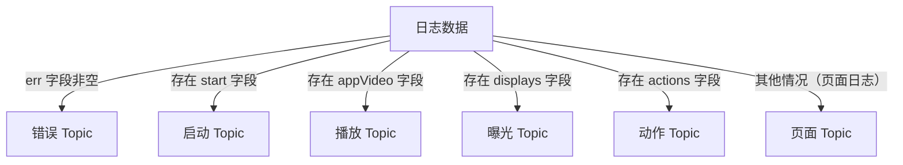

## 日志数据介绍与探索

两种日志方式的核心差异、用途及协作方式。

| 维度           | 前端埋点日志（客户端）                                       | 后端接口日志（服务端）                                       |
| -------------- | ------------------------------------------------------------ | ------------------------------------------------------------ |
| **生成位置**   | 用户设备（App、H5、小程序）                                  | 后端服务器（应用进程、网关、中间件）                         |
| **生成时机**   | 用户触发交互时（点击、滑动、曝光、收藏等）                   | 每次请求进入后端接口时（请求前、处理后、异常时）             |
| **典型内容**   | 设备信息（型号、OS、分辨率）、页面路径、停留时长、行为类型（`favor_add`）、展示列表（`displays`）、本地时间戳 | 请求 URL、Method、Header、参数、响应状态码、耗时、异常堆栈、调用链 trace_id、服务端时间戳 |
| **数据格式**   | 多为 JSON（可压缩/批处理）                                   | 文本行（日志框架输出）、JSON 或 ELK 结构化格式               |
| **记录方式**   | 埋点 SDK 自动采集 + 主动 HTTP 上报                           | 容器访问日志（如 Tomcat） + 业务代码中 `log.info/warn/error` |
| **网络依赖**   | 强依赖，上报失败可能丢失数据（可本地缓存重试）               | 无网络依赖（写本地磁盘或标准输出）                           |
| **可靠性**     | 相对低（用户清缓存、杀进程、弱网）                           | 高（服务器磁盘持久化，可配置同步/异步落盘）                  |
| **主要用途**   | 用户行为分析、转化漏斗、推荐效果、页面热力图、留存分析       | 接口监控、故障排查、性能分析（慢接口）、安全审计、调用链追踪 |
| **性能影响**   | 极小（异步批量上报）                                         | 视日志量而定（大量日志可能影响 IO，需采样或异步）            |
| **关联字段**   | `uid`（用户ID）、`sid`（会话ID）、`ts`（客户端时间）         | 可生成统一 `trace_id` / `request_id` 回传前端，或通过 `uid` + 时间窗关联 |
| **常见工具链** | 神策、GrowingIO、Firebase、自研埋点 SDK                      | ELK（Elasticsearch + Logstash + Kibana）、Loki、Splunk、自研日志平台 |

---

#### 两者如何协作（完整链路示例）

| 步骤                  | 发生位置 | 日志类型                  | 关键数据                                                     |
| --------------------- | -------- | ------------------------- | ------------------------------------------------------------ |
| 1. 用户点击“收藏”按钮 | 客户端   | 前端埋点                  | `{"action":"favor_add","item":"43","ts":...}`                |
| 2. 客户端发起收藏请求 | 客户端   | （前端埋点可关联请求 ID） | 携带 `trace_id` 在 HTTP Header                               |
| 3. 后端接口收到请求   | 服务端   | 后端日志                  | `timestamp, method=POST, url=/favor, trace_id=abc, status=200, duration=45ms` |
| 4. 后端处理成功并返回 | 服务端   | 后端日志                  | 同上，可记录数据库操作、缓存更新                             |
| 5. 客户端展示收藏成功 | 客户端   | 前端埋点                  | 页面曝光、toast 展示等                                       |

> **关联方式**：前端在请求头中加入 `X-Request-Id`（或 `trace_id`），后端打印该 ID；前端埋点也记录同一 ID，即可将行为与服务端日志精确关联。

---

#### 何时只用一种或同时用两种？

| 场景                                                       | 推荐方式                                |
| ---------------------------------------------------------- | --------------------------------------- |
| 只关心用户行为（点击、滑动、页面停留）                     | 前端埋点足够                            |
| 只排查接口错误、慢查询                                     | 后端日志即可                            |
| 需要还原完整用户体验（如购买失败是前端未上报还是后端超时） | 两者都需，并做关联                      |
| 极简内部工具，无前端                                       | 只做后端日志                            |
| 小程序/H5 无法获取后端日志                                 | 前端埋点 + 后端日志通过 `trace_id` 关联 |


### 日志数据样例

前端埋点构造的 JSON 字符串（日志） 设置了common、start、page、displays、actions、appVideo、err、ts 八种字段。其中

#### 公共字段

| 公共字段 | 描述               | 出现条件 / 所属日志类型 |
| -------- | ------------------ | ----------------------- |
| ts       | 时间戳，单位：毫秒 | 必选                    |
| common   | 公共信息           | 必选                    |

##### 公共字段与时间戳数据样例

```json
{
	"common": {
		"ar": "1",
		"ba": "vivo",
		"ch": "oppo",
		"is_new": "0",
		"md": "vivo iqoo3",
		"mid": "mid_107",
		"os": "Android 8.1",
		"sc": "1",
		"sid": "0a1655ae-7950-4166-8ccf-127a0ff37393",
		"uid": "7515",
		"vc": "v2.1.134"
	},
	"ts": 1774110241313
}
```

##### 公共字段说明

| 字段   | 值                                   | 说明                 |
| ------ | ------------------------------------ | -------------------- |
| ar     | 1                                    | 可能是区域或来源标识 |
| ba     | vivo                                 | 品牌 (Brand)         |
| ch     | oppo                                 | **渠道 (Channel)**   |
| is_new | 0                                    | 是否新用户 (0=否)    |
| md     | vivo iqoo3                           | **手机型号 (Model)** |
| mid    | mid_107                              | 设备唯一标识（简化） |
| os     | Android 8.1                          | 操作系统版本         |
| sc     | 1                                    | 屏幕/场景相关标识    |
| sid    | 0a1655ae-7950-4166-8ccf-127a0ff37393 | 会话 ID              |
| uid    | 7515                                 | 用户 ID              |
| vc     | v2.1.134                             | 客户端版本           |

##### 时间戳 (ts)数据说明

| 字段 | 值            | 转换后时间 (UTC+8)                 |
| ---- | ------------- | ---------------------------------- |
| ts   | 1774110338114 | **2026-03-21 20:25:38** (北京时间) |


#### 可选字段

| 公共字段 | 描述     | 出现条件 / 所属日志类型 |
| -------- | -------- | ----------------------- |
| err      | 错误信息 | 可选                    |

##### 错误日志样例

```json
{
	"common": {
        略。
	},
    "err": {
		"error_code": 2839,
		"msg": " Exception in thread \\  java.net.SocketTimeoutException\\n \\tat com.studybigdata.mock.log.AppError.main(AppError.java:xxxxxx)"
	},
	"ts": 1774110241313
}
```

#### 特有字段

| 独有字段 | 二级字段 | 描述         | 出现条件 / 所属日志类型                    |
| -------- | -------- | ------------ | ------------------------------------------ |
| start    |          | 启动信息     | 启动日志（独有）                           |
| appVideo |          | 视频播放记录 | 播放日志（独有）                           |
| page     |          | 页面信息     | 页面日志（独有）                           |
|          | actions  | 动作信息     | 动作日志（属于页面日志，必有 `page` 字段） |
|          | displays | 曝光信息     | 曝光日志（属于页面日志，必有 `page` 字段） |


##### 启动日志

```json
{
	"common": {
        略。
	},
	"start": {
		"entry": "icon",
		"first_open": 1,
		"loading_time": 17429,
		"open_ad_id": 16,
		"open_ad_ms": 1193,
		"open_ad_skip_ms": 5520
	},
	"ts": 1774110241313
}
```

> err 字段可选

##### 播放日志

```json
{
	"appVideo": {
		"play_sec": 30,
		"position_sec": 450,
		"video_id": "2851"
	},
	"common": {
        略。
	},
	"ts": 1774185011601
}
```

##### 页面日志

```json
{
	"common": {
	},
	"displays": [],
    "actions": [],
	"page": {
		"during_time": 18870,
		"item": "28422",
		"item_type": "order_id",
		"last_page_id": "course_detail",
		"page_id": "order"
	},
	"ts": 1774110338114
}
```

###### 页面信息 (page)说明

| 字段         | 值            | 说明                                |
| ------------ | ------------- | ----------------------------------- |
| page_id      | order         | 当前页面（订单页）                  |
| last_page_id | course_detail | 上一个页面（课程详情页）            |
| item         | 28422         | 当前页面相关的对象ID（订单ID）      |
| item_type    | order_id      | 对象类型                            |
| during_time  | 18870         | 在当前页面停留时间（毫秒 ≈ 18.9秒） |


##### 页面日志 - 曝光日志

```json
{
	"common": {
	},
	"displays": [{
		"display_type": "query",
		"item": "9",
		"item_type": "course_id",
		"order": 1,
		"pos_id": 5
	}, {
		"display_type": "query",
		"item": "10",
		"item_type": "course_id",
		"order": 2,
		"pos_id": 4
	}, {
		"display_type": "recommend",
		"item": "9",
		"item_type": "course_id",
		"order": 3,
		"pos_id": 4
	}, {
		"display_type": "query",
		"item": "8",
		"item_type": "course_id",
		"order": 4,
		"pos_id": 1
	}, {
		"display_type": "query",
		"item": "5",
		"item_type": "course_id",
		"order": 5,
		"pos_id": 2
	}, {
		"display_type": "promotion",
		"item": "6",
		"item_type": "course_id",
		"order": 6,
		"pos_id": 2
	}],
	"page": {
		"during_time": 18870,
		"item": "28422",
		"item_type": "order_id",
		"last_page_id": "course_detail",
		"page_id": "order"
	},
	"ts": 1774110338114
}
```


##### 页面日志 - 动作日志

收藏动作

```json
{
	"actions": [{
		"action_id": "favor_add",
		"item": "56",
		"item_type": "course_id",
		"ts": 1774110280126
	}]
}
```

加入购物车动作

```json
{
	"actions": [{
		"action_id": "cart_add",
		"item": "259",
		"item_type": "course_id",
		"ts": 1774181047498
	}]
}
```


### 日志分流

#### 日志分流类型

因此，将按照日志内容，将日志分为以下六小类

- 错误日志
- 启动日志
- 播放日志
- 页面日志
- 曝光日志
- 动作日志





### TODO

使用`Linux`文本查看工具从 `app.log`中选择3条日志数据，使用JSON格式化工具格式化后，观察日志的属性及属性值。

```http
https://www.bejson.com/
```

