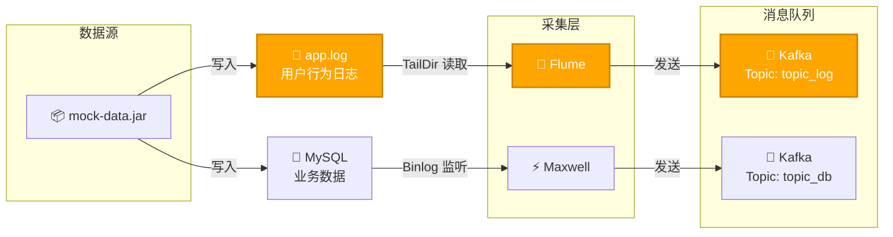
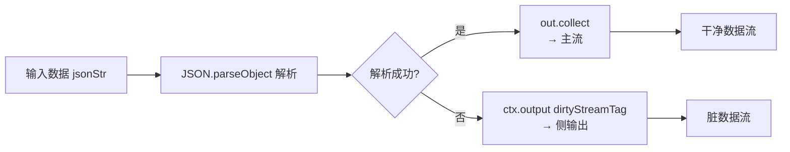
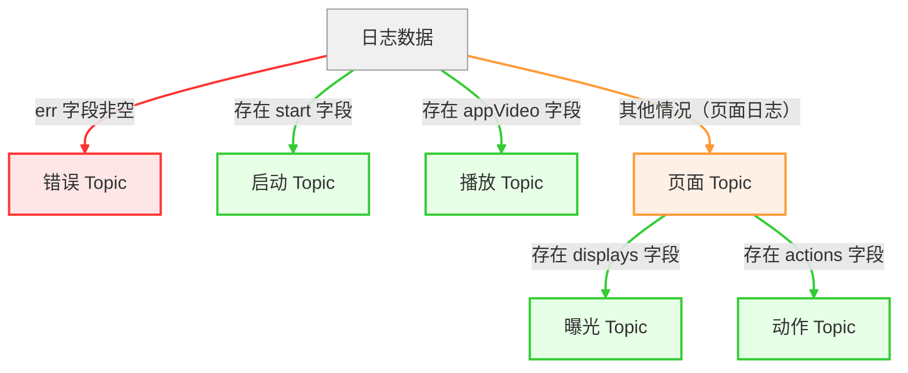

# DWD日志数据分流

## 前置条件



为完成后续开发，需要保证突出显示的**日志采集**链路是通畅的。

## 主程序

创建包`com.zhangsan.edu.dwd.log`


```java
public class BaseLogApp {
    public static void main(String[] args) throws Exception {

        // TODO 1. 环境准备及状态后端设置
        StreamExecutionEnvironment env = EnvUtil.getExecutionEnvironment(4);

        env.execute();

    }
}
```


## 从 Kafka 读取主流数据

```java
// TODO 2. 从 Kafka 读取主流数据
String topic = "topic_log";
String groupId = "base_log_app";
DataStreamSource<String> source = env.fromSource(KafkaUtil.getKafkaConsumer(topic, groupId),
        WatermarkStrategy.noWatermarks(), "base_log_source");
source.print();
```

启动程序，观察执行结果。

> 如果无法消费到数据，观察一下 log_position.json 文件的读取位置。


## 脏数据分流

**OutputTag** 是 Flink 用于**侧输出（Side Output）**的核心 API。

| 特性 | 说明                               |
| ---- | ---------------------------------- |
| 作用 | 标记并输出"额外"的数据流           |
| 泛型 | 指定侧输出流中数据的类型           |
| 标识 | 通过名称（String）区分不同的侧输出 |

#### 定义错误侧输出流Tag

```java
// TODO 3. 数据清洗，转换结构
// 3.1 定义错误侧输出流
OutputTag<String> dirtyStreamTag = new OutputTag<String>("dirtyStream") {
};
```




#### 分流（过滤脏数据）

```java
// 3.2 分流（过滤脏数据），转换主流数据结构 jsonStr -> jsonObj
SingleOutputStreamOperator<JSONObject> cleanedStream = source.process(
        new ProcessFunction<String, JSONObject>() {
            @Override
            public void processElement(String jsonStr, Context ctx, Collector<JSONObject> out) throws Exception {
                try {
                    JSONObject jsonObj = JSON.parseObject(jsonStr);
                    out.collect(jsonObj); 				 // 主流
                } catch (Exception e) {
                    ctx.output(dirtyStreamTag, jsonStr); // 侧输出
                }
            }
        }
);
```

脏数据虽然通过 `ctx.output()` 写入了侧输出，但**你还没有拿到它**。脏数据藏在 `cleanedStream` 内部，需要用 `getSideOutput()` 才能**单独拿到这个侧输出流**进行后续处理。

| 操作                    | 作用           | 说明                       |
| ----------------------- | -------------- | -------------------------- |
| `ctx.output(tag, data)` | **写入**侧输出 | 把数据放进"侧输出的盒子"里 |
| `getSideOutput(tag)`    | **提取**侧输出 | 从主流结果中取出侧输出流   |

```java
// 3.3 将脏数据写出到 Kafka 指定主题
DataStream<String> dirtyStream = cleanedStream.getSideOutput(dirtyStreamTag);
dirtyStream.print(); 
```


##### 输入

由于我们已经在`flume`中通过拦截器的方式拦截掉了非法的`JSON`，所以我们在这里根本就不会碰到非法数据流，为了方便观察效果，我们可以手动向`topic_log`中写几条测试数据，其中包含非法的`JSON`。

```bash
(base) [zhangsan@node1 log]$ kafka-console-producer.sh --bootstrap-server node1:9092,node2:9092,node3:9092 --topic topic_log
{"id":1,"name":"张三","email":"zhangsan@example.com","isValid":true,"reason":null}
{"id":2,"name":"李四","email":"lisi@example.com","isValid":true,"reason":null}
{"id":3,"name":"王五","email":"wangwu@example.com","isValid":true,"reason":null}
{"id":4,"name":"","email":"invalid-email","isValid":false,"reason":
:5,"name":"赵六","email":null,"isValid":false,"reason":"邮箱不能为空"}
```

##### Flink输出

```java
1> {"id":4,"name":"","email":"invalid-email","isValid":false,"reason":
1> :5,"name":"赵六","email":null,"isValid":false,"reason":"邮箱不能为空"}
```


#### 存入Kafa

##### Kafka生产者

在 `KafkaUtil`工具类中补充 `getKafkaProducer()` 方法

```java
public static KafkaSink<String> getKafkaProducer(String topic, String transId) {
    return KafkaSink.<String>builder()
            .setBootstrapServers(EduConfig.KAFKA_BOOTSTRAPS)
            .setRecordSerializer(KafkaRecordSerializationSchema.builder()
                    .setTopic(topic)
                    .setValueSerializationSchema(new SimpleStringSchema())
                    .build()
            )
            .setProperty(ProducerConfig.TRANSACTION_TIMEOUT_CONFIG, 15 * 60 * 1000 + "")
            //指定生产的精准一次性
            .setDeliveryGuarantee(DeliveryGuarantee.EXACTLY_ONCE)
            //如果生产的精准一次性消费   那么每一个流数据在做向kakfa写入的时候  都会生成一个transId，默认名字生成规则相同，会冲突，我们这里指定前缀进行区分
            .setTransactionalIdPrefix(transId)
            .build();
}
```

##### Sink

```java
String dirtyTopic = "dirty_data";
dirtyStream.sinkTo(KafkaUtil.getKafkaProducer(dirtyTopic, "dirty_trans"));
```

##### 测试

消费`dirty_data`，测试`Sink`结果

```bash
[zhangsan@node1 ~]$ kafka-console-consumer.sh --bootstrap-server node1:9092,node2:9092,node3:9092 --topic dirty_data --from-beginning
{"id":4,"name":"","email":"invalid-email","isValid":false,"reason":
:5,"name":"赵六","email":null,"isValid":false,"reason":"邮箱不能为空"}
```


### 日期格式化

创建 `DateFormatUtil`工具类用于日期格式化

```java
import java.time.LocalDateTime;
import java.time.LocalTime;
import java.time.ZoneId;
import java.time.ZoneOffset;
import java.time.format.DateTimeFormatter;
import java.util.Date;

public class DateFormatUtil {

    private static final DateTimeFormatter dtf = DateTimeFormatter.ofPattern("yyyy-MM-dd");
    private static final DateTimeFormatter dtfFull = DateTimeFormatter.ofPattern("yyyy-MM-dd HH:mm:ss");

    public static Long toTs(String dtStr, boolean isFull) {
        
        LocalDateTime localDateTime = null;
        if (!isFull) {
            dtStr = dtStr + " 00:00:00";
        }
        localDateTime = LocalDateTime.parse(dtStr, dtfFull);

        return localDateTime.toInstant(ZoneOffset.of("+8")).toEpochMilli();
    }

    public static Long toTs(String dtStr) {
        return toTs(dtStr, false);
    }

    public static String toDate(Long ts) {
        Date dt = new Date(ts);
        LocalDateTime localDateTime = LocalDateTime.ofInstant(dt.toInstant(), ZoneId.systemDefault());
        return dtf.format(localDateTime);
    }

    public static String toYmdHms(Long ts) {
        Date dt = new Date(ts);
        LocalDateTime localDateTime = LocalDateTime.ofInstant(dt.toInstant(), ZoneId.systemDefault());
        return dtfFull.format(localDateTime);
    }
}

```

测试一下日期转换工具类

```java
    public static void main(String[] args) {
        System.out.println(System.currentTimeMillis());
        System.out.println(toYmdHms(System.currentTimeMillis()));
        System.out.println(toTs("2021-01-01"));
        System.out.println(toDate(System.currentTimeMillis()));
    }
```


## 日志类型

前端埋点获取的日志可分为三大类：

- 启动日志

- 播放日志

- 页面日志

### 日志结构分析

前端埋点构造的 JSON 字符串（日志） 设置了common、start、page、displays、actions、appVideo、err、ts 八种字段。其中

#### 公共字段

| 公共字段 | 描述               | 出现条件 / 所属日志类型 |
| -------- | ------------------ | ----------------------- |
| ts       | 时间戳，单位：毫秒 | 必选                    |
| common   | 公共信息           | 必选                    |

#### 可选字段

| 公共字段 | 描述     | 出现条件 / 所属日志类型 |
| -------- | -------- | ----------------------- |
| err      | 错误信息 | 可选                    |

#### 特有字段

| 独有字段 | 二级字段 | 描述         | 出现条件 / 所属日志类型                    |
| -------- | -------- | ------------ | ------------------------------------------ |
| start    |          | 启动信息     | 启动日志（独有）                           |
| appVideo |          | 视频播放记录 | 播放日志（独有）                           |
| page     |          | 页面信息     | 页面日志（独有）                           |
|          | actions  | 动作信息     | 动作日志（属于页面日志，必有 `page` 字段） |
|          | displays | 曝光信息     | 曝光日志（属于页面日志，必有 `page` 字段） |


## 六种日志分流





```java
// TODO 5. 分流
// 5.1 定义启动、曝光、动作、错误、播放侧输出流
OutputTag<String> startTag = new OutputTag<String>("startTag") {
};
OutputTag<String> displayTag = new OutputTag<String>("displayTag") {
};
OutputTag<String> actionTag = new OutputTag<String>("actionTag") {
};
OutputTag<String> errorTag = new OutputTag<String>("errorTag") {
};
OutputTag<String> appVideoTag = new OutputTag<String>("appVideoTag") {
};


// 5.2 分流
SingleOutputStreamOperator<String> separatedStream = fixedStream.process(
        new ProcessFunction<JSONObject, String>() {
            @Override
            public void processElement(JSONObject jsonObj, Context context, Collector<String> out) throws Exception {

                // 5.2.1 收集错误数据
                JSONObject error = jsonObj.getJSONObject("err");
                if (error != null) {
                    context.output(errorTag, jsonObj.toJSONString());
                }

                // 剔除 "err" 字段
                jsonObj.remove("err");

                // 5.2.2 收集启动数据
                JSONObject start = jsonObj.getJSONObject("start");
                if (start != null) {
                    context.output(startTag, jsonObj.toJSONString());
                } else {
                    // 获取 "common" 字段
                    JSONObject common = jsonObj.getJSONObject("common");
                    // 获取 "ts"
                    Long ts = jsonObj.getLong("ts");
                    JSONObject appVideo = jsonObj.getJSONObject("appVideo");

                    // 5.2.3 收集播放数据
                    if (appVideo != null) {
                        context.output(appVideoTag, jsonObj.toJSONString());
                    } else {

                        // 获取 "page" 字段
                        JSONObject page = jsonObj.getJSONObject("page");

                        // 5.2.4 收集曝光数据
                        JSONArray displays = jsonObj.getJSONArray("displays");
                        if (displays != null) {
                            for (int i = 0; i < displays.size(); i++) {
                                JSONObject display = displays.getJSONObject(i);
                                JSONObject displayObj = new JSONObject();
                                displayObj.put("display", display);
                                displayObj.put("common", common);
                                displayObj.put("page", page);
                                displayObj.put("ts", ts);
                                context.output(displayTag, displayObj.toJSONString());
                            }
                        }

                        // 5.2.5 收集动作数据
                        JSONArray actions = jsonObj.getJSONArray("actions");
                        if (actions != null) {
                            for (int i = 0; i < actions.size(); i++) {
                                JSONObject action = actions.getJSONObject(i);
                                JSONObject actionObj = new JSONObject();
                                actionObj.put("action", action);
                                actionObj.put("common", common);
                                actionObj.put("page", page);
                                context.output(actionTag, actionObj.toJSONString());
                            }
                        }

                        // 5.2.6 收集页面数据
                        jsonObj.remove("displays");
                        jsonObj.remove("actions");
                        out.collect(jsonObj.toJSONString());
                    }
                }

            }
        }
);
```

##### 打印分流效果

```java
// 打印主流和各侧输出流查看分流效果
separatedStream.print("page>>>");
separatedStream.getSideOutput(startTag).print("start!!!");
separatedStream.getSideOutput(displayTag).print("display@@@");
separatedStream.getSideOutput(actionTag).print("action###");
separatedStream.getSideOutput(errorTag).print("error$$$");
separatedStream.getSideOutput(appVideoTag).print("appVideo$$$");
```


##### 将数据输出到 Kafka 的不同主题

```java
// TODO 6. 将数据输出到 Kafka 的不同主题
// 6.1 提取各侧输出流
DataStream<String> startDS = separatedStream.getSideOutput(startTag);
DataStream<String> displayDS = separatedStream.getSideOutput(displayTag);
DataStream<String> actionDS = separatedStream.getSideOutput(actionTag);
DataStream<String> errorDS = separatedStream.getSideOutput(errorTag);
DataStream<String> appVideoDS = separatedStream.getSideOutput(appVideoTag);

// 6.2 定义不同日志输出到 Kafka 的主题名称
String page_topic = "dwd_traffic_page_log";
String start_topic = "dwd_traffic_start_log";
String display_topic = "dwd_traffic_display_log";
String action_topic = "dwd_traffic_action_log";
String error_topic = "dwd_traffic_error_log";
String app_video_topic = "dwd_traffic_play_pre_process";

separatedStream.sinkTo(KafkaUtil.getKafkaProducer(page_topic, "page_trans"));
startDS.sinkTo(KafkaUtil.getKafkaProducer(start_topic, "start_trans"));
displayDS.sinkTo(KafkaUtil.getKafkaProducer(display_topic, "display_trans"));
actionDS.sinkTo(KafkaUtil.getKafkaProducer(action_topic, "action_trans"));
errorDS.sinkTo(KafkaUtil.getKafkaProducer(error_topic, "error_trans"));
appVideoDS.sinkTo(KafkaUtil.getKafkaProducer(app_video_topic, "app_video_trans"));
```


### 查看分流结果

#### IDEA插件


##### 消费测试

```
[zhangsan@node1 edu]$ kafka-console-producer.sh --bootstrap-server node1:9092,node2:9092,node3:9092 --topic dwd_traffic_start_log
```


---


## Other

可以在IDEA中安装AI编程插件，使用AI辅助我们编写代码，比如 阿里的灵码，腾讯的 Code Buddy。


