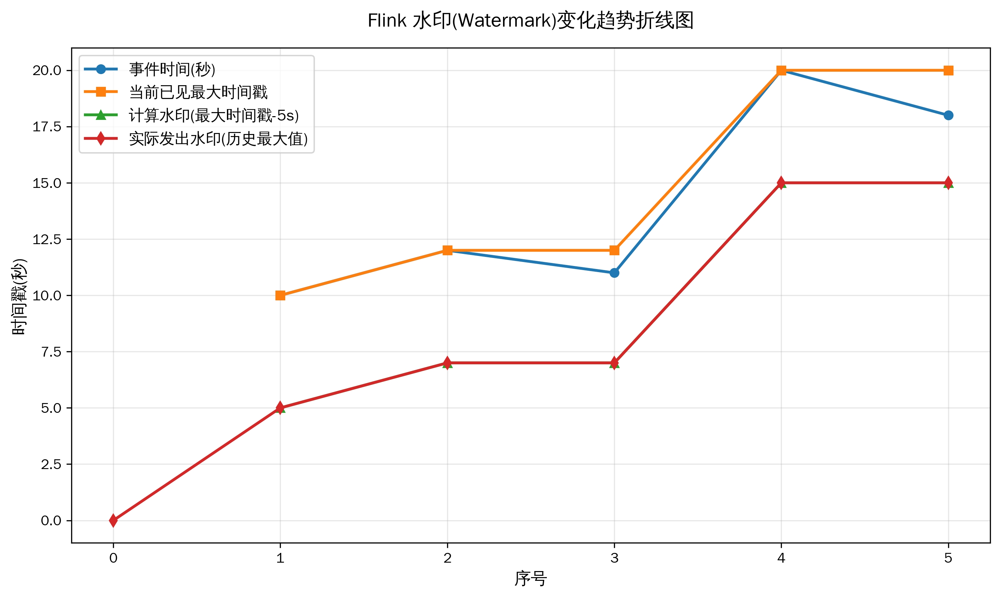
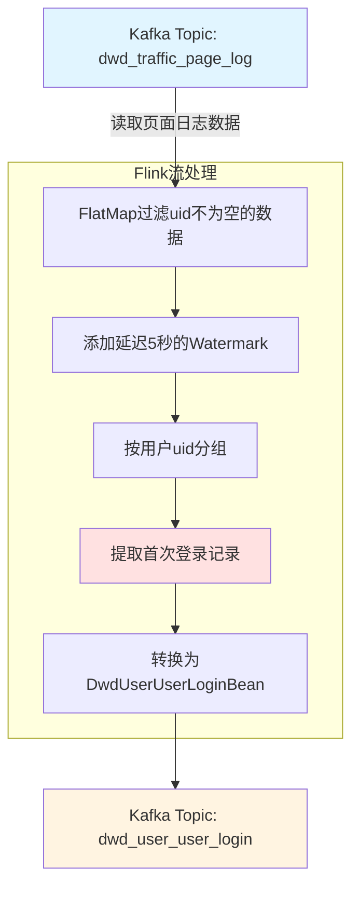

# Dwd-User-UserLogin

构建 `数仓明细事实表-用户域-用户登录明细事实表`

功能：

​	用户每日登录日志只保留一条，发送到Kafka。


## 数据处理窗口

##### 滚动窗口

 **5 秒长的滚动窗口**：`[0-5), [5-10), [10-15), [15-20)...`  

##### 常规情况

正常情况下，数据按照产生时间顺序到达，我们只需要

- 在收到 事件时间为 5s的数据时，关闭 [0-5) 窗口，进行数据的计算。
- 在收到 事件时间为 10s的数据时，关闭 [5-10) 窗口，进行数据的计算。
- 在收到 事件时间为 15s的数据时，关闭 [10-15) 窗口，进行数据的计算。

在某些情况下，数据的到达会出现乱序。

##### 解决办法

​	我们等待5s（即最大数据时间-延迟），如果还有数据未到达，就不再等待，判为迟到。

比如，车站售票，本来5s发车，[0,5)的乘客部分已到达，为了[0,5) 大部分乘客都能赶上这个乘车时间，延迟了5s;

如果仍有乘客未到，判为迟到，不能久等，先到的乘客会失去耐心。

## 数据乱序

### 1 场景映射

- 3个打饭窗口 = Kafka 3个分区队列

### 2 量化数据表

| 同学编号 | 入队时间 | 分配窗口 | 窗口拥堵延迟         | 出队时间 |
| -------- | -------- | -------- | -------------------- | -------- |
| A        | 12:00:00 | 窗口1    | 高拥堵/打饭速度慢+5s | 12:00:06 |
| B        | 12:00:02 | 窗口2    | 正常/打饭速度正常+1s | 12:00:03 |
| C        | 12:00:04 | 窗口3    | 无拥堵/打饭速度快+0s | 12:00:04 |

### 3 乱序数据体现

- 入队顺序：A(00) → B(02) → C(04)
- 出队顺序：B(03) → C(04) → A(06)

> 多队列拥堵不一致，**入队有序，到达无序**（数据进入Kafka多分区，出队乱序）


## Flink处理乱序

Flink通过水印来处理数据的乱序情况。

### 1. 水印的作用与基本规则
水印是 Flink 处理事件时间（Event Time）的核心概念，它用来**衡量事件时间的进度**，并告诉系统：“所有时间戳小于等于这个水印的事件，都已经到达了（即便有乱序，也假设不会再来了）”。 

水印必须**单调递增**（不能回退），这是为了保证时间向前推进，窗口能够被正确触发。

### 2. 例子场景设定
我们有一个温度传感器数据流，每条数据格式为 `(事件时间戳, 温度值)`。允许一定程度的乱序，设置**最大乱序时间**为 5 秒（即允许事件最多迟到 5 秒）。

采用常见的水印生成策略： 

​					$$ Watermark = max(所有已到达事件的最大时间戳) - 允许延迟(5s)$$

初始水印为 `Long.MIN_VALUE`（或 0）。

### 3. 水印递增过程

#### 事件到达顺序

实际到达时间与事件时间可以错乱

| 序号 | 事件时间 (秒)    | 当前已见最大时间戳 | 计算的水印 = 最大时间戳 - 5秒 | 实际发出的水印（取历史最大值） |
| ---- | ---------------- | ------------------ | ----------------------------- | ------------------------------ |
| 0    | –                | –                  | –                             | 初始水印 = 0（假设起始为0）    |
| 1    | 10               | 10                 | 10 - 5 = 5                    | max(0, 5) = **5**              |
| 2    | 12               | 12                 | 12 - 5 = 7                    | max(5, 7) = **7**              |
| 3    | 11（乱序）       | 12（不变）         | 12 - 5 = 7                    | max(7, 7) = **7**（不变）      |
| 4    | 20               | 20                 | 20 - 5 = 15                   | max(7, 15) = **15**            |
| 5    | 18（更晚的乱序） | 20（不变）         | 20 - 5 = 15                   | max(15, 15) = **15**（不变）   |

#### 水印数值序列



```bash
0 → 5 → 7 → 7 → 15 → 15 ...
```
严格**非递减**（本例中一直在增加或持平）。

### 4. 对窗口触发的影响
假设我们定义一个 **5 秒长的滚动窗口**：`[0-5), [5-10), [10-15), [15-20)...`  

- 当水印到达 **5** 时，意味着时间戳 ≤ 5 的事件都已到达，于是 `[0-5)` 窗口被触发计算。  
- 当水印到达 **7** 时，时间戳 ≤ 7 的事件齐全，触发 `[5-10)` 窗口（注意该窗口结束时间为 10，7 < 10 不会触发窗口 `[10-15)`）。  
- 当水印到达 **15** 时，触发 `[10-15)` 窗口（因为 15 ≥ 15）。

**注意**：后面乱序到来的 `11` 和 `18` 虽然比之前的水印晚，但因为它们的时间戳 ≤ 当前水印时，会被丢弃（Flink 允许配置侧输出流保存迟到数据）。

### 5. 关键点总结
- **水印递增的依据**：每次新事件到达，根据 `当前最大事件时间戳 - 允许延迟` 计算一个候选水印，然后与上次发出的水印取最大值。  
- **即使事件乱序**，只要新事件的时间戳不超过历史最大值，水印就不会回退，只会持平。  
- **水印单调递增**保证了事件时间向前推进，窗口可以按照时间顺序依次触发。

实际生产中可以选用周期性水印（`WatermarkStrategy.forBoundedOutOfOrderness`）或 Punctuated Watermark，但底层都遵循“取已见最大时间戳，减去延迟，并与前次比较取大”的递增规则。


## 处理流程




## 测试数据

用户每日登录日志只保留一条，发送到Kafka。

| 时间戳        | 对应日期时间        | uid  | mid     | sid                  | is_new | 测试场景              |
| ------------- | ------------------- | ---- | ------- | -------------------- | ------ | --------------------- |
| 1774202400000 | 2026-03-23 02:00:00 | null | mid_207 | session_20260524_003 | 0      | 无用户ID数据          |
|               |                     |      |         |                      |        |                       |
| 1774026000000 | 2026-03-21 01:00:00 | 8002 | mid_202 | session_20260522_002 | 0      | 老用户会话第1条       |
| 1774026010000 | 2026-03-21 01:00:10 | 8002 | mid_202 | session_20260522_002 | 0      | 同会话第2条（晚10秒） |
| 1774226227000 | 2026-03-23 08:37:07 | 8002 | mid_202 | session_20260524_002 | 0      | 老用户第三天登录      |
| 1774226237000 | 2026-03-23 08:37:17 | 8002 | mid_202 | session_20260524_002 | 0      | 老用户第三天2次登录   |
|               |                     |      |         |                      |        |                       |
| 1774116000000 | 2026-03-22 02:00:00 | 8004 | mid_204 | session_20260523_002 | 1      | 时间戳乱序-后发先到   |
| 1774115990000 | 2026-03-22 01:59:50 | 8004 | mid_204 | session_20260523_002 | 1      | 时间戳乱序-先发后到   |

### 消息生产者

请使用`Kafka Producer`向`dwd_traffic_page_log`中分别发送以下7条测试数据 

```json
{"common":{"ar":"7","ba":"一加","ch":"oneplus","is_new":"0","md":"OnePlus 10","mid":"mid_207","os":"Android 12","sc":"3","sid":"session_20260524_003","uid":null,"vc":"v2.1.134"},"ts":1774202400000}

{"common":{"ar":"2","ba":"华为","ch":"huawei","is_new":"0","md":"Mate 40","mid":"mid_202","os":"Android 11","sc":"2","sid":"session_20260522_002","uid":"8002","vc":"v2.1.133"},"ts":1774026000000}
{"common":{"ar":"2","ba":"华为","ch":"huawei","is_new":"0","md":"Mate 40","mid":"mid_202","os":"Android 11","sc":"2","sid":"session_20260522_002","uid":"8002","vc":"v2.1.133"},"ts":1774026010000}
{"common":{"ar":"2","ba":"华为","ch":"huawei","is_new":"0","md":"Mate 40","mid":"mid_202","os":"Android 11","sc":"2","sid":"session_20260524_002","uid":"8002","vc":"v2.1.133"},"ts":1774226227000}
{"common":{"ar":"2","ba":"华为","ch":"huawei","is_new":"0","md":"Mate 40","mid":"mid_202","os":"Android 11","sc":"2","sid":"session_20260524_002","uid":"8002","vc":"v2.1.133"},"ts":1774226237000}

{"common":{"ar":"4","ba":"OPPO","ch":"oppo","is_new":"1","md":"Find X3","mid":"mid_204","os":"Android 11","sc":"4","sid":"session_20260523_002","uid":"8004","vc":"v2.1.132"},"ts":1774116000000}
{"common":{"ar":"4","ba":"OPPO","ch":"oppo","is_new":"1","md":"Find X3","mid":"mid_204","os":"Android 11","sc":"4","sid":"session_20260523_002","uid":"8004","vc":"v2.1.132"},"ts":1774115990000}
```


## 代码实现 

为方便组织代码，我们在`com.zhangsan.edu.warehouse.dwd.log`包中创建类，命名为`DwdUserUserLogin`

#####  1. 创建环境设置状态后端

```java
       StreamExecutionEnvironment env = EnvUtil.getExecutionEnvironment(1);
	   //后续我们可在此逐步补充实现代码，阶段性测试。
       env.execute();
```

##### 2. 读取kafka的dwd_traffic_page_log主题数据

```java
        String topicName = "dwd_traffic_page_log";
        String groupId = "dwd_user_user_login";
        DataStreamSource<String> pageStream = env.fromSource(
                KafkaUtil.getKafkaConsumer(topicName, groupId),
                WatermarkStrategy.noWatermarks(),
                "user_login");
        pageStream.print("1-ppp ");
```


##### 3. 过滤及转换 uid != null

```java
        SingleOutputStreamOperator<JSONObject> jsonObjStream = pageStream.flatMap(new FlatMapFunction<String, JSONObject>() {
            @Override
            public void flatMap(String value, Collector<JSONObject> out) throws Exception {
                try {
                    JSONObject jsonObject = JSON.parseObject(value);
                    if (jsonObject.getJSONObject("common").getString("uid") != null) {
                        out.collect(jsonObject);
                    }else {
                        System.out.println("无uid，剔除。");
                    }
                } catch (Exception e) {
                    e.printStackTrace();
                }
            }
        });
        jsonObjStream.print("2-uuu ");
```


##### 4. 添加水印线

```java
        SingleOutputStreamOperator<JSONObject> withWaterMarkStream = jsonObjStream.assignTimestampsAndWatermarks(
                WatermarkStrategy.<JSONObject>forBoundedOutOfOrderness(Duration.ofSeconds(5L)) // 延迟5秒
                        .withTimestampAssigner(new SerializableTimestampAssigner<JSONObject>() {
                            @Override
                            public long extractTimestamp(JSONObject element, long recordTimestamp) {
                                return element.getLong("ts");//日志中记录的业务发生时间
                            }
                        }));
        withWaterMarkStream.print("3-www ");
```


##### 5. 按照会话id分组

```java
        KeyedStream<JSONObject, String> keyedStream = withWaterMarkStream.keyBy(new KeySelector<JSONObject, String>() {
            @Override
            public String getKey(JSONObject value) throws Exception {
                return value.getJSONObject("common").getString("sid");
            }
        });
        keyedStream.print("4-kkk ");
```


#####  6. 使用状态找出每个会话第一条数据

```java
        SingleOutputStreamOperator<JSONObject> firstStream = keyedStream.process(new KeyedProcessFunction<String, JSONObject, JSONObject>() {
            ValueState<JSONObject> firstLoginDtState;

            @Override
            public void open(Configuration parameters) throws Exception {
                super.open(parameters);
                ValueStateDescriptor<JSONObject> valueStateDescriptor = new ValueStateDescriptor<>("first_login_dt", JSONObject.class);
                // 添加状态存活时间
                StateTtlConfig stateTtlConfig = StateTtlConfig
                        .newBuilder(Time.days(1L))
                        .setUpdateType(StateTtlConfig.UpdateType.OnCreateAndWrite)
                        .build();
                valueStateDescriptor.enableTimeToLive(stateTtlConfig);
                firstLoginDtState = getRuntimeContext().getState(valueStateDescriptor);
            }

            @Override
            public void processElement(JSONObject jsonObject, Context ctx, Collector<JSONObject> out) throws Exception {
                // 处理数据，获取状态
                JSONObject firstLoginDt = firstLoginDtState.value();
                Long ts = jsonObject.getLong("ts");
                if (firstLoginDt == null) {
                    out.collect(jsonObject);
                    firstLoginDtState.update(jsonObject);
                    // 第一条数据到的时候开启定时器
                    ctx.timerService().registerEventTimeTimer(ts + 10 * 1000L);
                } else {
                    Long lastTs = firstLoginDt.getLong("ts");
                    if (ts < lastTs) { //如果当前数据时间小于上次数据时间，则更新状态
                        firstLoginDtState.update(jsonObject);
                        JSONObject value = firstLoginDtState.value();
                        System.out.println("当前数据时间小于上次数据时间，使用最早的时间，该条数据不再发向下游 "+value);
                    }else {
                        System.out.println("当前数据时间大于上次数据时间，该条数据不再发向下游" + jsonObject);
                    }
                }
            }

            @Override
            public void onTimer(long timestamp, OnTimerContext ctx, Collector<JSONObject> out) throws Exception {
                super.onTimer(timestamp, ctx, out);
//                out.collect(firstLoginDtState.value());
            }
        });
        firstStream.print("5-fff ");
```


##### 7. 转换结构

转换为`DwdUserUserLoginBean`对象。

###### DwdUserUserLoginBean创建

```java
package com.zhangsan.edu.warehouse.bean;

import lombok.AllArgsConstructor;
import lombok.Builder;
import lombok.Data;
import lombok.NoArgsConstructor;

@Data
@AllArgsConstructor
@NoArgsConstructor
@Builder
public class DwdUserUserLoginBean {
    // 用户 ID，对应于 common.uid
    String userId;

    // 登陆日期
    String dateId;

    // 登陆时间
    String loginTime;

    // 来源
    String sourceId;

    // 渠道，对应于 common.ch
    String channel;

    // 省份 ID，对应于 common.ar
    String provinceId;

    // 版本号，对应于 common.vc
    String versionCode;

    // 设备 ID，对应于 common.mid
    String midId;

    // 品牌，对应于 common.ba
    String brand;

    // 设备型号，对应于 common.md
    String model;

    // 操作系统，对应于 common.os
    String operatingSystem;

    // 时间戳
    Long ts;
}

```

###### 转换为`DwdUserUserLoginBean`对象

```java
        SingleOutputStreamOperator<String> mapStream = firstStream.map(new MapFunction<JSONObject, String>() {
            @Override
            public String map(JSONObject jsonObj) throws Exception {
                JSONObject common = jsonObj.getJSONObject("common");
                Long ts = jsonObj.getLong("ts");
                String loginTime = DateFormatUtil.toYmdHms(ts);
                String dateId = loginTime.substring(0, 10);

                DwdUserUserLoginBean dwdUserUserLoginBean = DwdUserUserLoginBean.builder()
                        .userId(common.getString("uid"))
                        .dateId(dateId).loginTime(loginTime)
                        .channel(common.getString("ch"))
                        .provinceId(common.getString("ar"))
                        .versionCode(common.getString("vc"))
                        .midId(common.getString("mid"))
                        .brand(common.getString("ba"))
                        .model(common.getString("md"))
                        .sourceId(common.getString("sc"))
                        .operatingSystem(common.getString("os"))
                        .ts(ts)
                        .build();

                return JSON.toJSONString(dwdUserUserLoginBean);
            }
        });
        mapStream.print("6-mmm ");
```

#####  8. 输出数据

```java
        String sinkTopic = "dwd_user_user_login";
        mapStream.sinkTo(KafkaUtil.getKafkaProducer(sinkTopic, "user_login_trans"));
```

##### 9. 执行任务

```java
        env.execute();
```


##### 程序执行前，清除检查点存储的数据。

```bash
[zhangsan@node1 log]$ hdfs dfs -rm -r /edu/ck
Deleted /edu/ck
```


### 观察实验结果

在本次实验中，我们使用了`7`条测试数据进行测试，程序会将用户每日的登录日志只保留一条发送到Kafka中，请观察实验结果，请问，你在Kafka的`dwd_user_user_login`中消费到了哪几条数据？
