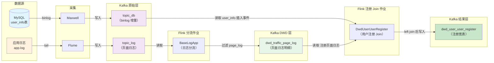
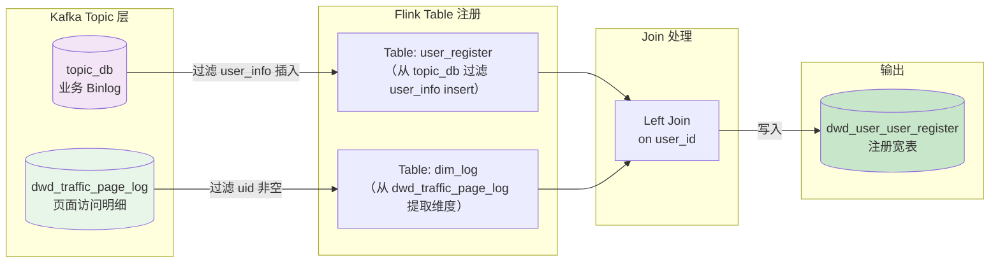

## DWD-User-Register

### 整体业务流程



### 主要业务流程



##### 表 1：用户注册业务数据（来自 topic_db）
| 字段          | 值                  | 说明                         |
| ------------- | ------------------- | ---------------------------- |
| user_id       | 7211                | 用户ID（从 data['id'] 提取） |
| register_time | 2026-05-24 17:59:28 | 注册时间（create_time）      |
| register_date | 2026-05-24          | 注册日期（格式化）           |
| ts            | 1645437568          | Binlog 中的时间戳（秒）      |

> **备注**：该数据是 Maxwell 从 MySQL `user_info` 表中捕获的 `insert` 事件，经过过滤后得到上述字段。

---

##### 表 2：页面访问日志数据（来自 dwd_traffic_page_log）
| 字段           | 值           | 说明                                 |
| -------------- | ------------ | ------------------------------------ |
| user_id        | 7211         | 用户ID（common['uid']）              |
| channel        | web          | 渠道（common['ch']）                 |
| province_id    | 26           | 省份ID（common['ar']）               |
| version_code   | null         | 版本号（common['vc']，本次无该字段） |
| source_id      | 2            | 来源ID（common['sc']）               |
| mid_id         | mid_216      | 设备ID（common['mid']）              |
| brand          | Huawei       | 品牌（common['ba']）                 |
| model          | Huawei P30   | 型号（common['md']）                 |
| operate_system | Android 11.0 | 操作系统（common['os']）             |

> **备注**：该数据来自 Flume 采集的应用日志，经 Flink 分流后写入 `dwd_traffic_page_log` 主题，记录了用户注册页面的访问行为。

---

##### 表 3：Left Join 最终结果（dwd_user_user_register）
| 字段           | 值                       | 说明                         |
| -------------- | ------------------------ | ---------------------------- |
| user_id        | 7212                     | 用户ID                       |
| register_time  | 2026-05-24 18:01:11      | 注册时间                     |
| register_date  | 2026-05-24               | 注册日期                     |
| channel        | web                      | 渠道                         |
| province_id    | 26                       | 省份ID                       |
| version_code   | null                     | 版本号（日志中缺失）         |
| source_id      | 2                        | 来源ID                       |
| mid_id         | mid_216                  | 设备ID                       |
| brand          | Huawei                   | 品牌                         |
| model          | Huawei P30               | 型号                         |
| operate_system | Android 11.0             | 操作系统                     |
| ts             | 1645437672               | 业务数据中的原始时间戳（秒） |
| row_op_ts      | 2026-05-24 10:01:14.811Z | 处理该行数据时的系统时间     |

> **备注**：  
>
> - 该结果是 Flink 将 **表 1**（user_register）与 **表 2**（dim_log）进行 `LEFT JOIN` 后写入 Kafka 的最终数据。  


### 代码编写

用户注册DWD构建，为更好的组织代码，我们在`com.zhangsan.edu.warehouse.dwd.db`包中创建类`DwdUserUserRegister`。

##### 1. 创建环境设置状态后端

```java
        StreamExecutionEnvironment env = EnvUtil.getExecutionEnvironment(4);
        StreamTableEnvironment tableEnv = StreamTableEnvironment.create(env);
```

##### 2. 设置表的TTL

```java
        EnvUtil.setTableEnvStateTtl(tableEnv,"10s");
```

###### EnvUtil

在`EnvUtil.java`中新增静态工具方法

```java
    public static void setTableEnvStateTtl(StreamTableEnvironment tableEnv, String ttl){
        tableEnv.getConfig().getConfiguration().setString("table.exec.state.ttl",ttl);
    }
```

##### 3. 读取topic_db的数据

```java
        String groupId = "dwd_user_user_register";
        KafkaUtil.createTopicDb(tableEnv, groupId);
```

###### KafkaUtil.java

在`KafkaUtil.java`中新增静态工具方法。

- 连接Kafka
- 将Kafka中的数据注册为Table

```java
    public static String getKafkaDDL(String topic, String groupId) {
        return "WITH (\n" +
                "  'connector' = 'kafka',\n" +
                "  'topic' = '" + topic + "',\n" +
                "  'properties.bootstrap.servers' = '" + EduConfig.KAFKA_BOOTSTRAPS + "',\n" +
                "  'properties.group.id' = '" + groupId + "',\n" +
                "  'scan.startup.mode' = 'group-offsets',\n" +
                "  'properties.auto.offset.reset' = 'earliest' , " +
                "  'format' = 'json'\n" +
                ")";
    }

    public static String getUpsertKafkaDDL(String topic) {
        return "WITH (\n" +
                "  'connector' = 'upsert-kafka',\n" +
                "  'topic' = '" + topic + "',\n" +
                "  'properties.bootstrap.servers' = '" + EduConfig.KAFKA_BOOTSTRAPS + "',\n" +
                "  'key.format' = 'json'," +
                "  'value.format' = 'json'" +
                ")";
    }

    public static void createTopicDb(StreamTableEnvironment tableEnv, String groupId) {
        tableEnv.executeSql("CREATE TABLE topic_db (\n" +
                "  `database` string,\n" +
                "  `table` string,\n" +
                "  `type` STRING,\n" +
                "  `data` map<string,string>,\n" +
                "  `ts` string\n" +
                ")" + getKafkaDDL("topic_db",groupId));
    }
```


##### 4. 读取page主题数据dwd_traffic_page_log

```java
        tableEnv.executeSql("CREATE TABLE page_log (\n" +
                "  `common` map<string,string>,\n" +
                "  `page` string,\n" +
                "  `ts` string\n" +
                ")" + KafkaUtil.getKafkaDDL("dwd_traffic_page_log",groupId));
```

##### 5. 过滤用户表数据

```java
        Table userRegister = tableEnv.sqlQuery("select \n" +
                "    data['id'] id,\n" +
                "    data['create_time'] create_time,\n" +
                "    date_format(data['create_time'],'yyyy-MM-dd') create_date,\n" +
                "    ts\n" +
                "from topic_db\n" +
                "where `table`='user_info'\n" +
                "and `type`='insert'" +
                "");
        tableEnv.createTemporaryView("user_register",userRegister);
```


##### 6. 过滤注册日志的维度信息

```java
        Table dimLog = tableEnv.sqlQuery("select \n" +
                        "    common['uid'] user_id,\n" +
                        "    common['ch'] channel, \n" +
                        "    common['ar'] province_id, \n" +
                        "    common['vc'] version_code, \n" +
                        "    common['sc'] source_id, \n" +
                        "    common['mid'] mid_id, \n" +
                        "    common['ba'] brand, \n" +
                        "    common['md'] model, \n" +
                        "    common['os'] operate_system \n" +

                        "from page_log\n" +
                        "where common['uid'] is not null \n"
                //"and page['page_id'] = 'register'"
        );
        tableEnv.createTemporaryView("dim_log",dimLog);
```

##### 7. join两张表格

```java
        Table resultTable = tableEnv.sqlQuery("select \n" +
                "    ur.id user_id,\n" +
                "    create_time register_time,\n" +
                "    create_date register_date,\n" +
                "    channel,\n" +
                "    province_id,\n" +
                "    version_code,\n" +
                "    source_id,\n" +
                "    mid_id,\n" +
                "    brand,\n" +
                "    model,\n" +
                "    operate_system,\n" +
                "    ts, \n" +
                "    current_row_timestamp() row_op_ts \n" +
                "from user_register ur \n" +
                "left join dim_log pl \n" +
                "on ur.id=pl.user_id");

        tableEnv.createTemporaryView("result_table",resultTable);
```

##### 8. 写出数据到kafka

```java
        tableEnv.executeSql(" create table dwd_user_user_register(\n" +
                "    user_id string,\n" +
                "    register_time string,\n" +
                "    register_date string,\n" +
                "    channel string,\n" +
                "    province_id string,\n" +
                "    version_code string,\n" +
                "    source_id string,\n" +
                "    mid_id string,\n" +
                "    brand string,\n" +
                "    model string,\n" +
                "    operate_system string,\n" +
                "    ts string,\n" +
                "    row_op_ts TIMESTAMP_LTZ(3) ,\n" +
                "    PRIMARY KEY (user_id) NOT ENFORCED\n" +
                ")" + KafkaUtil.getUpsertKafkaDDL("dwd_user_user_register"));

        tableEnv.executeSql("insert into dwd_user_user_register " +
                "select * from result_table");
```


### 测试数据

```bash
#!/bin/bash

# ==================== 配置区域 ====================
MYSQL_HOST="node1"
MYSQL_PORT="3306"
MYSQL_USER="root"
MYSQL_PASSWORD="your_password"
MYSQL_DATABASE="edu"

APP_LOG_FILE="/opt/bigdata/mock/edu/log/app.log"

# ==================== 1. 准备用户信息 ====================
LOGIN_NAME="test_user_$(date +%s)"
NICK_NAME="测试用户"
PASSWD="e10adc3949ba59abbe56e057f20f883e"
REAL_NAME="张三"
PHONE_NUM="13800138000"
EMAIL="test@example.com"
HEAD_IMG="http://img.example.com/avatar/1.jpg"
USER_LEVEL="1"
BIRTHDAY="1990-01-01"
GENDER="M"
CREATE_TIME=$(date +"%Y-%m-%d %H:%M:%S")
OPERATE_TIME=$CREATE_TIME
STATUS="active"

echo "========== 用户注册数据模拟 =========="
echo "登录名: $LOGIN_NAME"
echo "手机号: $PHONE_NUM"
echo ""

# ==================== 2. 执行插入SQL并获取自增ID（在同一次会话中）====================
INSERT_SQL="INSERT INTO user_info (login_name, nick_name, passwd, real_name, phone_num, email, head_img, user_level, birthday, gender, create_time, operate_time, status) VALUES ('$LOGIN_NAME', '$NICK_NAME', '$PASSWD', '$REAL_NAME', '$PHONE_NUM', '$EMAIL', '$HEAD_IMG', '$USER_LEVEL', '$BIRTHDAY', '$GENDER', '$CREATE_TIME', '$OPERATE_TIME', '$STATUS');"

# 关键：在同一次 mysql 连接中执行两条 SQL
USER_ID=$(mysql -h$MYSQL_HOST -P$MYSQL_PORT -u$MYSQL_USER -p$MYSQL_PASSWORD $MYSQL_DATABASE -N -s -e "
${INSERT_SQL}
SELECT LAST_INSERT_ID();
" 2>/dev/null)

if [ $? -ne 0 ] || [ -z "$USER_ID" ] || [ "$USER_ID" = "0" ]; then
    echo "❌ MySQL 操作失败或获取ID为空！"
    exit 1
fi

# 去除可能的空格和换行
USER_ID=$(echo $USER_ID | tr -d '[:space:]')

echo "✓ 用户信息已插入 MySQL"
echo "✓ 获取用户ID: $USER_ID"
echo ""

# ==================== 3. 构造JSON日志 ====================
TIMESTAMP_MS=$(($(date +%s) * 1000))

JSON_LOG="{\"common\":{\"ar\":\"26\",\"ba\":\"Huawei\",\"ch\":\"web\",\"is_new\":\"1\",\"md\":\"Huawei P30\",\"mid\":\"mid_216\",\"os\":\"Android 11.0\",\"sc\":\"2\",\"sid\":\"7f3a4228-01ae-4c76-86dc-c78c649b66e9\",\"uid\":\"${USER_ID}\"},\"page\":{\"during_time\":17619,\"page_id\":\"register\"},\"ts\":${TIMESTAMP_MS}}"

echo "生成的JSON日志:"
echo "$JSON_LOG"
echo ""

# ==================== 4. 追加到 app.log 文件 ====================
mkdir -p $(dirname $APP_LOG_FILE)

echo "$JSON_LOG" >> $APP_LOG_FILE

if [ $? -eq 0 ]; then
    echo "✓ 日志已追加到: $APP_LOG_FILE"
else
    echo "❌ 写入日志文件失败！"
    exit 1
fi

echo ""
echo "========== 完成 =========="
echo "后续流程："
echo "  Maxwell 会捕获 MySQL binlog → topic_db"
echo "  Flume 会读取 app.log → dwd_traffic_page_log"
echo "  Flink 程序会 JOIN 两张表"
```

记得为其增加可执行权限。


### 实验操作

#### 准备工作

1. 启动MySQL客户端，用来观测新用户是否成功注册到`user_info`表；
2. 检测`app.log`，用来观测新用户日志是否成功写入到`app.log`中；
3. 启动Kafka消费者，用来观察`maxwell`是否将注册操作产生的`BinLog`发送到下游`Kafka`的`topic_db`中；
4. 启动Kafka消费者，用来观察`Flume`是否将用户浏览注册页面产生的日志发送到下游`Kafka`的`topic_log`中；
5. 启动Flink日志分流job，用来观察注册日志是否分流到Kafka的`dwd_traffic_page_log`中；

1. 启动Kafka消费者，用来观测本实验是否将注册明细发送到`Kafka`的`dwd_user_user_register`中。

#### 启动Flink Job

1. 启动Flink `DwdUserUserRegister`job，该job会将用户注册行为产生的`业务数据`和`日志数据`进行`JOIN`，发送到`Kafka`的`dwd_user_user_register`中；
2. 启动上述生成测试数据脚本，该脚本会模拟注册行为，进行数据发送；


### 实验结果

#### 注册信息插入到数据库

```mysql
mysql> select * from user_info order by id desc limit 1;
+------+----------------------+--------------+----------------------------------+-----------+-------------+------------------+-------------------------------------+------------+------------+--------+---------------------+---------------------+--------+
| id   | login_name           | nick_name    | passwd                           | real_name | phone_num   | email            | head_img                            | user_level | birthday   | gender | create_time         | operate_time        | status |
+------+----------------------+--------------+----------------------------------+-----------+-------------+------------------+-------------------------------------+------------+------------+--------+---------------------+---------------------+--------+
| 7211 | test_user_1779616768 | 测试用户     | e10adc3949ba59abbe56e057f20f883e | 张三      | 13800138000 | test@example.com | http://img.example.com/avatar/1.jpg | 1          | 1990-01-01 | M      | 2026-05-24 17:59:28 | 2026-05-24 17:59:28 | active |
+------+----------------------+--------------+----------------------------------+-----------+-------------+------------------+-------------------------------------+------------+------------+--------+---------------------+---------------------+--------+
```

#### 注册日志追加到app.log

```bash
[zhangsan@node1 edu]$ tail -f log/app.log
{"common":{"ar":"26","ba":"Huawei","ch":"web","is_new":"1","md":"Huawei P30","mid":"mid_216","os":"Android 11.0","sc":"2","sid":"7f3a4228-01ae-4c76-86dc-c78c649b66e9","uid":"7211"},"page":{"during_time":17619,"page_id":"register"},"ts":1779616768000}
```


#### topic_db

`maxwell` 采集数据到 `kafka`

```bash
[zhangsan@node1 ~]$ kafka-console-consumer.sh --bootstrap-server node1:9092 --topic topic_db
{"database":"edu","table":"user_info","type":"insert","ts":1645437568,"xid":2431516,"commit":true,"data":{"id":7211,"login_name":"test_user_1779616768","nick_name":"测试用户","passwd":"e10adc3949ba59abbe56e057f20f883e","real_name":"张三","phone_num":"13800138000","email":"test@example.com","head_img":"http://img.example.com/avatar/1.jpg","user_level":"1","birthday":"1990-01-01","gender":"M","create_time":"2026-05-24 17:59:28","operate_time":"2026-05-24 17:59:28","status":"active"}}
```

#### topic_log

flume采集数据到 kafka

```bash
[zhangsan@node1 ~]$ kafka-console-consumer.sh --bootstrap-server node1:9092 --topic topic_log
{"common":{"ar":"26","ba":"Huawei","ch":"web","is_new":"1","md":"Huawei P30","mid":"mid_216","os":"Android 11.0","sc":"2","sid":"7f3a4228-01ae-4c76-86dc-c78c649b66e9","uid":"7211"},"page":{"during_time":17619,"page_id":"register"},"ts":1779616768000}
```

#### BaseLogApp.java

Flink日志分流数据到 `dwd_traffic_page_log`  topic。

```bash
(base) [zhangsan@node1 ~]$ kafka-console-consumer.sh --bootstrap-server node1:9092 --topic dwd_traffic_page_log
{"common":{"sc":"2","ar":"26","uid":"7211","os":"Android 11.0","ch":"web","is_new":"1","md":"Huawei P30","mid":"mid_216","ba":"Huawei","sid":"7f3a4228-01ae-4c76-86dc-c78c649b66e9"},"page":{"page_id":"register","during_time":17619},"ts":1779616768000}
```

#### DWD User Register

将注册信息 left Join后，存入 `dwd_user_user_register` topic。

```bash
[zhangsan@node1 ~]$ kafka-console-consumer.sh --bootstrap-server node1:9092 --topic dwd_user_user_register

{"user_id":"7212","register_time":"2026-05-24 18:01:11","register_date":"2026-05-24","channel":null,"province_id":null,"version_code":null,"source_id":null,"mid_id":null,"brand":null,"model":null,"operate_system":null,"ts":"1645437672","row_op_ts":"2026-05-24 10:01:12.991Z"}

{"user_id":"7212","register_time":"2026-05-24 18:01:11","register_date":"2026-05-24","channel":"web","province_id":"26","version_code":null,"source_id":"2","mid_id":"mid_216","brand":"Huawei","model":"Huawei P30","operate_system":"Android 11.0","ts":"1645437672","row_op_ts":"2026-05-24 10:01:14.811Z"}
```

实验中由于数据到达顺序，先输出了维度为空的中间结果，随后更新为上述完整记录（符合 `upsert-kafka` 的语义）。  
