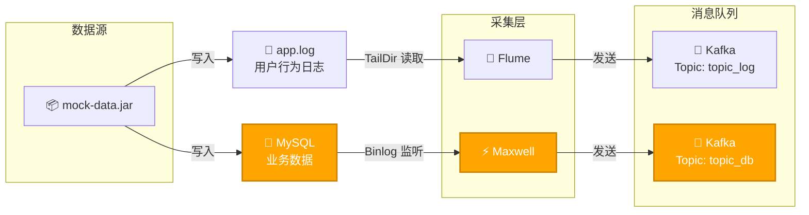

## 清空流程




1. 清空日志 

   1. 清空日志 app.log
   2. 清空数据库 edu

2. 清空Kafka

   1. clear topic_db
   2. clear topic_log

3. 清空HBase中的维度表

   ```sql
   DROP TABLE EDU_REALTIME.DIM_BASE_SUBJECT_INFO;
   DROP TABLE EDU_REALTIME.DIM_CHAPTER_INFO;
   DROP TABLE EDU_REALTIME.DIM_COURSE_INFO;
   DROP TABLE EDU_REALTIME.DIM_KNOWLEDGE_POINT;
   DROP TABLE EDU_REALTIME.DIM_TEST_PAPER;
   DROP TABLE EDU_REALTIME.DIM_TEST_PAPER_QUESTION;
   DROP TABLE EDU_REALTIME.DIM_TEST_POINT_QUESTION;
   DROP TABLE EDU_REALTIME.DIM_TEST_QUESTION_INFO;
   DROP TABLE EDU_REALTIME.DIM_TEST_QUESTION_OPTION;
   DROP TABLE EDU_REALTIME.DIM_USER_INFO;
   DROP TABLE EDU_REALTIME.DIM_VIDEO_INFO;
   ```


## 重新接入数据

1. 初始化数据库 edu

2. 创建 topic_db 4分区、3副本

3. 创建 topic_log 4分区、3副本

4. 调整Maxwell分区策略 `producer_partition_by=table`，重启 Maxwell

5. 在`Phoenix`中创建数据库

   ```mysql
   CREATE SCHEMA IF NOT EXISTS EDU_REALTIME;
   ```

6. 在clickhouse中创建数据库

   ```sql
   DROP DATABASE IF EXISTS edu_realtime;
   CREATE DATABASE IF NOT EXISTS edu_realtime;
   ```


```sql
drop table if exists dws_traffic_source_keyword_page_view_window;
create table if not exists dws_traffic_source_keyword_page_view_window
(
    stt           DateTime,
    edt           DateTime,
    source        String,
    keyword       String,
    keyword_count UInt64,
    ts            UInt64
) engine = ReplacingMergeTree(ts)
      partition by toYYYYMMDD(stt)
      order by (stt, edt, source, keyword);

```

